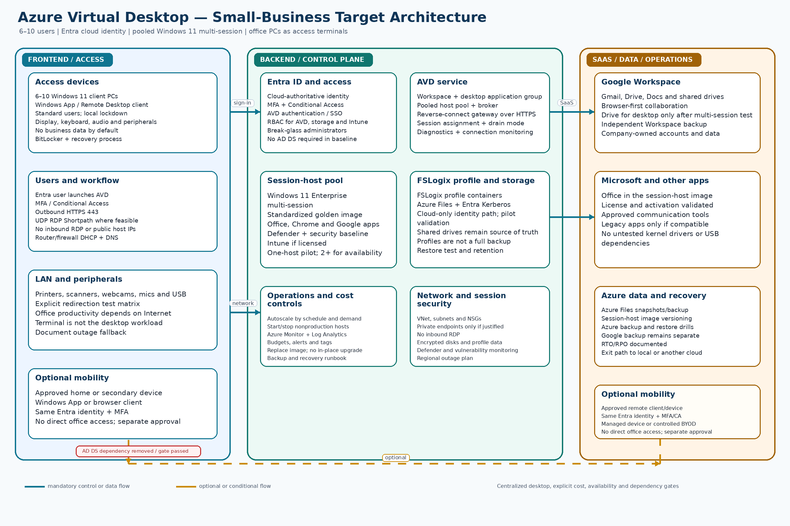

# Solution 3 — Azure Virtual Desktop (AVD) with Office PCs as Access Terminals

## Detailed architecture design, analysis, and comparison

**Design scope:** 6–10 users, six initial users, Windows PCs currently joined to on-premises AD DS, Google Workspace as the primary SaaS platform, Microsoft Office, communication tools, and retirement of the local domain controller.

**Document relationship:** The authoritative baseline is [`requirements.md`](requirements.md). Remote work and user/device portability are optional; identity security, endpoint recovery, data ownership, application continuity, and AD dependency removal remain mandatory.

## 1. Executive decision

Azure Virtual Desktop (AVD) is technically valid, but it should remain a conditional or exception architecture for this small-business environment. It moves the Windows desktop and application workload from the office PCs into Azure. The existing PCs become access terminals that display a remote Windows session rather than running the main business desktop locally.

AVD is justified when one or more of the following are confirmed business requirements:

- every user must receive the same centrally managed Windows desktop and application set;
- a legacy Windows application must run in one controlled environment;
- business data should remain primarily in a central cloud desktop rather than on office PCs;
- users need a consistent desktop from multiple approved locations or devices;
- the office PCs should be inexpensive terminals with a longer replacement cycle; or
- a demonstrated security, support, or compliance benefit outweighs the added Azure consumption and operational work.

If the business mainly needs to remove AD DS while retaining six to ten capable PCs, Entra ID + Intune remains the simpler and lower-risk baseline. AVD adds a host-pool lifecycle, image management, profile storage, Azure networking, session troubleshooting, licensing validation, Internet dependency, and consumption-cost control. Those components must be accepted as a deliberate trade-off rather than introduced merely as an AD replacement.

The preferred AVD target is:

- Microsoft Entra ID as the authoritative cloud identity;
- Entra-joined Windows 11 Enterprise multi-session session hosts;
- a pooled host pool, normally with one host for a pilot and two or more hosts for production availability;
- one AVD workspace and desktop application group for the initial user population;
- a standardized golden image containing Office, Chrome, Google Workspace access, communication tools, and approved line-of-business applications;
- FSLogix profile containers on Azure Files using the supported Microsoft Entra Kerberos cloud-only identity path, subject to a pilot validation of permissions, region, and application behavior;
- Azure autoscale, budgets, alerts, monitoring, and a documented image replacement process;
- office firewall egress to Microsoft and Google cloud services, with no inbound RDP and no public IP addresses on session hosts;
- Intune and Defender for Cloud/Endpoint controls where the selected licenses and operating model justify them; and
- optional remote access only after the business approves the mobility scope, device policy, and incremental cost.

Microsoft documents that Entra-joined session hosts can remove the need for line-of-sight to an on-premises domain controller or Entra Domain Services. AVD also uses reverse-connect transport, so the normal design does not expose an inbound RDP listener. The exact license entitlement, Azure Files authentication model, and profile behavior must still be validated before production approval.

## 2. Architecture diagram

Blue paths are normal identity, management, session, and data flows. Orange paths are optional or conditional. The diagram intentionally shows no permanent AD DS server and no inbound Internet RDP. The office PCs remain required access hardware even though the desktop workload is centralized.

## 3. Design principles

### 3.1 Centralize only when the benefit is real

AVD changes the operating model, not just the login method. Every user session, Windows application, profile, and much of the troubleshooting path depends on Azure and Internet connectivity. Select it when centralization solves a documented business problem.

### 3.2 Prefer a pooled host pool

Six users generally do not need six always-on personal desktops. A pooled host pool provides a common image and can place users on an available session host. Pooled desktops reduce idle capacity and simplify image management, but they require application compatibility testing, profile persistence, and clear handling of user-specific settings.

### 3.3 Separate pilot economics from production availability

One small session host can reduce pilot cost. It is also a single point of failure and may become saturated during concurrent use. Production must either accept that risk formally or use two or more hosts, drain mode, and a tested capacity plan.

### 3.4 Entra-join rather than recreate AD DS by default

The preferred baseline uses cloud-only Entra identities and Entra-joined session hosts. It does not add a domain controller, Entra Domain Services, or a site-to-site VPN simply to preserve an old domain model. Any application that truly requires LDAP, Kerberos, traditional GPO processing, or a domain-bound service must be identified and treated as a design exception.

### 3.5 Treat the image as a product

The golden image is the production desktop. It needs ownership, versioning, a maintenance window, application compatibility tests, security updates, rollback images, and a replacement process. Pooled session hosts should be reimaged or replaced rather than upgraded in place when the platform or image lifecycle requires it.

### 3.6 Profiles are user data, not the backup plan

FSLogix makes a pooled desktop feel persistent by attaching a user profile container. A profile container is not, by itself, a complete backup, an application recovery plan, or an exit strategy. Azure Files protection, independent Google Workspace backup, image versioning, and restore tests are separate requirements.

### 3.7 Recovery is mandatory; mobility is optional

AVD can make a user less dependent on one physical PC, but the business does not have to enable remote work. If remote or secondary-device access is approved, it must reuse Entra identity, MFA, Conditional Access, logging, and offboarding controls rather than create an unmanaged access path.

## 4. Logical architecture

### 4.1 Identity and access layer

Microsoft Entra ID is the authoritative directory for AVD. User objects, groups, authentication methods, Conditional Access, licensing assignment, and administrator roles are managed in Entra.

Recommended controls:

- one verified corporate domain and one named account per employee;
- separate privileged administrator accounts and at least two protected emergency accounts;
- security groups for AVD users, host-pool assignment, application access, and administrators;
- MFA for all users, with phishing-resistant methods for administrators where practical;
- Conditional Access requiring MFA and blocking legacy authentication;
- separate policies for administrator access, office terminals, and optional remote devices;
- sign-in and audit-log retention for the approved period;
- company-controlled tenant ownership, billing, recovery methods, and DNS registrations; and
- a documented joiner/mover/leaver process that revokes AVD, Google, Office, and other SaaS access together.

AVD authentication and Windows session-host authentication should use the same Entra identity. Local-only Windows accounts are not a supported identity solution for AVD user sessions. If a third-party identity provider is retained, it must federate with Entra and pass the AVD authentication and Conditional Access pilot.

### 4.2 AVD resource hierarchy

Use a small, clearly named Azure resource structure:

| Scope | Example design | Purpose |
|---|---|---|
| Subscription | Existing controlled production subscription or dedicated small-business subscription | Billing, quotas, policy, support ownership |
| Resource group | `rg-avd-prod-ca` | AVD, host-pool, workspace, diagnostics and dependent resources |
| Host pool | `hp-avd-pooled-prod` | Pooled session hosts and load-balancing policy |
| Workspace | `ws-avd-prod` | User-facing AVD workspace |
| Desktop application group | `dag-avd-desktop-prod` | Full desktop assignment to the initial user group |
| Session-host VM scale set or VM set | Named consistently by image/version | Windows multi-session capacity |
| Storage resource group | `rg-avd-storage-ca` | Azure Files profile share and protection resources |
| Monitoring resource group | Existing shared or dedicated Log Analytics scope | Diagnostics, alerts and operational evidence |

Use tags for owner, environment, cost center, data classification, image version, support contact, and shutdown schedule. Keep the first deployment in one Azure region selected for user latency, data residency, and service availability. Multi-region AVD is a separate project and is not part of the lightweight baseline.

### 4.3 Workspace, application group, and host pool

The AVD service exposes one workspace and one desktop application group for the first phase. Assign access through a group rather than individual users. Add RemoteApp application groups only if a specific workflow benefits from publishing one application instead of a full desktop.

Recommended host-pool settings:

- **Pooled** host-pool type for shared capacity;
- breadth-first load balancing for an even pilot distribution, or depth-first only after capacity and performance testing support it;
- drain mode before maintenance or image replacement;
- session limits, idle/disconnect timeouts, and logoff policy documented with user impact;
- clipboard, drive, printer, USB, camera, microphone, and local-device redirection disabled by default and enabled only where needed;
- Start VM on Connect only when its latency and quota behavior are acceptable; and
- a scaling plan that powers hosts on and off according to the actual working schedule.

Do not add a public IP to a session-host NIC. Do not publish TCP 3389 to the Internet. The AVD service brokers connections using reverse connect over HTTPS; RDP Shortpath may add UDP performance where network conditions permit.

### 4.4 Session-host compute and image

The session host is a Windows 11 Enterprise multi-session Azure VM. The final VM size depends on Office usage, browser tabs, Drive behavior, video conferencing, and line-of-business applications. A small pilot can start with one general-purpose VM and measure CPU, memory, disk latency, logon duration, and concurrent-user density before selecting the production size.

The image should include only approved and supportable software:

- Windows 11 Enterprise multi-session with current supported updates;
- Microsoft 365 Apps or separately licensed Office, activated and tested for shared computer use where required;
- Chrome and Google Workspace browser access;
- Google Drive for desktop only after multi-session, profile, caching, and synchronization testing;
- communication and conferencing software with camera, microphone, and media redirection tests;
- Defender and the selected endpoint-security baseline;
- required line-of-business applications, with vendor support confirmed for multi-session;
- approved fonts, printers, certificate chains, and browser extensions; and
- no unapproved kernel drivers, VPN clients, local database servers, or hardware-dependent utilities.

Maintain a versioned image definition and a small test ring. Store the last known-good image and document how to roll back a host pool. For pooled session hosts, plan image replacement/redeployment instead of relying on an in-place Windows upgrade. Validate Windows 11 hardware and application prerequisites before selecting the image.

### 4.5 Profile and user-data layer

Use FSLogix profile containers when a pooled host pool needs a persistent user experience. The preferred storage target is an Azure Files share configured for Microsoft Entra Kerberos authentication for cloud-only identities, subject to pilot validation.

Profile design requirements:

- one profile container per user with a documented naming and quota convention;
- Azure Files share permissions mapped to the AVD user group and administrators by least privilege;
- exclusions for disposable caches where they improve logon and storage behavior;
- tested handling of Outlook, Chrome, Office, Google Drive, and communication-app caches;
- no assumption that profile containers replace shared-drive permissions or SaaS backup;
- Azure Files snapshots/backup selected according to the RPO/RTO; and
- a restore test that proves a user can sign in to a replacement host with a recovered profile.

Cloud-only Entra Kerberos and FSLogix behavior are feature-specific. Test the exact Azure region, storage configuration, permissions, profile format, and host image before committing production data. If the pilot fails, use a supported alternative such as a personal-host design, OneDrive/known-folder redirection where appropriate, browser-first Google Workspace access, or a separately validated profile-storage architecture. Do not reintroduce AD DS solely because a profile-storage shortcut was not tested.

Business documents should remain in Google Shared drives or other approved SaaS repositories. Local session-host disks and profile containers are working storage, not the authoritative business repository.

### 4.6 Google Workspace integration

Google Workspace remains the primary collaboration platform. In the AVD session, users use Chrome, Gmail, Drive, Docs, shared drives, and approved SaaS applications.

Recommended Google design:

- use the same corporate email address in Entra and Google Workspace where possible;
- use browser-first Google Workspace access for the pilot;
- install Google Drive for desktop only after confirming multi-session support, cache location, profile persistence, concurrent-session behavior, and file-locking expectations;
- preserve Shared drive ownership and permissions independent of AVD;
- retain an independent Google Workspace backup and export process;
- define whether offline Google files are allowed, noting that AVD sessions depend on cloud connectivity; and
- test links, Chrome profiles, extensions, printing, download controls, and data-loss-prevention policies.

If Google is the authoritative identity for the wider business, federation or lifecycle synchronization with Entra must be designed explicitly. Avoid manually maintaining two unrelated user directories. The selected identity source, provisioning direction, and offboarding evidence must be recorded before pilot enrollment.

### 4.7 Office and other applications

Office applications run in the session-host image rather than on the terminal by default. Confirm that each license permits use in a shared Windows multi-session environment. Microsoft Office and Google Workspace are complementary in this design: Office supports local document workflows, while Google Workspace remains the SaaS and collaboration system.

For every other application, record:

- publisher support for Azure Virtual Desktop and Windows multi-session;
- license activation and user/device assignment behavior;
- CPU, memory, disk, graphics, and network requirements;
- profile and roaming behavior;
- dependency on LDAP, Kerberos, SMB, a local database, a hardware token, a kernel driver, or an office-only IP range;
- printer, scanner, webcam, microphone, USB, smart-card, and clipboard behavior; and
- backup, data location, and restore procedure.

An application that needs traditional domain services is not silently “solved” by AVD. It must be remediated, replaced, isolated behind a documented exception, or retained on a supported service until a later project.

### 4.8 Office terminals and local network

The existing PCs can remain as Windows 11 access terminals if they meet lifecycle, performance, security, and recovery requirements. They need:

- a supported Windows client edition;
- Windows App or the supported Remote Desktop client;
- local standard-user operation and controlled administration;
- BitLocker or equivalent device encryption and a documented recovery-key process;
- endpoint protection, patching, inventory, and remote-support controls;
- no default storage of business data outside approved local caches;
- tested display scaling, audio, webcam, printer, scanner, USB, smart-card, and keyboard behavior; and
- a replacement or reprovisioning process independent of the AVD session host.

The office router/firewall should provide DHCP and DNS forwarding after AD DS retirement. The AVD baseline needs outbound access to Microsoft identity, AVD, monitoring, update, and storage endpoints and to Google Workspace. Use the vendor-published endpoint requirements and review them as they change.

Network requirements:

- outbound HTTPS 443 is required for control and reverse-connect traffic;
- UDP RDP Shortpath is optional and should be tested rather than required for acceptance;
- no inbound RDP, SMB, LDAP, or administrative connection from the Internet;
- no public session-host IP addresses;
- VNet subnets, NSGs, and route controls are kept minimal and documented;
- private endpoints and private DNS are used only when a data-control or network requirement justifies their additional cost and administration; and
- office Internet bandwidth, latency, jitter, packet loss, and failover behavior are measured during peak use.

### 4.9 Azure operations, monitoring, and backup

Operate AVD through a small set of repeatable controls:

- Azure Monitor and Log Analytics for host health, connection failures, sign-in failures, boot failures, and capacity;
- alerting for stopped/unavailable hosts, failed scaling actions, profile attach failures, storage capacity, backup failures, and budget thresholds;
- Azure budgets and cost alerts by subscription, resource group, and host pool;
- scheduled maintenance and drain-mode runbooks;
- image version and rollback records;
- Azure Files backup/snapshots according to the approved RPO/RTO;
- session-host recovery through image redeployment rather than manual repair wherever practical;
- independent Google Workspace backup; and
- quarterly restore evidence for a profile, a shared file, a session host, and administrative access.

Azure Backup protects selected Azure resources; it does not automatically prove that a user can work after a full host-pool or identity failure. Document the recovery sequence and test it.

## 5. User and administrator flows

### 5.1 Normal office sign-in

1. The user signs in to the Windows access terminal with a standard local device account or an approved terminal sign-in method.
2. The user launches Windows App or the supported Remote Desktop client.
3. Entra authenticates the user and enforces MFA and Conditional Access.
4. AVD assigns the user to an available session host in the pooled host pool.
5. The broker establishes a reverse-connect session; UDP Shortpath is attempted where available and TCP fallback remains available.
6. FSLogix attaches the user profile container from Azure Files.
7. The user opens Office, Chrome, Google Workspace, communication tools, and approved applications in the hosted Windows session.

The terminal is an access device, not the authoritative desktop. A terminal replacement should not require reconstructing the user’s hosted profile or application configuration.

### 5.2 New user

1. Create the user in the authoritative directory and assign the approved Entra/AVD and application licenses.
2. Enforce MFA and add the user to the AVD access group.
3. Confirm Google Workspace and other SaaS access through the documented provisioning process.
4. Verify profile-container creation, Office activation, Google Workspace access, and application entitlements.
5. Provide the Windows App sign-in instructions and a short user orientation.

### 5.3 New or rebuilt access terminal

1. Install a supported Windows client image and current patches.
2. Enroll the terminal in the selected management and endpoint-security controls.
3. Apply the local lockdown, BitLocker, browser, Windows App, and peripheral policies.
4. Test Entra/MFA sign-in, AVD launch, printer/audio/webcam behavior, and sign-out.
5. Return the terminal to the user without copying profile containers or business data locally.

### 5.4 Image maintenance

1. Update the image definition in a non-production test ring.
2. Test Office, Chrome, Google Workspace, communication tools, profiles, printers, and line-of-business applications.
3. Publish a versioned image and place hosts into drain mode one at a time.
4. Reimage or replace the selected hosts and confirm profile attachment and monitoring.
5. Roll back to the previous image if acceptance tests fail.

### 5.5 Administrator and support flow

Administrators use separate privileged Entra accounts, MFA, least-privilege Azure RBAC, and documented break-glass procedures. Support starts with the AVD connection/health view, Entra sign-in logs, host health, profile attach events, image version, Azure Files status, and cost alerts. The runbook must distinguish an identity problem, a client/terminal problem, a host-pool capacity problem, a profile/storage problem, an application problem, and an Internet problem.

### 5.6 Optional remote-work flow

If approved, an employee launches the same AVD workspace from an approved home or secondary device, authenticates with Entra MFA and Conditional Access, and receives the same hosted desktop. No direct connection to the office LAN, domain controller, SMB share, or RDP listener is required.

This optional flow must be separately tested for device trust, browser/client support, audio/video quality, printing, downloads, clipboard, session timeout, lost-device revocation, and data leakage. If the business only needs Gmail, Drive, Docs, and browser SaaS remotely, direct managed-device SaaS access may be simpler and less expensive than AVD.

## 6. Security baseline

### 6.1 Identity security

- Entra MFA for every AVD user;
- Conditional Access for MFA, device/session risk, administrators, and optional external access;
- separate privileged accounts and protected emergency accounts;
- least-privilege Azure RBAC for AVD, storage, networking, monitoring, and billing;
- no shared user accounts;
- prompt offboarding and token/session revocation; and
- reviewed sign-in, audit, provisioning, and AVD diagnostic logs.

### 6.2 Session-host security

- supported Windows 11 Enterprise multi-session image;
- Microsoft Defender and selected endpoint-security controls;
- security baseline, firewall, attack-surface reduction, browser, and application controls;
- current Windows and application updates;
- encrypted OS and data disks using supported Azure encryption;
- no public IP and no inbound RDP;
- local administrator access removed or separately controlled;
- controlled clipboard, drive, printer, USB, camera, and microphone redirection; and
- application allow-list or least-privilege controls where the selected tooling supports them.

### 6.3 Data security

- Google Workspace and shared-drive permissions remain authoritative for Google data;
- Azure Files profile-share permissions follow least privilege;
- profile, backup, and exported data are encrypted in transit and at rest;
- downloads, clipboard, printing, and local-drive redirection are explicitly approved;
- administrative credentials and recovery keys are not stored in profiles or on terminals; and
- data-retention, legal-hold, and deletion behavior is documented for both Google and Azure.

### 6.4 Network security

- outbound-only office firewall model;
- vendor endpoint allow-list reviewed during change management;
- no office-to-cloud VPN required in the cloud-only baseline;
- no public management endpoint for session hosts;
- minimal VNet, subnet, and NSG design;
- private endpoints only after a cost/benefit decision; and
- documented behavior if the office Internet connection fails.

## 7. AD DS dependency-removal gate

AVD does not automatically eliminate every dependency on the old domain. Before stopping the domain controller, discovery evidence must prove that each item is replaced, remediated, or formally waived:

| Dependency | AVD target treatment | Evidence required |
|---|---|---|
| User authentication | Entra identity and MFA | Successful user and admin sign-in tests |
| Windows computer accounts | Entra-joined session hosts and managed terminals | Join, enrollment, and replacement evidence |
| Group Policy | Intune, image policy, application policy, or documented local policy | Policy-to-control mapping and test results |
| DNS/DHCP | Router/firewall or supported cloud/network service | Lease, name resolution, and outage test |
| File shares | Google Shared drives, Azure Files, or approved SaaS | Permission, ownership, backup, and restore test |
| Print services | Direct/cloud printing or supported print service | Print and driver test |
| LDAP/Kerberos | Application remediation or approved retained dependency | Vendor/application evidence |
| Certificates | Cloud PKI, application-managed certificates, or replacement | Certificate issuance and renewal test |
| VPN/RADIUS/Wi-Fi | Cloud identity integration or network-device replacement | Authentication and revocation test |
| Service accounts | Managed identity, app identity, or documented replacement | Rotation, ownership, and run test |
| Scheduled tasks/scripts | Cloud automation, task redesign, or approved local task | Execution, ownership, and recovery test |
| Backup jobs | Azure Files/VM backup and independent SaaS backup | Successful restore evidence |
| Monitoring/alerting | Azure Monitor, endpoint, network, and SaaS alerts | Alert delivery and response test |

The final gate requires a current dependency inventory, exports of required AD information, a rollback plan, tested emergency access, and a change window. Do not power off the only domain controller until the business owner approves the evidence.

## 8. Migration implementation plan

### Phase 0 — Discovery and AVD fit decision

- inventory users, PCs, Windows editions, Office licenses, Google Workspace editions, applications, peripherals, bandwidth, and AD dependencies;
- measure peak concurrent users and identify expected AVD session density;
- classify applications as browser/SaaS, Office, multi-session compatible, domain-dependent, hardware-dependent, or retired;
- confirm whether a central desktop is actually required or merely attractive;
- define RTO/RPO, monthly budget ceiling, region, optional mobility scope, and one-host versus two-host availability target;
- record Windows 10 upgrade/replacement requirements; and
- approve a written go/no-go decision for AVD before building production resources.

### Phase 1 — Azure foundation and governance

- select subscription, region, resource groups, naming, tags, and owners;
- configure budgets, alerts, RBAC, policy, diagnostic settings, and support contacts;
- define VNet, subnet, NSG, DNS, egress, and private-endpoint decisions;
- confirm Azure quotas and eligible AVD licensing; and
- create an implementation rollback and cost-shutdown procedure.

### Phase 2 — Identity and access foundation

- confirm Entra tenant ownership and verified domain;
- create groups, privileged accounts, emergency accounts, and MFA/Conditional Access policies;
- assign only the licenses required for the pilot;
- configure AVD authentication and optional SSO; and
- map the Google Workspace identity lifecycle and offboarding process.

### Phase 3 — Image and application engineering

- build a Windows 11 Enterprise multi-session golden image;
- install Office, Chrome, Google Workspace/browser components, communication tools, security agents, and approved applications;
- validate shared-computer licensing and application vendor support;
- test printers, scanners, cameras, microphones, USB, clipboard, and display behavior;
- create an image versioning, test-ring, rollback, and replacement procedure; and
- document every application’s profile, data, identity, and backup dependency.

### Phase 4 — AVD service and host-pool pilot

- create the workspace, desktop application group, pooled host pool, and one pilot session host;
- apply drain, timeout, redirection, and load-balancing settings;
- enable diagnostics, monitoring, and autoscale schedule;
- enroll session hosts in Intune/Defender where licensed and justified;
- test Entra-joined host behavior without on-premises line-of-sight; and
- capture baseline CPU, memory, logon, profile, application, and connection metrics.

### Phase 5 — Profile, storage, and recovery pilot

- create Azure Files profile storage and configure the selected Entra Kerberos path;
- apply least-privilege share and NTFS permissions;
- attach FSLogix profiles for pilot users;
- test profile creation, reconnect, concurrent session behavior, cache growth, and restore;
- configure Azure Files snapshots/backup as approved; and
- document the fallback if cloud-only profile authentication or an application is not compatible.

### Phase 6 — User and terminal pilot

- migrate two representative users with different application and peripheral needs;
- configure two representative Windows access terminals;
- test normal sign-in, MFA, reconnect, disconnect, printer/scanner/audio/video, Google Workspace, Office, communication tools, and support workflows;
- test Internet degradation and a session-host failure;
- measure user experience and cost at expected concurrency; and
- obtain written pilot acceptance before expanding.

### Phase 7 — Production rollout

- add production hosts only after sizing and availability approval;
- migrate users in small groups and keep the old AD-dependent path available only for rollback evidence;
- replace or reimage terminals as needed to meet Windows 11 and security requirements;
- publish support instructions and a short user guide;
- enforce budgets, alerts, diagnostics, and backup checks; and
- record exceptions with an owner, expiration date, and remediation plan.

### Phase 8 — Stabilization and AD DS retirement

- complete the dependency-removal checklist;
- confirm all users, terminals, hosts, profiles, applications, DNS/DHCP, printing, certificates, VPN/RADIUS, scripts, and backups work without the domain controller;
- export required AD and configuration evidence;
- monitor for an agreed stabilization period;
- take a final backup and document the rollback point;
- stop and decommission the AD DS server only after business-owner approval; and
- securely retire, repurpose, or dispose of the old server and credentials.

## 9. Operating model

### Routine operations

| Frequency | Activity | Evidence |
|---|---|---|
| Daily/automated | AVD health, failed connections, host availability, profile and backup alerts | Alert queue and response record |
| Weekly | Review host capacity, scaling actions, failed sign-ins, image drift, and user-impacting incidents | Short operations review |
| Monthly | Review Azure spend, budgets, inactive users, storage growth, patch status, and backup success | Cost and service report |
| Quarterly | Restore profile/file/host samples, test emergency access, review RBAC and Conditional Access, review image lifecycle | Recovery and access evidence |
| On change | Pilot image/app/network changes, drain hosts, update documentation, and retain rollback | Change record |

### Support model

The target must be supportable by a generalist administrator or managed service provider. The runbook should include:

- user cannot authenticate;
- Windows App cannot connect;
- host pool has no available session host;
- session is slow or disconnects;
- profile does not attach;
- Google Workspace or Office application fails;
- printer/scanner/audio/video redirection fails;
- host image or update is defective;
- Azure Files or backup is unavailable; and
- Azure spend exceeds the expected envelope.

The support provider must have documented access, named ownership, a transfer procedure, and no dependency on one employee’s personal account.

## 10. Licensing, capacity, and cost model

### Licensing requirements

Each user requires an eligible Windows/AVD entitlement. Confirm the exact entitlement before purchase; do not assume that an existing Microsoft or Google subscription automatically includes every AVD right. Validate:

- Windows 11 Enterprise multi-session access rights;
- Microsoft 365 Apps or Office shared-computer activation rights;
- Entra ID and Conditional Access features;
- Intune enrollment and endpoint-security features if selected;
- Azure Files and Entra Kerberos feature support;
- third-party application licenses for shared sessions; and
- external-user licensing if any nonemployee or external access is proposed.

Google Workspace remains a separate subscription and is not replaced by AVD. AVD does not eliminate Google Workspace backup, domain ownership, or application licensing.

### Capacity profiles

| Profile | Session-host approach | Availability | Appropriate use |
|---|---|---|---|
| Pilot | One small general-purpose host | Single point of failure | Two to three representative users and application testing |
| Lean production | One right-sized host with autoscale | Low; planned outage on host failure | Only with explicit business acceptance of the risk |
| Recommended production | Two right-sized hosts with drain mode and autoscale | Better, but not full regional HA | Normal six-user workload with basic continuity |
| Growth/exception | Additional hosts, app groups, storage and network controls | Higher cost and operations | Proven concurrency, legacy apps, or wider mobility need |

### Budgetary planning ranges

Use the Azure Pricing Calculator and current license quotes for approval. The following is a planning model, not a quote:

| Cost area | Planning treatment |
|---|---|
| Eligible user licenses | Per-user recurring cost; validate existing Microsoft entitlements and Office rights |
| Session-host compute | Main variable; autoscale and scheduled shutdown reduce off-hours use |
| OS/data disks | Per-host recurring storage; include performance tier requirements |
| Azure Files profiles | Capacity, transactions, redundancy, snapshots and backup |
| Monitoring | Log Analytics ingestion, retention, alerts and diagnostic settings |
| Backup | Azure Files/VM protection and independent Google Workspace backup |
| Network | Usually modest for a small office, but include egress and optional private endpoints |
| Support/implementation | Higher than local endpoint migration because image, profile, host-pool and session operations are new |

For a six-user deployment, a low-concurrency pilot may fit within a few hundred dollars per month of Azure infrastructure, while two always-available hosts, premium storage, backup, monitoring, and additional licenses can raise the total substantially. Autoscale reduces idle compute; it does not remove licensing, storage, support, or Internet costs. Approve the monthly ceiling only after a concurrency pilot.

### Budgetary implementation effort

| Scope | Estimate |
|---|---:|
| Discovery and AVD fit assessment | 8–12 hours |
| Azure foundation, identity, network and governance | 8–16 hours |
| Image, application and peripheral engineering | 12–24 hours |
| AVD host pool, monitoring, autoscale and pilot | 10–16 hours |
| FSLogix/Azure Files, backup and recovery tests | 8–16 hours |
| User rollout, documentation and AD retirement | 12–20 hours |
| **Basic total** | **58–104 hours** |

Legacy applications, two-host availability, private endpoints, complex printing, third-party federation, or failed profile authentication can add material effort. The implementation estimate should be revised after Phase 0.

### Standard deployment, operational, and maintenance budget

For a comparable six-user planning model, use Canadian dollars before tax and annual commitments where available. “Deployment” is one-time professional services. “Operational” is recurring licensing, Azure consumption, and backup cost and excludes support labor. “Maintenance” is routine administration at **CAD 125–150/hour** and excludes incidents, major projects, hardware replacement, and vendor support contracts.

| Cost category | Standard planning amount |
|---|---:|
| One-time deployment | **CAD 7,250–15,600** for the documented 58–104 hour basic scope. A low-concurrency pilot may fit within **CAD 6,000–10,800** for 48–72 hours. |
| Recurring operational cost | **CAD 980–1,850/month** gross for two right-sized session hosts, Microsoft 365 Business Premium without Copilot, retained Google Workspace Business Plus, and backup. A one-host pilot is approximately **CAD 680–1,150/month**, but retains the host single point of failure. |
| Routine maintenance | **CAD 750–1,800/month** for approximately 6–12 hours of image, host-pool, FSLogix/profile, autoscale, monitoring, patch, release, backup, and recovery administration. A one-host pilot may require approximately 4–8 hours/month. |
| Excluded or optional items | Hardware replacement, Internet service, optional dual-WAN/5G or UPS, private endpoints, higher regional availability, major application work, incident response, and vendor support contracts. |

## 11. Analysis and comparison with the other options

### 11.1 Requirement fit

| Requirement dimension | Solution 1: Entra ID + Intune | Solution 2: Google Workspace + GCPW | Solution 3: AVD |
|---|---|---|---|
| Remove AD DS | Strong | Possible with feature-gap validation | Strong for the cloud-only baseline |
| Retain capable local PCs as workstations | Strong | Strong | PCs become access terminals |
| Google Workspace alignment | Good with integration | Strongest | Good inside hosted sessions, but adds another desktop plane |
| Windows policy and security depth | Strongest of the three | Variable; validate gaps | Strong on session hosts; terminals still need management |
| Centralized desktop/application consistency | Moderate | Limited | Strongest |
| Local/offline productivity | Strong | Strong | Weak; depends on Internet and Azure availability |
| User/device portability | Optional and straightforward | Optional and straightforward | Strong if hosted-session model is useful |
| Local data minimization | Moderate | Moderate | Strong for business workload, with profile/storage caveats |
| Infrastructure simplicity | Strong | Strong if gaps are acceptable | Weakest |
| Predictable low cost | Strong | Often strongest | Weakest; consumption and license sensitivity |
| Small-business maintainability | Strong | Strong with documented control gaps | Requires specialist runbooks or managed support |
| Legacy AD-dependent applications | Requires remediation | Requires remediation | May centralize them but does not remove the dependency automatically |

### 11.2 Why AVD is third for this baseline

AVD is third because the requirements prioritize lightweight infrastructure, low recurring cost, stable local productivity, and operation without a full-time specialist. AVD introduces:

- Azure VM compute and storage consumption;
- pooled-session capacity and single-host availability decisions;
- golden-image lifecycle and application compatibility work;
- FSLogix and Azure Files permissions, backup, and restore;
- terminal redirection and remote-session troubleshooting;
- greater dependence on office Internet and Azure regional services; and
- more licenses and operating procedures than are necessary when the existing PCs are capable Windows 11 workstations.

Those trade-offs are worthwhile only when centralized desktops or a terminal model deliver a measurable business benefit. AVD should move ahead of Solution 2 only when Windows application control, central data location, or standardized hosted desktops are more important than the Google-first low-cost model. It should not displace Solution 1 for a simple AD retirement without such a benefit.

### 11.3 Decision rule

Select AVD if the pilot proves all of the following:

1. the business accepts Internet/Azure dependency and the approved monthly cost ceiling;
2. the application set, Office licensing, peripherals, and Google Workspace workflows work in multi-session;
3. the profile-storage design passes sign-in, performance, backup, and restore tests;
4. one-host risk or the cost of two hosts is explicitly approved;
5. the resulting centralization materially improves support, data control, application delivery, or mobility; and
6. the organization can operate the service using a documented generalist or managed-support model.

Otherwise, use Solution 1 as the default target and keep Solution 2 as the Google-centric alternative.

## 12. Risks and mitigations

| Risk | Impact | Mitigation |
|---|---|---|
| One host fails | All users may lose the desktop | Pilot with one host only; use two production hosts or formally accept the risk |
| Office Internet fails | Users cannot reach hosted desktops | Test connectivity, maintain SaaS/mobile fallback where approved, document outage procedure |
| Azure regional/service outage | Hosted desktop unavailable | Define RTO/RPO, status/support procedures, and a later BCDR decision; do not imply regional HA |
| AVD consumption exceeds budget | Cost is unpredictable | Autoscale, schedules, right-size hosts, budgets, alerts, and monthly review |
| Profile container/authentication issue | Slow or failed logon, lost settings | Pilot Entra Kerberos/Azure Files, restore test, fallback profile design |
| Google Drive for desktop is incompatible | File sync or profile problems | Browser-first pilot; test Drive in multi-session before image inclusion |
| Printer/USB/camera behavior fails | Operational disruption | Explicit redirection matrix and direct/cloud peripheral alternatives |
| Image drift or bad update | Multiple users affected | Test ring, versioned image, drain mode, replacement and rollback |
| License is not eligible | Compliance/cost problem | Verify user, Windows, Office, AVD, and application entitlements before deployment |
| Legacy app requires AD DS | Domain controller cannot be retired | Remediate, replace, isolate, or document a temporary dependency with owner and date |
| Private networking becomes overbuilt | Cost and maintenance increase | Start with simple supported VNet/egress; add private endpoints only for a proven need |
| Terminal is compromised | Session/data exposure | Patch/encrypt/lock down terminals, require MFA, limit redirection, revoke lost-device sessions |
| Profile or backup is treated as the data source | Recovery or exit failure | Keep Google Shared drives authoritative; maintain separate Azure and SaaS backups |
| AVD skills are unavailable | Slow or expensive support | Use concise runbooks, monitoring, managed support, and transfer-ready documentation |

## 13. Acceptance criteria

The option is accepted only when the following tests pass or a named business owner signs a documented exception:

### Identity and access

- all pilot users authenticate to AVD with the authoritative Entra identity;
- MFA and Conditional Access behave as designed;
- privileged and emergency access are tested without relying on one employee;
- user provisioning and termination revoke AVD, Google, Office, and other SaaS access;
- session-host join type is consistent and no on-premises line-of-sight is required in the cloud-only baseline.

### Desktop and application

- workspace, desktop application group, pooled host pool, and capacity policy work;
- the golden image is versioned, recoverable, and supported;
- Office activation and Google Workspace access work for representative users;
- required communication, browser, and line-of-business applications pass their compatibility tests;
- profile containers attach, reconnect, and restore within the agreed time;
- printers, scanners, audio, webcams, USB, clipboard, and display behavior meet role requirements;
- users can reconnect after a network interruption without profile corruption; and
- a replacement office terminal can access the same user desktop without manual data reconstruction.

### Security and network

- no inbound RDP or public session-host IP is present;
- outbound endpoint access is documented and monitored;
- terminal and session-host encryption, patching, endpoint protection, and local-admin controls pass review;
- approved data-redirection settings are enforced;
- logs and actionable alerts are delivered to the administrator; and
- lost-terminal/session revocation is demonstrated.

### Recovery, operations, and cost

- Azure Files/profile, session-host image, Google Workspace, and administrative restore tests pass;
- autoscale, drain mode, maintenance, and rollback procedures are documented and exercised;
- budgets and cost alerts fire at the approved thresholds;
- the support runbook can distinguish identity, client, host, profile, application, network, and Azure service faults;
- the three-year cost model and monthly ceiling are approved; and
- the complete AD DS dependency-removal gate is signed off before decommissioning.

### Optional mobility

If remote work or portability is enabled, also verify approved external-device policy, MFA, Conditional Access, session revocation, performance, peripherals, download/clipboard controls, and the incremental cost. If not enabled, record that it is intentionally out of scope and do not treat its absence as a failure.

## 14. Decisions required before implementation

1. Is centralized Windows desktop delivery a confirmed business requirement, or is the objective only AD retirement?
2. Which Azure region and subscription will own the service?
3. What user concurrency, application mix, and performance target determine session-host sizing?
4. Is a pooled host pool acceptable, and is one-host risk acceptable for pilot or production?
5. Which applications and peripherals must run inside the hosted session?
6. Will Google Workspace be browser-first, or is Google Drive for desktop required in the multi-session image?
7. Does the selected Azure Files/Entra Kerberos/FSLogix path pass the cloud-only pilot?
8. Which Microsoft, Windows, AVD, Office, Google, and third-party licenses are already owned and eligible?
9. Will session hosts and terminals be enrolled in Intune, and what additional security tool is required?
10. What monthly operating-cost ceiling, RTO, RPO, and support arrangement are approved?
11. Is optional remote work or user/device portability enabled now, deferred, or limited to managed devices?
12. Which AD DS dependencies remain, and who owns each remediation or exception?

## 15. References

- [Microsoft 365 Business Premium pricing in Canada](https://www.microsoft.com/en-ca/microsoft-365/business/microsoft-365-business-premium)
- [Google Workspace pricing in Canada](https://workspace.google.com/intl/en_ca/business/)
- [Azure Virtual Desktop licensing](https://learn.microsoft.com/en-us/azure/virtual-desktop/licensing)
- [Understand and estimate Azure Virtual Desktop costs](https://learn.microsoft.com/en-us/azure/virtual-desktop/understand-estimate-costs)
- [Azure Pricing Calculator](https://azure.microsoft.com/en-ca/pricing/calculator/)
- [Azure Virtual Desktop prerequisites](https://learn.microsoft.com/en-us/azure/virtual-desktop/prerequisites)
- [Deploy Azure Virtual Desktop](https://learn.microsoft.com/en-us/azure/virtual-desktop/deploy-azure-virtual-desktop)
- [Azure-joined session hosts](https://learn.microsoft.com/en-us/azure/virtual-desktop/azure-ad-joined-session-hosts)
- [Azure Virtual Desktop authentication](https://learn.microsoft.com/en-us/azure/virtual-desktop/authentication)
- [Configure single sign-on for Azure Virtual Desktop](https://learn.microsoft.com/en-us/azure/virtual-desktop/configure-single-sign-on)
- [Azure Virtual Desktop network connectivity](https://learn.microsoft.com/en-us/azure/virtual-desktop/network-connectivity)
- [RDP Shortpath for Azure Virtual Desktop](https://learn.microsoft.com/en-us/azure/virtual-desktop/rdp-shortpath)
- [Azure Virtual Desktop security recommendations](https://learn.microsoft.com/en-us/azure/virtual-desktop/security-recommendations)
- [Create and assign an autoscale scaling plan](https://learn.microsoft.com/en-us/azure/virtual-desktop/autoscale-create-assign-scaling-plan)
- [FSLogix profile containers for Azure Virtual Desktop](https://learn.microsoft.com/en-us/azure/virtual-desktop/fslogix-profile-containers)
- [Store FSLogix profile containers on Azure Files](https://learn.microsoft.com/en-us/azure/virtual-desktop/store-fslogix-profile)
- [Enable Microsoft Entra Kerberos authentication for Azure Files](https://learn.microsoft.com/en-us/azure/storage/files/storage-files-identity-auth-hybrid-identities-enable)
- [Configure FSLogix profile containers with Azure Files and Microsoft Entra ID](https://learn.microsoft.com/en-us/fslogix/how-to-configure-profile-container-entra-id-hybrid)
- [Azure Virtual Desktop multi-region business continuity](https://learn.microsoft.com/en-us/azure/architecture/example-scenario/azure-virtual-desktop/azure-virtual-desktop-multi-region-bcdr)
