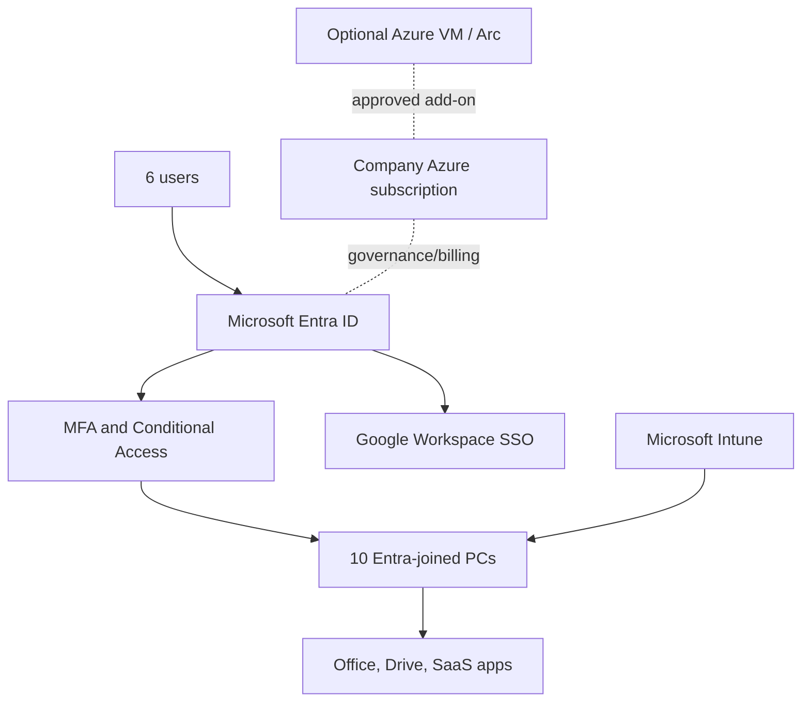
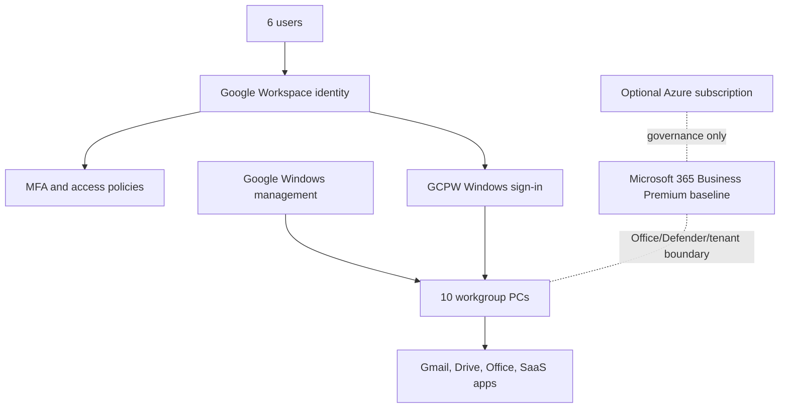
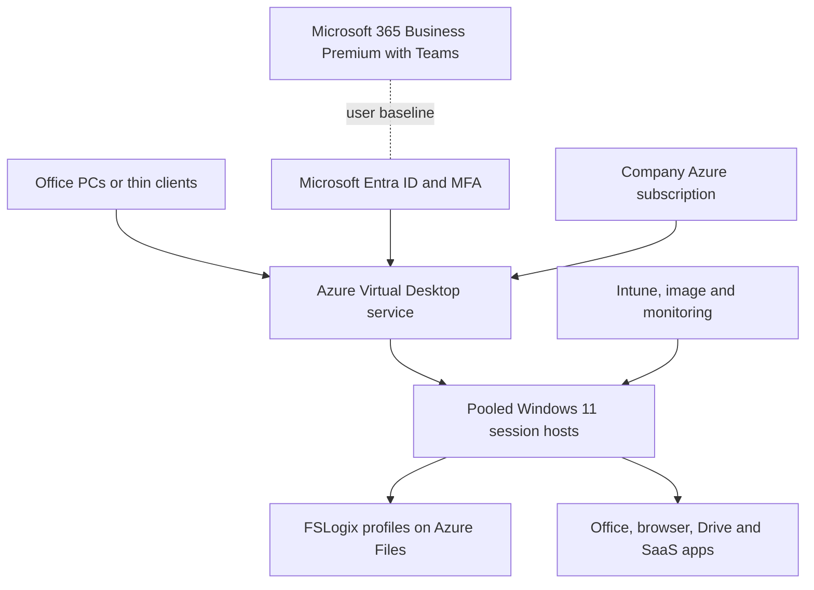

# Cloud Identity and Desktop Modernization Options

**Document status:** Draft v0.1  
**Prepared for:** Small-office cloud migration  
**Scope:** 6 users, 10 office PCs, one existing on-premises Active Directory environment
**Date:** 2026-09-04

**Currency:** CAD unless otherwise stated

## 1. Purpose

This document evaluates three options for retiring the existing on-premises Active Directory Domain Services (AD DS) server while retaining 10 physical office PCs and the current Google Workspace-centered application model.

The evaluated options are:

1. Microsoft Entra ID Join with Microsoft Intune
2. Google Workspace, Google Credential Provider for Windows, and Windows device management
3. Azure Virtual Desktop with centrally managed session hosts and the office PCs used as access terminals

The document defines business and technical requirements, target architectures, migration activities, budgetary costs, implementation effort, constraints, risks, and a recommended direction.

## 2. Critical terminology

Microsoft Entra ID is a cloud identity and access-management service. It is **not** a cloud-hosted replacement for AD DS and does not provide traditional domain controllers, Group Policy, LDAP, Kerberos domain authentication, or NTLM in the same manner as AD DS.

Therefore, the proposed project is not a literal migration of AD DS into Entra ID. It is a modernization project that:

- moves user identity and authentication to a cloud identity provider;
- replaces domain-joined Windows management with modern device management;
- migrates or eliminates workloads currently dependent on the domain controller; and
- retires AD DS only after every dependency has been addressed.

Microsoft Entra Domain Services exists but is not included as a preferred option for this six-user environment. It preserves managed-domain capabilities for legacy applications, but adds cost and operational complexity and does not eliminate the domain model.

## 3. Current-state assumptions

This draft uses the following assumptions. They must be validated during discovery.

| Area | Assumption |
|---|---|
| Users and devices | 6 named users and 10 company-owned Windows PCs |
| Operating system | Windows 11 Pro, or hardware capable of running a supported Windows 11 Pro release |
| Current identity | One on-premises AD DS domain and one domain controller/server |
| Primary collaboration platform | Google Workspace, including Gmail, Google Drive, and Google Docs; retained or optional according to the selected solution |
| Microsoft applications | Locally installed Microsoft Office applications are required |
| Other applications | SaaS communication and business applications; no confirmed application requires LDAP, Kerberos, NTLM, or a Windows domain |
| Local data | User profiles and any server file shares can be migrated to approved cloud storage |
| Office network | Reliable business Internet, firewall/router, LAN, and Wi-Fi remain in place |
| Availability | Normal small-business availability; no formal 24x7 high-availability requirement has yet been provided |
| Compliance | No regulated-data, legal-hold, or Canada-only data-residency requirement has yet been confirmed |
| Support | Remote administration is acceptable |

### 3.1 Common licensing and platform baseline

The updated architecture documents use the following comparable commercial baseline:

- Six **Microsoft 365 Business Premium with Teams** licenses are the common user-subscription baseline. The bundle includes Entra ID P1-level controls, Intune Plan 1, Office, Teams, Exchange Online, SharePoint, OneDrive, Defender for Business, Defender for Office 365 Plan 1, and Purview information-protection/DLP capabilities. Copilot, Entra ID P2, Intune Plan 2/Suite, and independent backup are separate.
- Solution 1 uses Entra ID as the authoritative identity and Intune as the Windows management plane. Solution 2 retains Google Workspace as authoritative and uses GCPW/Google Admin as the Windows control plane; Intune is included in the common license but is not layered onto GCPW-managed PCs. Solution 3 uses Entra ID for AVD access and hosted Windows sessions.
- Google Workspace is optional or retained according to the solution. Its license fee is **optional and excluded from the comparable cost calculation**; the required entitlement must still be verified before using Gmail, Drive, Docs, shared drives, or Google device management.
- Solution 1 and Solution 3 require a company-owned Microsoft Entra tenant and Azure subscription foundation. Solution 2 does not require Azure compute or an Azure subscription for GCPW, although an Azure subscription may be created as an optional governance boundary under the company standard.
- Entra ID Free plus standalone Intune Plan 1 is only a reduced-control exception for Solution 1. It lacks important controls such as custom Conditional Access and device-compliance gates, some self-service password-reset/enrollment paths, dynamic groups, and advanced risk/governance capabilities.
- Azure resource consumption, optional Azure services, hardware replacement, Internet service, optional dual-WAN/5G or UPS, major application work, incident response, and vendor support contracts are excluded unless separately estimated and approved.

## 4. Requirements

### 4.1 Business requirements

| ID | Requirement | Priority |
|---|---|---|
| BR-01 | Retire the on-premises AD DS server without losing access to users, devices, applications, or business data. | Mandatory |
| BR-02 | Retain the 10 office PCs unless a device fails compatibility or security checks. | Mandatory |
| BR-03 | Preserve access to Gmail, Google Drive, Google Docs, Microsoft Office, and approved communication tools. | Mandatory |
| BR-04 | Support secure work from the office and, if approved, remote locations. | Mandatory |
| BR-05 | Minimize ongoing administration for an environment with no more than 6–10 users in the near term. | Mandatory |
| BR-06 | Provide a documented onboarding, offboarding, password-reset, device-replacement, and recovery process. | Mandatory |
| BR-07 | Complete migration with a tested rollback method and limited user downtime. | Mandatory |
| BR-08 | Keep licensing and cloud consumption predictable and proportionate to the organization size. | Mandatory |

### 4.2 Identity and access requirements

| ID | Requirement |
|---|---|
| IAM-01 | One approved authoritative identity system must control the user lifecycle. Maintaining two unrelated authoritative directories is not acceptable. |
| IAM-02 | Every user must have an individual account. Shared interactive accounts are prohibited except where a documented application requirement exists. |
| IAM-03 | Phishing-resistant MFA should be used where supported; MFA is mandatory for all users and administrators. |
| IAM-04 | At least two emergency administrator accounts must be created, secured separately, excluded only from policies that would prevent emergency access, and monitored. |
| IAM-05 | Administrative accounts must be separate from routine user accounts. |
| IAM-06 | Access must follow least privilege, with group-based assignment wherever practical. |
| IAM-07 | Authentication and administrator audit logs must be retained for an agreed period. |
| IAM-08 | SaaS applications should use SAML or OpenID Connect single sign-on where supported. |
| IAM-09 | Onboarding and offboarding must add or revoke access across Windows, Google Workspace, Microsoft services, and other SaaS applications. |

### 4.3 Endpoint requirements

| ID | Requirement |
|---|---|
| END-01 | Each retained PC must run a supported edition and release of Windows 11. Windows Home is not acceptable for Microsoft Entra Join. |
| END-02 | Full-disk encryption using BitLocker must be enabled, and recovery keys must be escrowed in an approved administrative system. |
| END-03 | Antivirus/endpoint detection, host firewall, automatic patching, screen lock, and browser security policies must be centrally enforced. |
| END-04 | Users must not receive permanent local-administrator rights. A controlled elevation or support procedure is required. |
| END-05 | A managed local administrator account and password-rotation method are required. |
| END-06 | The system must maintain device inventory, ownership, compliance, and last-contact information. |
| END-07 | Lost, stolen, or retired devices must be blockable and, where supported, remotely wipeable. |
| END-08 | Required applications must be packaged or documented for repeatable installation. |
| END-09 | Existing user profiles, browser data, local files, printers, scanners, webcams, and other required peripherals must be tested before cutover. |

### 4.4 Application and data requirements

| ID | Requirement |
|---|---|
| APP-01 | Create a complete inventory of installed applications, versions, licensing, owners, data locations, and authentication dependencies. |
| APP-02 | Confirm whether any application uses AD security groups, LDAP, Kerberos, NTLM, integrated Windows authentication, mapped drives, or domain service accounts. |
| APP-03 | Confirm whether Microsoft Office licensing permits the selected physical or virtual-desktop deployment. |
| APP-04 | Migrate user and shared data to an approved cloud repository with defined ownership and sharing controls. |
| APP-05 | Google Drive for desktop behavior, offline access, shared drives, file ownership, and local cache capacity must be tested. |
| APP-06 | Backup must be defined independently from synchronization. Google Drive, OneDrive, and an AVD profile container are not by themselves complete backup strategies. |
| APP-07 | Define retention, deletion, legal-hold, and recovery-point objectives before migration. |

### 4.5 Network and infrastructure requirements

| ID | Requirement |
|---|---|
| NET-01 | Inventory every service currently hosted on the AD server, including AD-integrated DNS, DHCP, file shares, print services, certificate services, NPS/RADIUS, VPN authentication, scripts, scheduled tasks, and backup agents. |
| NET-02 | Replace AD-integrated DNS with router/firewall DNS forwarding, a managed DNS service, or another documented design before retiring the domain controller. |
| NET-03 | Move DHCP to the firewall/router or another supported platform if it is currently hosted on Windows Server. |
| NET-04 | Provide stable Internet connectivity with sufficient bandwidth and latency. A secondary Internet connection is recommended if cloud access is business-critical. |
| NET-05 | Maintain a business-grade firewall, current firmware, segmented guest Wi-Fi, and administrative access controls. |
| NET-06 | Permit only documented outbound endpoints required by the selected cloud services. Inbound exposure of Windows hosts is prohibited. |
| NET-07 | Remote support must use an approved secured tool; direct Internet exposure of RDP is prohibited. |

### 4.6 Operations, recovery, and acceptance requirements

| ID | Requirement |
|---|---|
| OPS-01 | Export and protect current AD, DNS, DHCP, GPO, group, user, and computer configuration before migration. |
| OPS-02 | Back up all server and endpoint data and perform at least one sample restore before cutover. |
| OPS-03 | Pilot the selected solution with one user and one non-critical PC before broad migration. |
| OPS-04 | Do not demote or remove the domain controller during the pilot. Preserve a documented rollback window. |
| OPS-05 | Establish monitoring and alerts for identity risk, failed sign-ins, noncompliant devices, endpoint threats, backup failures, and AVD capacity where applicable. |
| OPS-06 | Document the target environment, licenses, policies, application deployment, recovery procedures, and administrative ownership. |
| OPS-07 | Obtain user acceptance for sign-in, Gmail, Drive, Docs, Office, printing, scanning, communication tools, and remote access before final decommissioning. |

### 4.7 Mandatory discovery checklist before design approval

The following must be answered. Without these answers, cost and effort remain budgetary rather than fixed:

- Which Windows Server roles are installed on the current server?
- Are DNS and DHCP running on Windows Server, the firewall, or another device?
- Are there file shares, mapped drives, printer queues, login scripts, or redirected folders?
- Which GPOs exist, and which settings must be recreated?
- Do any applications or appliances authenticate against AD, LDAP, RADIUS, Kerberos, or NTLM?
- Are there domain service accounts, scheduled tasks, Windows services, or scripts?
- Is Active Directory Certificate Services installed or are domain certificates auto-enrolled?
- How much local and shared data exists, and who owns it?
- What Google Workspace edition is currently licensed?
- What Microsoft 365 or Office licenses are already owned?
- Are all PCs running Windows 11 Pro and supported hardware?
- Which peripherals and locally installed applications are mandatory?
- Is remote work required, and from what types of endpoints?
- What recovery time objective (RTO) and recovery point objective (RPO) are required?
- Is Canadian data residency, privacy regulation, cyber-insurance control, or legal retention in scope?

## 5. Solution 1 — Microsoft Entra ID Join and Microsoft Intune

### 5.1 Target architecture

Microsoft Entra ID becomes the authoritative workforce identity and Windows sign-in platform. Each PC is removed from the AD DS domain, joined directly to Entra ID, and enrolled in Intune. Intune replaces required GPO functions with configuration profiles, compliance policies, application deployment, update rings, security baselines, BitLocker management, and remote actions.

Google Workspace remains the primary email and collaboration platform. Entra ID can provide SAML single sign-on and automated provisioning to Google Workspace, subject to detailed configuration and testing. The user objects must be matched carefully to avoid duplicate accounts or incorrect file ownership.

See the detailed [Solution 1 user sign-in and authentication workflow](images/entra_id_google_authentication_workflow.svg). The sequence is Entra Windows sign-in, MFA/Conditional Access, Intune compliance evaluation, local Windows session creation, and approved SAML/provisioning access to Google Workspace.

### 5.2 Required components

- Company-owned Microsoft Entra tenant, verified company domain, and one associated Azure subscription for ownership, billing, RBAC, budgets, alerts, and governance
- Six Microsoft 365 Business Premium with Teams licenses as the baseline; this includes Entra ID P1-level controls and Intune Plan 1, so standalone Intune Plan 1 or Entra ID P1 licenses are not added
- Supported Windows 11 Pro devices
- Microsoft Intune configuration, compliance, application, and update policies
- MFA and Conditional Access
- Microsoft Defender for Business or another centrally managed endpoint-security platform
- Google Workspace SAML SSO and, if selected, automatic provisioning integration
- Cloud backup for Google Workspace and any other required business data; the Google Workspace license fee remains excluded from the comparable cost model
- Firewall/router-hosted DHCP and non-AD DNS design if currently provided by Windows Server
- Cached Entra sign-in tested for every assigned user/device after a successful initial online sign-in

### 5.3 Implementation sequence

1. Discover AD DS, server-role, application, data, GPO, network, and licensing dependencies.
2. Back up the server and endpoints; export directory and policy configuration.
3. Create or verify the company-owned Entra tenant, custom domain, administrators, MFA, Conditional Access, and emergency accounts.
4. Create or associate one company-owned Azure subscription with the Entra tenant; confirm billing owner, subscription RBAC, budgets, alerts, policies, activity logging, and the prohibition on unapproved resource deployment.
5. Configure Intune enrollment, device restrictions, compliance, BitLocker, Defender, Windows Update, local-admin controls, and application deployment.
6. Configure Google Workspace SSO/provisioning in a test group without changing all production users.
7. Build and validate one pilot PC, including user-profile and data migration.
8. Have each assigned user complete an online Entra sign-in, then test lock/restart sign-in with the network disconnected; record which local applications and files remain usable.
9. Migrate remaining PCs one at a time, keeping the domain controller available for rollback.
10. Validate all acceptance tests and monitor for at least one agreed stabilization period.
11. Move or eliminate remaining DNS, DHCP, file, print, certificate, authentication, and service-account dependencies.
12. Demote and decommission the domain controller only after formal dependency and acceptance sign-off.

### 5.4 Advantages

- Best direct fit for managing company-owned Windows PCs without AD DS.
- Strong Windows-native device configuration, compliance, encryption, update, application, and security controls.
- Physical PCs continue to work locally during a temporary Internet outage after cached sign-in, although cloud applications remain unavailable.
- Cached sign-in provides short-term local continuity only for users who have previously signed in online; it does not support first-time sign-in, new-device enrollment, password recovery, or live cloud authentication during the outage.
- Lower Azure infrastructure cost and complexity than AVD.
- Supports repeatable device deployment and replacement through Windows Autopilot for compatible procurement scenarios.
- Provides a credible path to a single authoritative identity across Windows and Google Workspace.

### 5.5 Reliability and single-point-of-failure review

Solution 1 removes the on-premises domain controller as an organization-wide dependency, but it does not automatically provide redundant office connectivity or eliminate managed-cloud service outages. The design must explicitly address the remaining failure paths:

- Entra ID and Intune are provider-managed control-plane dependencies. Protect against tenant lockout with two separately protected emergency accounts, independent recovery methods, documented escalation, and tested local-device outage behavior.
- Entra SAML for Google Workspace can become a shared authentication path. Pilot federation, retain a protected direct Google administrative recovery path, and test federation bypass or rollback before enforcing SSO broadly.
- The single ISP/router/firewall path shown in the logical design is a local single point of failure. Back up its configuration, protect the edge equipment with a UPS, and maintain a rapid-replacement plan. Keep dual-WAN or 5G/cellular failover optional; add it only when the approved RTO and business value justify the cost.
- A failed PC is a per-user failure. Keep business data in company-controlled cloud locations, maintain a repeatable Intune/Autopilot rebuild process, and test replacement-device recovery; provide a spare or loaner when the user RTO requires it.
- Google Workspace synchronization is not backup. Use independent backup with separate credentials, protected retention, documented exports, and periodic sample restores.

The solution must not be described as fully highly available unless the applicable WAN, power, replacement-equipment, recovery, and failover tests are approved and completed.

### 5.6 Limitations and risks

- GPOs cannot be copied blindly; required settings must be translated to Intune or replaced.
- Applications requiring LDAP, Kerberos, NTLM, domain computer accounts, or Windows integrated authentication need remediation or a separate legacy service.
- User profiles do not automatically convert from AD domain profiles to Entra profiles. Data and selected settings must be migrated with a tested method.
- Google Workspace and Microsoft cloud identities must be integrated deliberately; matching email addresses alone does not create lifecycle integration.
- Maintaining both Google Workspace and a Microsoft 365 bundle may create overlapping email, storage, and collaboration licenses.

### 5.7 Budgetary cost and effort

| Item | Budgetary estimate |
|---|---:|
| Microsoft 365 Business Premium with Teams | **CAD 29.80/user/month** on annual commitment; 6 users = **CAD 178.80/month** before tax. This is the baseline bundle and already includes Entra ID P1-level controls and Intune Plan 1. |
| Google Workspace | **Optional; license fee excluded** from this comparable model. Verify the required Google Workspace edition and entitlement before using Gmail, Drive, Docs, shared drives, or SAML/provisioning. |
| Independent cloud backup | **CAD 50–100/month** planning allowance, depending on protected services, capacity, retention, and vendor. |
| Azure subscription and consumption | **CAD 0 fixed subscription fee** in the baseline. The company-owned subscription is required as the governance/billing boundary; optional Azure resources such as logging, automation, or a VM require a separate estimate. |
| Implementation effort | **36–54 hours** for a clean six-user/up-to-10-PC environment; **52–72 hours** when profile migration, legacy applications, complex GPO translation, Google account matching, Azure governance exceptions, or AD-hosted services require remediation. |
| Indicative one-time services at CAD 125–150/hour | **CAD 4,500–8,100** for the baseline; **CAD 6,500–10,800** for the complex range. |

The six-user baseline license/platform estimate is **CAD 228.80–278.80/month** (Business Premium with Teams plus backup), or **CAD 2,745.60–3,345.60/year**. The optional Google Workspace license is not included. Routine maintenance is approximately **CAD 375–750/month** (3–5 hours); if Azure resources or frequent application packaging and incident support are added, budget approximately **CAD 625–1,200/month**.

## 6. Solution 2 — Google Workspace with GCPW and Windows device management

### 6.1 Target architecture

Google Workspace becomes the authoritative identity. Google Credential Provider for Windows (GCPW) allows users to sign in to Windows using their organizational Google Account. Google's enhanced desktop security features provide Windows settings and device-management capabilities through the Google Admin console.

The PCs are not joined to a traditional Windows domain. This is a cloud-first, workgroup-style design with Google identity integration. It is viable only when the organization has simple endpoint requirements and no remaining dependency on AD DS protocols or domain features.

See the detailed [Solution 2 user sign-in and authentication workflow](images/google_gcpw_authentication_workflow.svg). The sequence is GCPW sign-in, Google Workspace authentication and 2-Step Verification/policy evaluation, Windows profile creation, optional Google Windows-management enrollment, and access to Google services. Google Workspace remains authoritative; Microsoft Entra ID is not the Solution 2 identity control plane.

### 6.2 Required components

- Google Workspace edition that includes the required advanced endpoint and Windows-management features; the Google entitlement is required when this solution is selected, but its license fee is excluded from the comparable cost model
- Six Microsoft 365 Business Premium with Teams licenses as the common Microsoft portfolio baseline for Office, Defender for Business, and the Microsoft tenant/licensing boundary, unless an approved reduced-cost exception is documented
- GCPW deployed and configured on every PC
- Supported Windows edition and Google Chrome
- Google Workspace MFA, administrator protections, context-aware/access policies as licensed, and audit logging
- Defined method for Windows configuration, patching, BitLocker recovery-key custody, local-administrator control, software distribution, and endpoint detection
- Intune is included in the common Business Premium license but is not used as a competing Windows MDM for GCPW-managed PCs
- Separate backup for Google Workspace data
- Firewall/router-hosted DHCP and non-AD DNS design if currently provided by Windows Server

### 6.3 Implementation sequence

1. Discover AD DS, server-role, application, data, GPO, network, and licensing dependencies.
2. Confirm that Google Workspace is the authoritative directory and select the required edition; confirm the six-user Microsoft 365 Business Premium with Teams baseline or document the reduced-cost exception and its missing controls.
3. Confirm the company-owned Microsoft tenant, verified domain, billing owner, and recovery contacts. If an Azure subscription is required by company standard, associate it with the tenant and configure ownership, RBAC, budgets, alerts, policies, and activity logging without introducing Azure resources by default.
4. Harden Workspace administrator accounts, MFA, organizational units, groups, access controls, and audit settings.
5. Design Windows settings, patching, encryption, endpoint protection, application deployment, and local-admin procedures.
6. Install and configure GCPW and Google Windows management on one pilot PC.
7. Test how the existing AD profile will be linked or migrated; do not assume the old profile will be adopted automatically.
8. Validate Drive for desktop, Office, printing, scanning, browsers, and all business applications.
9. Deploy the configuration to the remaining PCs and complete user acceptance.
10. Move or eliminate remaining server dependencies.
11. Decommission AD DS only after the environment operates without domain services for the agreed stabilization period.

### 6.4 Advantages

- Aligns identity with the organization's existing Gmail, Drive, and Docs platform.
- Avoids introducing Microsoft as a second primary user directory if Windows-management requirements are modest.
- GCPW provides Google-account-based Windows sign-in and Google service SSO.
- Potentially lower incremental licensing if the organization already owns the required Google Workspace edition.
- Simple conceptual model for a small organization that uses almost entirely web and SaaS applications.

### 6.5 Limitations and risks

- This is not a functional replacement for a Windows domain. It does not reproduce AD DS computer accounts, Group Policy breadth, LDAP, Kerberos domain services, NTLM domain authentication, or Windows-integrated access to legacy resources.
- Google's Windows-management controls are narrower than Intune. Exact requirements for application packaging, endpoint detection and response, privileged access, BitLocker recovery, configuration reporting, and remediation must be tested rather than assumed.
- If a separate RMM/UEM, endpoint-security, patching, or privilege-management product is needed, the apparent simplicity and cost advantage decreases.
- GCPW creates or associates a Windows user experience, but profile migration must be piloted. Incorrect profile handling can strand local application settings and data.
- Locally installed Microsoft Office still requires valid Microsoft licensing and its update channel must be managed.
- This option should be rejected if discovery identifies any non-remediable domain-dependent application or security control.

### 6.6 Budgetary cost and effort

| Item | Budgetary estimate |
|---|---:|
| Microsoft 365 Business Premium with Teams | **CAD 29.80/user/month** on annual commitment; 6 users = **CAD 178.80/month** before tax. This is the common Microsoft baseline for Office, Defender for Business, and the Microsoft tenant/licensing boundary. Intune Plan 1 is included but is not the GCPW Windows control plane. |
| Google Workspace | **Optional; license fee excluded** from this comparable model. The required Google Workspace entitlement and edition must still be verified for GCPW, Gmail, Drive, Docs, shared drives, and Google Windows management. |
| Supplemental endpoint/RMM tooling | Excluded pending the control-gap pilot; estimate separately if Google-native controls do not meet the requirements. |
| Independent cloud backup | **CAD 50–100/month** planning allowance, depending on protected services, capacity, retention, and vendor. |
| Azure subscription and consumption | **CAD 0 fixed subscription fee** if the optional governance boundary is created without Azure resources. Azure VM, Arc, Monitor, networking, or other services require a separate estimate. |
| Implementation effort | **30–46 hours** for a clean six-user/up-to-10-PC environment; **42–62 hours** when profile migration, custom settings, MSI packaging, application remediation, or supplemental endpoint controls are required. |
| Indicative one-time services at CAD 125–150/hour | **CAD 3,750–6,900** for the baseline; the complex range is approximately **CAD 5,250–9,300**. |

The six-user comparable baseline is **CAD 228.80–278.80/month** (Microsoft 365 Business Premium with Teams plus backup). This excludes the Google Workspace license fee and supplemental endpoint/RMM tooling, even though the Google entitlement remains required if Solution 2 is selected. Routine maintenance is approximately **CAD 375–900/month** (3–6 hours).

## 7. Solution 3 — Azure Virtual Desktop with office PCs as terminals

### 7.1 Target architecture

Users connect from the office PCs to a centrally managed Azure Virtual Desktop (AVD) environment. Applications are installed in a standard Windows 11 Enterprise multi-session image. User profiles are stored in FSLogix profile containers, normally on Azure Files. The local office PCs act primarily as secured access devices.

For six office users, the baseline is a pooled host pool rather than six dedicated virtual machines. One correctly sized session host may support normal office work, but it is a single point of failure. A production design should allow a second host for maintenance and recovery, with autoscale controlling runtime where appropriate.

See the detailed [Solution 3 user sign-in and authentication workflow](images/avd_entra_authentication_workflow.svg). The sequence is access-terminal sign-in, Entra MFA/Conditional Access and license-token evaluation, AVD workspace/broker authorization, session-host connection, and FSLogix profile/application attachment. Google Workspace is accessed in the hosted session when retained.

### 7.2 Required components

- Company-owned Microsoft Entra tenant and Azure subscription, billing controls, resource groups, RBAC, budgets, alerts, policies, activity logging, and region selection
- Six Microsoft 365 Business Premium with Teams licenses as the baseline AVD user subscription; this includes Entra ID P1-level controls, Intune Plan 1, Office, Teams, and Defender for Business. Confirm AVD and shared-computer eligibility before production.
- AVD workspace, host pool, application group, session hosts, and scaling plan
- Supported Windows 11 Enterprise multi-session image and repeatable image-maintenance process
- Intune or another supported configuration-management approach for session hosts
- Azure Files and FSLogix profile containers, permissions, monitoring, backup, and recovery design
- Network security controls and, only if private resources require it, VNet integration, private endpoints, DNS, firewall, or VPN
- Remote Desktop client or supported browser access on each terminal
- Sufficient Internet bandwidth, low latency, and preferably a backup Internet connection
- Peripheral redirection validation for printers, scanners, webcams, microphones, USB devices, and multiple monitors
- Google Workspace is optional/retained according to the approved design; its license fee is excluded from the comparable cost model. Google Drive for desktop compatibility and cache/profile behavior must be tested in multi-session Windows.

### 7.3 Initial sizing assumption

The following is a starting point, not an approved production size:

- Pooled host pool for 6 named users
- Windows 11 Enterprise multi-session
- 1 general-purpose 8-vCPU/32-GB session host during normal operation
- Capacity for a second host during maintenance, incidents, or high load
- Approximately 30–50 GB of profile capacity per user initially, adjusted after measurement
- Autoscale schedule aligned with business hours
- Standardized application image and monthly patch/release cycle
- No GPU workload and no heavy CAD, engineering, video-editing, or compute-intensive application

Sizing must be tested with actual browser tabs, Google Drive behavior, Office files, videoconferencing, printing, and concurrent-user workload. A paper estimate is insufficient.

### 7.4 Implementation sequence

1. Complete the same AD DS and application discovery required by the other options.
2. Create or associate the company-owned Azure subscription with the production Entra tenant; establish security, budgets, naming, region, logging, policy, and administrative roles.
3. Prepare Entra ID, MFA, Conditional Access, emergency accounts, groups, and six Microsoft 365 Business Premium with Teams user licenses.
4. Build the AVD network, workspace, pooled host pool, application group, and autoscale plan.
5. Create a hardened standard image with Office, browsers, Google components, communication tools, security agents, and required line-of-business applications.
6. Configure Azure Files, FSLogix, permissions, profile exclusions, backup, and restore tests.
7. Pilot with one or two users and measure sign-in time, CPU, memory, storage IOPS, application performance, videoconferencing, and peripheral redirection.
8. Adjust host size, session density, scaling, image, and profile settings using pilot evidence.
9. Configure and harden the 10 endpoint/terminal devices and deploy the Remote Desktop client.
10. Migrate users in stages, stabilize, eliminate server dependencies, and then retire AD DS.

### 7.5 Advantages

- Centralized application installation, patching, security, and desktop configuration.
- User data and application execution remain in Azure rather than on each office terminal, subject to redirection and download policies.
- Existing PCs can have extended useful life if they can securely run the AVD client and supported local operating system.
- A standard image reduces configuration drift across user desktops.
- Supports controlled remote access without exposing RDP directly to the Internet.
- Pooled multi-session desktops can be more economical than 10 dedicated Cloud PCs when concurrency and schedules are well managed.

### 7.6 Limitations and risks

- Highest architecture and operational complexity of the three options.
- AVD is not automatically cheap. Compute, storage, backup, monitoring, network services, image maintenance, and support all add cost.
- Business productivity depends on Internet and Azure availability. A local Internet outage can stop all desktop work.
- One host is a single point of failure; two always-on hosts improve availability but increase cost.
- Poorly configured FSLogix storage causes slow sign-ins, profile corruption, or failed sessions.
- Google Drive for desktop and other per-user applications require explicit multi-session compatibility testing.
- Audio/video meetings, printers, scanners, USB devices, multiple monitors, and other redirected peripherals can produce a worse experience than local execution.
- An AVD environment still needs active management: image updates, application releases, capacity, profiles, monitoring, security, and incident response.
- AVD does not eliminate identity design. Session hosts still require a supported identity and join model, and legacy application dependencies remain relevant.

### 7.7 Budgetary cost and effort

| Item | Budgetary estimate |
|---|---:|
| Microsoft 365 Business Premium with Teams | **CAD 29.80/user/month** on annual commitment; 6 users = **CAD 178.80/month** before tax. This is the baseline AVD user subscription and includes Entra ID P1-level controls, Intune Plan 1, Office, Teams, and Defender for Business. |
| Azure AVD infrastructure and services | Validate with the Azure Pricing Calculator and a measured pilot. A one-host pilot is approximately **CAD 508–978/month gross**; two right-sized hosts for better availability are approximately **CAD 808–1,678/month gross**, including the license-only baseline, backup, and estimated Azure consumption. |
| Google Workspace | **Optional/retained; license fee excluded** from the comparable calculation. Verify the required entitlement if Gmail, Drive, Docs, shared drives, or related workflows remain in the hosted desktop. |
| Implementation effort | **58–104 hours** for the basic deployment scope; a low-concurrency pilot may fit within **48–72 hours**. Application complexity, private networking, high availability, or formal disaster recovery increases effort. |
| Indicative one-time services at CAD 125–150/hour | **CAD 7,250–15,600** for the basic scope; **CAD 6,000–10,800** for a 48–72 hour pilot. |

The license-only baseline is **CAD 228.80–278.80/month** (Business Premium with Teams plus backup), but it is already included in the gross AVD operating ranges above and must not be added twice. Routine maintenance is approximately **CAD 750–1,800/month** (6–12 hours); a one-host pilot may require approximately **CAD 500–1,200/month**.

## 8. Comparative assessment

The comparison uses the updated requirements, where remote work and user/device portability are optional. A mandatory requirement overrides a general fit assessment. For example, if a critical application requires domain Kerberos and cannot be modernized, neither Solution 1 nor Solution 2 can be approved as written.

| Criterion | Solution 1: Entra ID + Intune | Solution 2: Google + GCPW | Solution 3: AVD |
|---|---|---|---|
| Authoritative identity | Entra ID | Google Workspace | Entra ID, with hosted desktops |
| Windows sign-in | Native Entra join | GCPW Google-account sign-in | Hosted-session sign-in |
| Windows endpoint depth | Strongest native Windows control | Conditional; feature coverage must be tested | Strong for session hosts; terminals also need management |
| Google Workspace alignment | Good through SAML/provisioning | Best native alignment | Indirect and more complex |
| Local Windows productivity | Preserved | Preserved | Not the primary model |
| Application deployment | Broad Intune packaging and policy model | MSI/custom-setting model; validate non-MSI apps | Centralized image/app model |
| Privilege, EDR, recovery | More complete when licensed | May require supplemental products | Requires host, profile, and terminal controls |
| MDM compatibility | Native Microsoft stack | GCPW conflicts with third-party MDM/UEM | Separate AVD/endpoint management stack |
| Simplicity | Moderate | Lowest if requirements are basic | Lowest |
| Recurring cost | Moderate | Potentially lowest when Google and supplemental controls are already funded | Highest and consumption-sensitive |
| Office Internet outage | Some local productivity can continue | Some local productivity can continue after sign-in | Hosted work may be unavailable |
| Optional remote work | Supported if enabled | Supported if enabled and controlled | Strong capability but not baseline-required |
| Suitability for this baseline | **Preferred for Windows control** | **Conditional low-cost alternative** | **Exception only** |

## 9. Cost summary

### 9.1 Standard six-user cost model

The following comparable model assumes six users and up to 10 PCs, normal SaaS and Office workloads, annual commitments where available, Canadian dollars before tax, and no major hardware replacement. “Deployment” is one-time professional services. “Operational” is recurring licensing, cloud, backup, and—only for Solution 3—estimated AVD consumption. “Maintenance” is routine administration at **CAD 125–150/hour** and excludes incidents, major projects, hardware replacement, and vendor support contracts.

| Solution | Implementation effort and cost | Recurring baseline/platform cost | Routine maintenance |
|---|---:|---:|---:|
| **Solution 1: Entra ID + Intune** | **36–54 hours**, approximately 6–10 weeks; **CAD 4,500–8,100** | **CAD 228.80–278.80/month** for six Business Premium with Teams licenses plus independent backup. Google Workspace is optional and excluded; Azure consumption is excluded. | **CAD 375–750/month**; approximately **CAD 625–1,200/month** if Azure resources or frequent packaging/incident support are added. |
| **Solution 2: Google Workspace + GCPW** | **30–46 hours**, approximately 5–9 weeks; **CAD 3,750–6,900**. A complex profile/control-gap scope may reach 42–62 hours. | **CAD 228.80–278.80/month** for the common Microsoft Business Premium with Teams baseline plus backup. Google Workspace and supplemental endpoint/RMM fees are excluded, although the Google entitlement remains required. | **CAD 375–900/month** (approximately 3–6 hours). |
| **Solution 3: Azure Virtual Desktop** | **58–104 hours**, approximately 10–16 weeks; **CAD 7,250–15,600**. A low-concurrency pilot may be **48–72 hours / CAD 6,000–10,800**. | **CAD 808–1,678/month gross** for two right-sized hosts, licenses, backup, and estimated Azure consumption. A one-host pilot is approximately **CAD 508–978/month** and remains a single point of failure. Google Workspace fees are excluded. | **CAD 750–1,800/month** (approximately 6–12 hours); one-host pilot approximately **CAD 500–1,200/month**. |

These are planning estimates, not quotations. The Solution 3 gross range already includes the license-only baseline and must not be added to it a second time. All totals exclude tax, reseller margin, hardware replacement, Internet service, optional dual-WAN/5G or UPS, formal compliance work, large data migration, complex application remediation, optional value-add services, incident response, and ongoing managed support. Recalculate Azure consumption for the selected region, workload schedule, storage tier, network design, and availability target.

### 9.2 Optional value-adds and Azure add-ons

The following are deliberately excluded from the baseline implementation and recurring-cost ranges. Each requires an owner, measurable outcome, implementation estimate, cost ceiling, data boundary, and rollback or retirement criterion:

| Optional capability | Small-business value | Planning treatment |
|---|---|---|
| Windows Autopilot | Faster replacement and reprovisioning of compatible PCs | Solution 1 baseline add-on; optional for AVD access terminals. Allow approximately 4–8 hours. Do not layer onto GCPW-managed PCs without a control-plane redesign. |
| SharePoint/Teams operating hub | Central procedures, templates, onboarding, and Microsoft-owned content | Uses baseline Microsoft 365 services where appropriate; allow approximately 6–12 hours. Avoid duplicating Google repositories without a content-ownership decision. |
| Standard Power Automate workflows | Lightweight approvals, onboarding/offboarding, reminders, and support exceptions | Allow approximately 2–4 hours per simple workflow. Premium connectors, gateways, RPA, AI Builder, and high-volume use require a separate license review. |
| Microsoft 365 Copilot Chat or paid Copilot pilot | Employee research, drafting, summarization, or work-grounded assistance | Copilot Chat enablement may be available to eligible Business Premium users; paid Copilot is a separate per-user add-on and should start with a one- or two-user pilot. |
| Copilot Studio internal FAQ agent | Self-service IT, HR, or procedure guidance | Separate agent licensing/usage review; allow approximately 8–16 hours plus content-owner and maintenance time. |
| Intune mobile application management | Controlled mobile/BYOD access | Optional Intune capability; allow approximately 4–8 hours for policy, privacy, Conditional Access, and revocation testing. |
| Azure VM jumpbox or temporary remote server | Controlled administrative or migration access | Optional/add-on only; use private access, Entra MFA/RBAC, budgets, automatic shutdown, and expiry. Allow approximately 6–12 hours plus Azure consumption. |
| Azure Arc for retained on-premises hosts | Central inventory, management, and patch visibility | Optional/add-on only for approved retained hosts; price Arc, Update Manager, Monitor, Defender, and extensions separately. |

### 9.3 Azure Well-Architected validation

All three detailed architecture documents map the designs to the five Azure Well-Architected pillars. The control depth depends on the Azure footprint: Solution 3 requires the most Azure-specific validation, Solution 1 requires subscription governance for the company-owned foundation, and Solution 2 uses Azure only if its optional governance boundary is approved.

| Pillar | Required cross-solution evidence |
|---|---|
| Reliability | Emergency access, outage behavior, backup/restore, rollback, recovery testing, and explicit AVD host-availability decisions. |
| Security | MFA, Conditional Access where licensed, least privilege, encryption, endpoint protection, recovery-key custody, and no inbound RDP. |
| Cost Optimization | Business Premium baseline, optional Google licensing treatment, backup allowances, budgets/alerts, resource tagging, AVD autoscale, and right-sizing. |
| Operational Excellence | Pilot rings, repeatable policy/image build steps, monitoring, incident/change records, support runbooks, and handover evidence. |
| Performance Efficiency | Device/application compatibility tests, profile validation, AVD concurrency measurement, host sizing, and controlled scaling. |

## 10. Recommendation

### 10.1 Preferred solution

Proceed with **Solution 1: Microsoft Entra ID Join and Microsoft Intune**, using six Microsoft 365 Business Premium with Teams licenses as the baseline, creating or associating one company-owned Azure subscription with the Entra tenant, and retaining Google Workspace for Gmail, Drive, and Docs with Entra SSO/provisioning where approved. Exclude the Google Workspace license fee from the comparison model, but verify that the required Google entitlement remains available.

This solution is the strongest fit because the problem includes Windows workstation identity, security, configuration, patching, encryption, and application management—not merely access to Google applications. Intune has the most complete native control plane for those Windows requirements without introducing persistent virtual-desktop infrastructure.

### 10.2 Conditional alternatives

Choose **Solution 2** only if discovery proves all of the following:

- the PCs require only basic Windows configuration and software management;
- no application or appliance depends on AD DS protocols or domain membership;
- Google Workspace provides every required endpoint control, or identified gaps are accepted and funded through another product; and
- the organization accepts a workgroup-style Windows architecture;
- the GCPW/Google Windows-management pilot passes sign-in, encryption, patching, endpoint-security, application, inventory, recovery, and device-retirement acceptance; and
- the common Microsoft 365 Business Premium baseline is either approved or its reduced-cost exception documents how Office, security, and missing controls will be covered.

Choose **Solution 3** only if centralized desktops provide a documented business benefit that justifies the extra cost and operational burden, such as:

- users need the same managed desktop from office and remote locations;
- local endpoint data must be minimized;
- application deployment and version consistency are materially difficult on physical PCs; or
- aging PCs need to function as access terminals while applications run centrally;
- the company-owned Azure subscription, AVD licensing, concurrency, profile storage, backup, and availability budget are approved; and
- the Entra authentication, AVD brokering, image, FSLogix, peripheral, and recovery pilots pass acceptance.

For only six users with ordinary SaaS and Office workloads, AVD is technically valid but usually excessive unless one of those benefits is mandatory.

## 11. Proposed next steps

1. Run a 4–8 hour discovery workshop and technical assessment using the checklist in Section 4.7.
2. Produce an application and server-dependency register with an owner and disposition for every item.
3. Confirm existing Google, Microsoft, Windows, Office, endpoint-security, backup, and Internet-service entitlements; approve six Microsoft 365 Business Premium with Teams licenses as the common baseline or document the exception.
4. Approve the authoritative identity platform and target security baseline. For Solutions 1 and 3, create or associate the company-owned Entra tenant and Azure subscription; for Solution 2, decide whether the optional Azure governance boundary is needed.
5. Obtain reseller quotations and calculate Azure pricing using the actual region, measured schedule, storage, network, and availability requirements.
6. Validate the appropriate sign-in workflow diagram and recovery path: Entra/Intune and Google federation for Solution 1, GCPW/Google Admin for Solution 2, or Entra/AVD brokering for Solution 3.
7. Build a one-user/one-device pilot without altering the production domain controller.
8. Update this document with pilot results, confirmed pricing, final RTO/RPO, cutover steps, rollback criteria, optional add-on decisions, and the decommissioning checklist.

## 12. Completed end state and deliverables

After the approved plan is carried out, the handover package should include:

- A company-owned identity foundation and, where required, Azure subscription with verified domain, ownership, billing, RBAC, budgets, alerts, policies, activity logging, and recovery contacts.
- User and administrator accounts, MFA, emergency access, group assignments, onboarding/offboarding, and the selected sign-in/recovery workflow tested and documented.
- All retained PCs or AVD access terminals inventoried, supported, encrypted, patched, protected, and managed by the approved control plane.
- Approved Office, Google Workspace, browser, communication, printing, scanning, and line-of-business workflows tested through user acceptance.
- User and shared data migrated with ownership, retention, backup, restore evidence, RPO/RTO, and vendor-exit procedures documented.
- AD DS dependencies replaced or formally accepted, with DNS/DHCP and other network/service responsibilities documented after domain-controller retirement.
- Final architecture diagrams, policy/configuration register, migration ledger, operating runbooks, support contacts, cost/license register, rollback evidence, and business acceptance sign-off.
- Evidence for every approved optional add-on, including its owner, controls, cost, operating procedure, and expiry/retirement decision.

## 13. Acceptance criteria

The project is complete only when:

- all six users can sign in with the approved cloud identity and MFA;
- six Microsoft 365 Business Premium with Teams licenses are assigned as the approved common baseline, or a documented exception identifies replacement Office, identity, security, and missing-control coverage;
- for Solutions 1 and 3, the company-owned Entra tenant and Azure subscription are associated and their ownership, billing, RBAC, budgets, alerts, policies, and activity logging are tested; for Solution 2, any optional Azure subscription has the same governance evidence;
- the selected authentication workflow passes online sign-in, MFA/2-Step Verification, recovery, offline or outage behavior where applicable, and offboarding tests;
- all 10 PCs or terminal devices are inventoried, encrypted, patched, protected, and centrally managed;
- Gmail, Google Drive, Google Docs, Microsoft Office, communication tools, printing, scanning, and required peripherals pass user acceptance testing;
- user and shared data have been migrated, protected, and sample-restored;
- onboarding, offboarding, support, device replacement, and emergency access have been tested and documented;
- DNS, DHCP, file, print, LDAP, Kerberos, NTLM, RADIUS, VPN, certificate, service-account, script, and scheduled-task dependencies have documented replacements or have been proven unused;
- rollback criteria and the stabilization period have been satisfied;
- the domain controller has been demoted cleanly and its backups retained according to the approved retention plan; and
- final architecture, configuration, licensing, operating procedures, and recovery documentation have been handed over.

## 14. References

- [Microsoft: Plan a Microsoft Entra join deployment](https://learn.microsoft.com/en-us/entra/identity/devices/device-join-plan)
- [Microsoft: What is a Microsoft Entra joined device?](https://learn.microsoft.com/en-us/entra/identity/devices/concept-directory-join)
- [Microsoft: Microsoft Entra device management FAQ](https://learn.microsoft.com/en-us/entra/identity/devices/faq)
- [Microsoft: Troubleshoot primary refresh token issues](https://learn.microsoft.com/en-us/entra/identity/devices/troubleshoot-primary-refresh-token)
- [Microsoft: Windows device enrollment guide for Intune](https://learn.microsoft.com/en-us/intune/device-enrollment/windows/guide)
- [Microsoft: Microsoft 365 business plans and pricing in Canada](https://www.microsoft.com/en-ca/microsoft-365/business/microsoft-365-plans-and-pricing)
- [Microsoft: Microsoft 365 Business Premium pricing in Canada](https://www.microsoft.com/en-ca/microsoft-365/business/microsoft-365-business-premium)
- [Microsoft: Google Cloud / G Suite Connector SSO with Entra ID](https://learn.microsoft.com/en-us/entra/identity/saas-apps/google-apps-tutorial)
- [Microsoft: Google Workspace automatic provisioning with Entra ID](https://learn.microsoft.com/en-us/entra/identity/saas-apps/g-suite-provisioning-tutorial)
- [Google: Enhanced desktop security for Windows overview](https://knowledge.workspace.google.com/admin/devices/overview-enhanced-desktop-security-for-windows)
- [Google: Install Google Credential Provider for Windows](https://knowledge.workspace.google.com/admin/devices/install-google-credential-provider-for-windows)
- [Google: Enable Windows device management](https://knowledge.workspace.google.com/admin/devices/enable-windows-device-management)
- [Google: Google Workspace business editions](https://knowledge.workspace.google.com/admin/getting-started/editions/business-editions)
- [Google: Google Workspace pricing in Canada](https://workspace.google.com/intl/en_ca/business/)
- [Microsoft: Azure Virtual Desktop licensing](https://learn.microsoft.com/en-us/azure/virtual-desktop/licensing)
- [Microsoft: Understand and estimate Azure Virtual Desktop costs](https://learn.microsoft.com/en-us/azure/virtual-desktop/understand-estimate-costs)
- [Microsoft: Azure Virtual Desktop prerequisites](https://learn.microsoft.com/en-us/azure/virtual-desktop/prerequisites)
- [Microsoft: FSLogix profile containers for Azure Virtual Desktop](https://learn.microsoft.com/en-us/azure/virtual-desktop/fslogix-profile-containers)
- [Microsoft: Azure Virtual Desktop autoscale scaling plans](https://learn.microsoft.com/en-us/azure/virtual-desktop/autoscale-create-assign-scaling-plan)
- [Azure Pricing Calculator](https://azure.microsoft.com/en-ca/pricing/calculator/)
