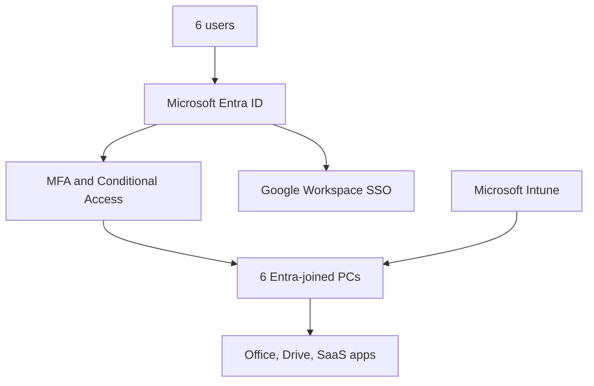
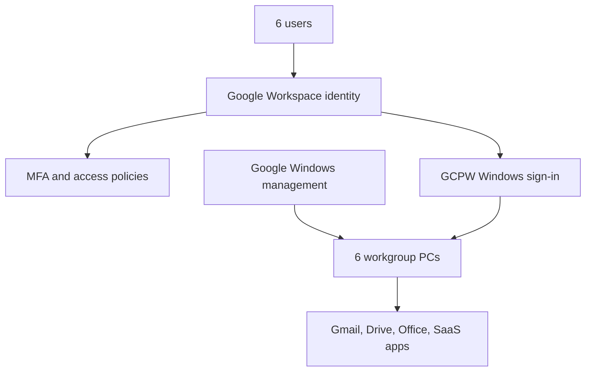
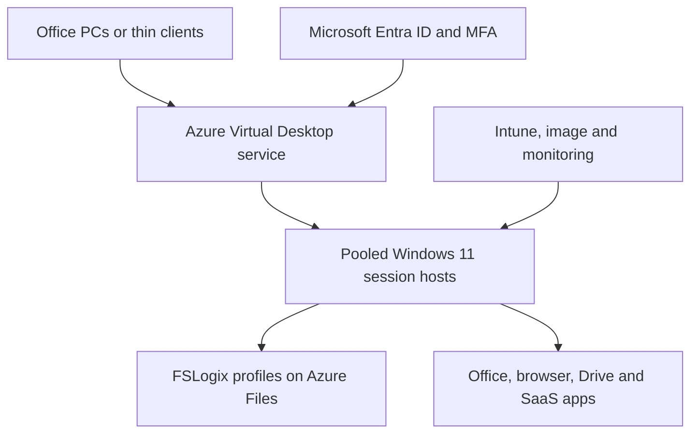

# Cloud Identity and Desktop Modernization Options

**Document status:** Draft v0.1  
**Prepared for:** Small-office cloud migration  
**Scope:** 6 users, 6 office PCs, one existing on-premises Active Directory environment  
**Date:** 2026-08-30  
**Currency:** CAD unless otherwise stated

## 1. Purpose

This document evaluates three options for retiring the existing on-premises Active Directory Domain Services (AD DS) server while retaining six physical office PCs and the current Google Workspace-centered application model.

The evaluated options are:

1. Microsoft Entra ID Join with Microsoft Intune
2. Google Workspace, Google Credential Provider for Windows, and Windows device management
3. Azure Virtual Desktop with centrally managed session hosts and the office PCs used as access terminals

The document defines business and technical requirements, target architectures, migration activities, budgetary costs, implementation effort, constraints, risks, and a recommended direction.

## 2. Critical terminology

Microsoft Entra ID is a cloud identity and access-management service. It is **not** a cloud-hosted replacement for AD DS and does not provide traditional domain controllers, Group Policy, LDAP, Kerberos domain authentication, or NTLM in the same manner as AD DS.

Therefore, the proposed project is not a literal migration of AD DS into Entra ID. It is a modernization project that:

- moves user identity and authentication to a cloud identity provider;
- replaces domain-joined Windows management with modern device management;
- migrates or eliminates workloads currently dependent on the domain controller; and
- retires AD DS only after every dependency has been addressed.

Microsoft Entra Domain Services exists but is not included as a preferred option for this six-user environment. It preserves managed-domain capabilities for legacy applications, but adds cost and operational complexity and does not eliminate the domain model.

## 3. Current-state assumptions

This draft uses the following assumptions. They must be validated during discovery.

| Area | Assumption |
|---|---|
| Users and devices | 6 named users and 6 company-owned Windows PCs |
| Operating system | Windows 11 Pro, or hardware capable of running a supported Windows 11 Pro release |
| Current identity | One on-premises AD DS domain and one domain controller/server |
| Primary collaboration platform | Google Workspace, including Gmail, Google Drive, and Google Docs |
| Microsoft applications | Locally installed Microsoft Office applications are required |
| Other applications | SaaS communication and business applications; no confirmed application requires LDAP, Kerberos, NTLM, or a Windows domain |
| Local data | User profiles and any server file shares can be migrated to approved cloud storage |
| Office network | Reliable business Internet, firewall/router, LAN, and Wi-Fi remain in place |
| Availability | Normal small-business availability; no formal 24x7 high-availability requirement has yet been provided |
| Compliance | No regulated-data, legal-hold, or Canada-only data-residency requirement has yet been confirmed |
| Support | Remote administration is acceptable |

## 4. Requirements

### 4.1 Business requirements

| ID | Requirement | Priority |
|---|---|---|
| BR-01 | Retire the on-premises AD DS server without losing access to users, devices, applications, or business data. | Mandatory |
| BR-02 | Retain the six office PCs unless a device fails compatibility or security checks. | Mandatory |
| BR-03 | Preserve access to Gmail, Google Drive, Google Docs, Microsoft Office, and approved communication tools. | Mandatory |
| BR-04 | Support secure work from the office and, if approved, remote locations. | Mandatory |
| BR-05 | Minimize ongoing administration for an environment with no more than 6–10 users in the near term. | Mandatory |
| BR-06 | Provide a documented onboarding, offboarding, password-reset, device-replacement, and recovery process. | Mandatory |
| BR-07 | Complete migration with a tested rollback method and limited user downtime. | Mandatory |
| BR-08 | Keep licensing and cloud consumption predictable and proportionate to the organization size. | Mandatory |

### 4.2 Identity and access requirements

| ID | Requirement |
|---|---|
| IAM-01 | One approved authoritative identity system must control the user lifecycle. Maintaining two unrelated authoritative directories is not acceptable. |
| IAM-02 | Every user must have an individual account. Shared interactive accounts are prohibited except where a documented application requirement exists. |
| IAM-03 | Phishing-resistant MFA should be used where supported; MFA is mandatory for all users and administrators. |
| IAM-04 | At least two emergency administrator accounts must be created, secured separately, excluded only from policies that would prevent emergency access, and monitored. |
| IAM-05 | Administrative accounts must be separate from routine user accounts. |
| IAM-06 | Access must follow least privilege, with group-based assignment wherever practical. |
| IAM-07 | Authentication and administrator audit logs must be retained for an agreed period. |
| IAM-08 | SaaS applications should use SAML or OpenID Connect single sign-on where supported. |
| IAM-09 | Onboarding and offboarding must add or revoke access across Windows, Google Workspace, Microsoft services, and other SaaS applications. |

### 4.3 Endpoint requirements

| ID | Requirement |
|---|---|
| END-01 | Each retained PC must run a supported edition and release of Windows 11. Windows Home is not acceptable for Microsoft Entra Join. |
| END-02 | Full-disk encryption using BitLocker must be enabled, and recovery keys must be escrowed in an approved administrative system. |
| END-03 | Antivirus/endpoint detection, host firewall, automatic patching, screen lock, and browser security policies must be centrally enforced. |
| END-04 | Users must not receive permanent local-administrator rights. A controlled elevation or support procedure is required. |
| END-05 | A managed local administrator account and password-rotation method are required. |
| END-06 | The system must maintain device inventory, ownership, compliance, and last-contact information. |
| END-07 | Lost, stolen, or retired devices must be blockable and, where supported, remotely wipeable. |
| END-08 | Required applications must be packaged or documented for repeatable installation. |
| END-09 | Existing user profiles, browser data, local files, printers, scanners, webcams, and other required peripherals must be tested before cutover. |

### 4.4 Application and data requirements

| ID | Requirement |
|---|---|
| APP-01 | Create a complete inventory of installed applications, versions, licensing, owners, data locations, and authentication dependencies. |
| APP-02 | Confirm whether any application uses AD security groups, LDAP, Kerberos, NTLM, integrated Windows authentication, mapped drives, or domain service accounts. |
| APP-03 | Confirm whether Microsoft Office licensing permits the selected physical or virtual-desktop deployment. |
| APP-04 | Migrate user and shared data to an approved cloud repository with defined ownership and sharing controls. |
| APP-05 | Google Drive for desktop behavior, offline access, shared drives, file ownership, and local cache capacity must be tested. |
| APP-06 | Backup must be defined independently from synchronization. Google Drive, OneDrive, and an AVD profile container are not by themselves complete backup strategies. |
| APP-07 | Define retention, deletion, legal-hold, and recovery-point objectives before migration. |

### 4.5 Network and infrastructure requirements

| ID | Requirement |
|---|---|
| NET-01 | Inventory every service currently hosted on the AD server, including AD-integrated DNS, DHCP, file shares, print services, certificate services, NPS/RADIUS, VPN authentication, scripts, scheduled tasks, and backup agents. |
| NET-02 | Replace AD-integrated DNS with router/firewall DNS forwarding, a managed DNS service, or another documented design before retiring the domain controller. |
| NET-03 | Move DHCP to the firewall/router or another supported platform if it is currently hosted on Windows Server. |
| NET-04 | Provide stable Internet connectivity with sufficient bandwidth and latency. A secondary Internet connection is recommended if cloud access is business-critical. |
| NET-05 | Maintain a business-grade firewall, current firmware, segmented guest Wi-Fi, and administrative access controls. |
| NET-06 | Permit only documented outbound endpoints required by the selected cloud services. Inbound exposure of Windows hosts is prohibited. |
| NET-07 | Remote support must use an approved secured tool; direct Internet exposure of RDP is prohibited. |

### 4.6 Operations, recovery, and acceptance requirements

| ID | Requirement |
|---|---|
| OPS-01 | Export and protect current AD, DNS, DHCP, GPO, group, user, and computer configuration before migration. |
| OPS-02 | Back up all server and endpoint data and perform at least one sample restore before cutover. |
| OPS-03 | Pilot the selected solution with one user and one non-critical PC before broad migration. |
| OPS-04 | Do not demote or remove the domain controller during the pilot. Preserve a documented rollback window. |
| OPS-05 | Establish monitoring and alerts for identity risk, failed sign-ins, noncompliant devices, endpoint threats, backup failures, and AVD capacity where applicable. |
| OPS-06 | Document the target environment, licenses, policies, application deployment, recovery procedures, and administrative ownership. |
| OPS-07 | Obtain user acceptance for sign-in, Gmail, Drive, Docs, Office, printing, scanning, communication tools, and remote access before final decommissioning. |

### 4.7 Mandatory discovery checklist before design approval

The following must be answered. Without these answers, cost and effort remain budgetary rather than fixed:

- Which Windows Server roles are installed on the current server?
- Are DNS and DHCP running on Windows Server, the firewall, or another device?
- Are there file shares, mapped drives, printer queues, login scripts, or redirected folders?
- Which GPOs exist, and which settings must be recreated?
- Do any applications or appliances authenticate against AD, LDAP, RADIUS, Kerberos, or NTLM?
- Are there domain service accounts, scheduled tasks, Windows services, or scripts?
- Is Active Directory Certificate Services installed or are domain certificates auto-enrolled?
- How much local and shared data exists, and who owns it?
- What Google Workspace edition is currently licensed?
- What Microsoft 365 or Office licenses are already owned?
- Are all PCs running Windows 11 Pro and supported hardware?
- Which peripherals and locally installed applications are mandatory?
- Is remote work required, and from what types of endpoints?
- What recovery time objective (RTO) and recovery point objective (RPO) are required?
- Is Canadian data residency, privacy regulation, cyber-insurance control, or legal retention in scope?

## 5. Solution 1 — Microsoft Entra ID Join and Microsoft Intune

### 5.1 Target architecture

Microsoft Entra ID becomes the authoritative workforce identity and Windows sign-in platform. Each PC is removed from the AD DS domain, joined directly to Entra ID, and enrolled in Intune. Intune replaces required GPO functions with configuration profiles, compliance policies, application deployment, update rings, security baselines, BitLocker management, and remote actions.

Google Workspace remains the primary email and collaboration platform. Entra ID can provide SAML single sign-on and automated provisioning to Google Workspace, subject to detailed configuration and testing. The user objects must be matched carefully to avoid duplicate accounts or incorrect file ownership.

### 5.2 Required components

- Microsoft Entra ID tenant and verified company domain
- Microsoft Entra ID P1 and Microsoft Intune Plan 1 entitlements, preferably through an appropriate Microsoft 365 business bundle
- Supported Windows 11 Pro devices
- Microsoft Intune configuration, compliance, application, and update policies
- MFA and Conditional Access
- Microsoft Defender for Business or another centrally managed endpoint-security platform
- Google Workspace SAML SSO and, if selected, automatic provisioning integration
- Cloud backup for Google Workspace and any other required business data
- Firewall/router-hosted DHCP and non-AD DNS design if currently provided by Windows Server

### 5.3 Implementation sequence

1. Discover AD DS, server-role, application, data, GPO, network, and licensing dependencies.
2. Back up the server and endpoints; export directory and policy configuration.
3. Prepare and secure the Entra tenant, custom domain, administrators, MFA, Conditional Access, and emergency accounts.
4. Configure Intune enrollment, device restrictions, compliance, BitLocker, Defender, Windows Update, local-admin controls, and application deployment.
5. Configure Google Workspace SSO/provisioning in a test group without changing all production users.
6. Build and validate one pilot PC, including user-profile and data migration.
7. Migrate remaining PCs one at a time, keeping the domain controller available for rollback.
8. Validate all acceptance tests and monitor for at least one agreed stabilization period.
9. Move or eliminate remaining DNS, DHCP, file, print, certificate, authentication, and service-account dependencies.
10. Demote and decommission the domain controller only after formal dependency and acceptance sign-off.

### 5.4 Advantages

- Best direct fit for managing company-owned Windows PCs without AD DS.
- Strong Windows-native device configuration, compliance, encryption, update, application, and security controls.
- Physical PCs continue to work locally during a temporary Internet outage after cached sign-in, although cloud applications remain unavailable.
- Lower Azure infrastructure cost and complexity than AVD.
- Supports repeatable device deployment and replacement through Windows Autopilot for compatible procurement scenarios.
- Provides a credible path to a single authoritative identity across Windows and Google Workspace.

### 5.5 Reliability and single-point-of-failure review

Solution 1 removes the on-premises domain controller as an organization-wide dependency, but it does not automatically provide redundant office connectivity or eliminate managed-cloud service outages. The design must explicitly address the remaining failure paths:

- Entra ID and Intune are provider-managed control-plane dependencies. Protect against tenant lockout with two separately protected emergency accounts, independent recovery methods, documented escalation, and tested local-device outage behavior.
- Entra SAML for Google Workspace can become a shared authentication path. Pilot federation, retain a protected direct Google administrative recovery path, and test federation bypass or rollback before enforcing SSO broadly.
- The single ISP/router/firewall path shown in the logical design is a local single point of failure. Back up its configuration, protect it with a UPS, maintain a rapid-replacement plan, and add dual-WAN or cellular failover only when the approved RTO and business value justify the cost.
- A failed PC is a per-user failure. Keep business data in company-controlled cloud locations, maintain a repeatable Intune/Autopilot rebuild process, and test replacement-device recovery; provide a spare or loaner when the user RTO requires it.
- Google Workspace synchronization is not backup. Use independent backup with separate credentials, protected retention, documented exports, and periodic sample restores.

The solution must not be described as fully highly available unless the applicable WAN, power, replacement-equipment, recovery, and failover tests are approved and completed.

### 5.6 Limitations and risks

- GPOs cannot be copied blindly; required settings must be translated to Intune or replaced.
- Applications requiring LDAP, Kerberos, NTLM, domain computer accounts, or Windows integrated authentication need remediation or a separate legacy service.
- User profiles do not automatically convert from AD domain profiles to Entra profiles. Data and selected settings must be migrated with a tested method.
- Google Workspace and Microsoft cloud identities must be integrated deliberately; matching email addresses alone does not create lifecycle integration.
- Maintaining both Google Workspace and a Microsoft 365 bundle may create overlapping email, storage, and collaboration licenses.

### 5.7 Budgetary cost and effort

| Item | Budgetary estimate |
|---|---:|
| Microsoft licensing | Use current reseller quote. As a public reference, Microsoft lists Microsoft 365 Business Premium with Copilot at **CAD 43.40/user/month** on annual billing; 6 users = **CAD 260.40/month** before tax. A narrower combination may cost less if Office, security, or Entra/Intune rights already exist. |
| Google Workspace | Existing subscription retained; incremental cost not included. |
| Cloud backup | CAD 30–100/month, depending on protected services, capacity, retention, and vendor. |
| Azure consumption | Normally negligible for the identity/device-management design itself; excludes optional logging, automation, or other Azure workloads. |
| Implementation effort | **32–48 hours** for a clean six-device environment; add remediation time for legacy applications, complex profiles, server roles, or large data volumes. |
| Indicative one-time services at CAD 125–150/hour | **CAD 4,000–7,200** |

## 6. Option 2 — Google Workspace with GCPW and Windows device management

### 6.1 Target architecture

Google Workspace becomes the authoritative identity. Google Credential Provider for Windows (GCPW) allows users to sign in to Windows using their organizational Google Account. Google's enhanced desktop security features provide Windows settings and device-management capabilities through the Google Admin console.

The PCs are not joined to a traditional Windows domain. This is a cloud-first, workgroup-style design with Google identity integration. It is viable only when the organization has simple endpoint requirements and no remaining dependency on AD DS protocols or domain features.

### 6.2 Required components

- Google Workspace edition that includes the required advanced endpoint and Windows-management features; Business Plus is the baseline assumed in this document
- GCPW deployed and configured on every PC
- Supported Windows edition and Google Chrome
- Google Workspace MFA, administrator protections, context-aware/access policies as licensed, and audit logging
- Defined method for Windows configuration, patching, BitLocker recovery-key custody, local-administrator control, software distribution, and endpoint detection
- Separate Microsoft Office licensing if desktop Office remains required
- Separate backup for Google Workspace data
- Firewall/router-hosted DHCP and non-AD DNS design if currently provided by Windows Server

### 6.3 Implementation sequence

1. Discover AD DS, server-role, application, data, GPO, network, and licensing dependencies.
2. Confirm that Google Workspace is the authoritative directory and select the required edition.
3. Harden Workspace administrator accounts, MFA, organizational units, groups, access controls, and audit settings.
4. Design Windows settings, patching, encryption, endpoint protection, application deployment, and local-admin procedures.
5. Install and configure GCPW and Windows management on one pilot PC.
6. Test how the existing AD profile will be linked or migrated; do not assume the old profile will be adopted automatically.
7. Validate Drive for desktop, Office, printing, scanning, browsers, and all business applications.
8. Deploy the configuration to the remaining PCs and complete user acceptance.
9. Move or eliminate remaining server dependencies.
10. Decommission AD DS only after the environment operates without domain services for the agreed stabilization period.

### 6.4 Advantages

- Aligns identity with the organization's existing Gmail, Drive, and Docs platform.
- Avoids introducing Microsoft as a second primary user directory if Windows-management requirements are modest.
- GCPW provides Google-account-based Windows sign-in and Google service SSO.
- Potentially lower incremental licensing if the organization already owns the required Google Workspace edition.
- Simple conceptual model for a small organization that uses almost entirely web and SaaS applications.

### 6.5 Limitations and risks

- This is not a functional replacement for a Windows domain. It does not reproduce AD DS computer accounts, Group Policy breadth, LDAP, Kerberos domain services, NTLM domain authentication, or Windows-integrated access to legacy resources.
- Google's Windows-management controls are narrower than Intune. Exact requirements for application packaging, endpoint detection and response, privileged access, BitLocker recovery, configuration reporting, and remediation must be tested rather than assumed.
- If a separate RMM/UEM, endpoint-security, patching, or privilege-management product is needed, the apparent simplicity and cost advantage decreases.
- GCPW creates or associates a Windows user experience, but profile migration must be piloted. Incorrect profile handling can strand local application settings and data.
- Locally installed Microsoft Office still requires valid Microsoft licensing and its update channel must be managed.
- This option should be rejected if discovery identifies any non-remediable domain-dependent application or security control.

### 6.6 Budgetary cost and effort

| Item | Budgetary estimate |
|---|---:|
| Google Workspace Business Plus | Google publicly lists **USD 22/user/month** on an annual/fixed-term plan or **USD 26.40/user/month** on a flexible plan. For 6 users: **USD 132–158.40/month**, before tax and currency conversion. If already licensed, count only the upgrade delta from the existing edition. |
| Microsoft Office | If not already licensed, Microsoft publicly lists Apps for business at **CAD 14.20/user/month** on annual billing; 6 users = **CAD 85.20/month** before tax. Confirm whether the actual existing license can be retained. |
| Supplemental endpoint/RMM tooling | CAD 0–180/month. This cannot be fixed until security and management gaps are assessed. |
| Cloud backup | CAD 30–100/month, depending on protected services, capacity, retention, and vendor. |
| Implementation effort | **28–44 hours** if no domain-dependent workload remains; add time for third-party endpoint tooling, profile remediation, or application packaging. |
| Indicative one-time services at CAD 125–150/hour | **CAD 3,500–6,600** |

## 7. Option 3 — Azure Virtual Desktop with office PCs as terminals

### 7.1 Target architecture

Users connect from the office PCs to a centrally managed Azure Virtual Desktop (AVD) environment. Applications are installed in a standard Windows 11 Enterprise multi-session image. User profiles are stored in FSLogix profile containers, normally on Azure Files. The local office PCs act primarily as secured access devices.

For six office users, the baseline is a pooled host pool rather than six dedicated virtual machines. One correctly sized session host may support normal office work, but it is a single point of failure. A production design should allow a second host for maintenance and recovery, with autoscale controlling runtime where appropriate.

### 7.2 Required components

- Azure tenant, subscription, billing controls, resource groups, and region selection
- Microsoft Entra ID and eligible per-user AVD licenses; Microsoft 365 Business Premium is an eligible internal-user license
- AVD workspace, host pool, application group, session hosts, and scaling plan
- Supported Windows 11 Enterprise multi-session image and repeatable image-maintenance process
- Intune or another supported configuration-management approach for session hosts
- Azure Files and FSLogix profile containers, permissions, monitoring, backup, and recovery design
- Network security controls and, only if private resources require it, VNet integration, private endpoints, DNS, firewall, or VPN
- Remote Desktop client or supported browser access on each terminal
- Sufficient Internet bandwidth, low latency, and preferably a backup Internet connection
- Peripheral redirection validation for printers, scanners, webcams, microphones, USB devices, and multiple monitors
- Google Drive for desktop compatibility and cache/profile behavior testing in multi-session Windows

### 7.3 Initial sizing assumption

The following is a starting point, not an approved production size:

- Pooled host pool for 6 named users
- Windows 11 Enterprise multi-session
- 1 general-purpose 8-vCPU/32-GB session host during normal operation
- Capacity for a second host during maintenance, incidents, or high load
- Approximately 30–50 GB of profile capacity per user initially, adjusted after measurement
- Autoscale schedule aligned with business hours
- Standardized application image and monthly patch/release cycle
- No GPU workload and no heavy CAD, engineering, video-editing, or compute-intensive application

Sizing must be tested with actual browser tabs, Google Drive behavior, Office files, videoconferencing, printing, and concurrent-user workload. A paper estimate is insufficient.

### 7.4 Implementation sequence

1. Complete the same AD DS and application discovery required by the other options.
2. Establish Azure governance, security, budgets, naming, region, logging, and administrative roles.
3. Prepare Entra ID, MFA, Conditional Access, emergency accounts, groups, and licensing.
4. Build the AVD network, workspace, pooled host pool, application group, and autoscale plan.
5. Create a hardened standard image with Office, browsers, Google components, communication tools, security agents, and required line-of-business applications.
6. Configure Azure Files, FSLogix, permissions, profile exclusions, backup, and restore tests.
7. Pilot with one or two users and measure sign-in time, CPU, memory, storage IOPS, application performance, videoconferencing, and peripheral redirection.
8. Adjust host size, session density, scaling, image, and profile settings using pilot evidence.
9. Configure and harden the six endpoint/terminal devices and deploy the Remote Desktop client.
10. Migrate users in stages, stabilize, eliminate server dependencies, and then retire AD DS.

### 7.5 Advantages

- Centralized application installation, patching, security, and desktop configuration.
- User data and application execution remain in Azure rather than on each office terminal, subject to redirection and download policies.
- Existing PCs can have extended useful life if they can securely run the AVD client and supported local operating system.
- A standard image reduces configuration drift across user desktops.
- Supports controlled remote access without exposing RDP directly to the Internet.
- Pooled multi-session desktops can be more economical than six dedicated Cloud PCs when concurrency and schedules are well managed.

### 7.6 Limitations and risks

- Highest architecture and operational complexity of the three options.
- AVD is not automatically cheap. Compute, storage, backup, monitoring, network services, image maintenance, and support all add cost.
- Business productivity depends on Internet and Azure availability. A local Internet outage can stop all desktop work.
- One host is a single point of failure; two always-on hosts improve availability but increase cost.
- Poorly configured FSLogix storage causes slow sign-ins, profile corruption, or failed sessions.
- Google Drive for desktop and other per-user applications require explicit multi-session compatibility testing.
- Audio/video meetings, printers, scanners, USB devices, multiple monitors, and other redirected peripherals can produce a worse experience than local execution.
- An AVD environment still needs active management: image updates, application releases, capacity, profiles, monitoring, security, and incident response.
- AVD does not eliminate identity design. Session hosts still require a supported identity and join model, and legacy application dependencies remain relevant.

### 7.7 Budgetary cost and effort

| Item | Budgetary estimate |
|---|---:|
| Eligible Microsoft user licensing | Use current reseller quote. The same public **CAD 43.40/user/month** Microsoft 365 Business Premium with Copilot reference produces **CAD 260.40/month** for 6 users. Other eligible AVD licenses may be appropriate depending on existing entitlements. |
| Azure AVD infrastructure | **CAD 300–700/month** budgetary range for session-host compute, profile storage, backup, monitoring, and modest network usage. High availability, private networking, extended hours, heavy workloads, or larger profiles can exceed this range. Validate with the Azure Pricing Calculator and a measured pilot. |
| Google Workspace | Existing subscription retained; incremental cost not included. |
| Cloud backup outside AVD profiles | CAD 30–100/month, depending on protected data and retention. |
| Implementation effort | **48–72 hours** for a basic production deployment and pilot; application complexity, private networking, high availability, or formal disaster recovery increases effort. |
| Indicative one-time services at CAD 125–150/hour | **CAD 6,000–10,800** |

## 8. Comparative assessment

Scoring uses 1 = weak/unfavourable and 5 = strong/favourable for this specific six-user environment.

| Criterion | Solution 1: Entra + Intune | Option 2: Google + GCPW | Option 3: AVD |
|---|:---:|:---:|:---:|
| Windows endpoint management | 5 | 2 | 5 |
| Alignment with Google Workspace | 4 | 5 | 3 |
| Replacement of common GPO/security controls | 5 | 2 | 5 |
| Simplicity of architecture | 4 | 5 | 2 |
| Lowest likely recurring cost | 4 | 5 | 2 |
| Offline/local productivity | 5 | 5 | 1 |
| Centralized application delivery | 3 | 2 | 5 |
| Dependence on office Internet | 3 | 3 | 1 |
| Suitability for legacy domain-dependent apps | 1 | 1 | 3, only with additional domain services |
| Operational effort | 4 | 4 | 2 |
| Overall fit, subject to discovery | **5** | **3** | **3** |

The numbers are decision aids, not measurements. A mandatory requirement overrides the score. For example, if a critical application requires domain Kerberos and cannot be modernized, neither Solution 1 nor Option 2 can be approved as written.

## 9. Cost summary

| Option | Main monthly costs | One-time implementation estimate |
|---|---:|---:|
| Solution 1: Entra ID + Intune | Approximately CAD 260.40 Microsoft reference licensing + CAD 30–100 backup; subtract already-owned entitlements and obtain a reseller quote | CAD 4,000–7,200 |
| 2. Google + GCPW | USD 132–158.40 Google Business Plus + CAD 85.20 Office if needed + CAD 0–180 supplemental endpoint tooling + CAD 30–100 backup | CAD 3,500–6,600 |
| 3. AVD | Approximately CAD 260.40 eligible Microsoft reference licensing + CAD 300–700 Azure + CAD 30–100 backup, while retaining Google Workspace | CAD 6,000–10,800 |

These figures are planning estimates, not quotations. They exclude tax, reseller margin, hardware replacement, Internet upgrades, formal project management, after-hours cutover, regulated-compliance work, large data migration, complex application remediation, and ongoing managed support. Google pricing is shown in USD where the public source provides USD figures. Azure consumption must be recalculated for the selected Canadian region, workload schedule, reservation model, storage tier, and availability design.

## 10. Recommendation

### 10.1 Preferred solution

Proceed with **Solution 1: Microsoft Entra ID Join and Microsoft Intune**, while retaining Google Workspace for Gmail, Drive, and Docs and integrating it with Entra ID for SSO and lifecycle management.

This solution is the strongest fit because the problem includes Windows workstation identity, security, configuration, patching, encryption, and application management—not merely access to Google applications. Intune has the most complete native control plane for those Windows requirements without introducing persistent virtual-desktop infrastructure.

### 10.2 Conditional alternatives

Choose **Option 2** only if discovery proves all of the following:

- the PCs require only basic Windows configuration and software management;
- no application or appliance depends on AD DS protocols or domain membership;
- Google Workspace provides every required endpoint control, or identified gaps are accepted and funded through another product; and
- the organization accepts a workgroup-style Windows architecture.

Choose **Option 3** only if centralized desktops provide a documented business benefit that justifies the extra cost and operational burden, such as:

- users need the same managed desktop from office and remote locations;
- local endpoint data must be minimized;
- application deployment and version consistency are materially difficult on physical PCs; or
- aging PCs need to function as access terminals while applications run centrally.

For only six users with ordinary SaaS and Office workloads, AVD is technically valid but usually excessive unless one of those benefits is mandatory.

## 11. Proposed next steps

1. Run a 4–8 hour discovery workshop and technical assessment using the checklist in Section 4.7.
2. Produce an application and server-dependency register with an owner and disposition for every item.
3. Confirm existing Google, Microsoft, Windows, Office, endpoint-security, backup, and Internet-service entitlements.
4. Approve the authoritative identity platform and the target security baseline.
5. Obtain reseller quotations and calculate Azure pricing using the actual region and measured schedule.
6. Build a one-user/one-device pilot without altering the production domain controller.
7. Update this document with pilot results, confirmed pricing, final RTO/RPO, cutover steps, rollback criteria, and the decommissioning checklist.

## 12. Acceptance criteria

The project is complete only when:

- all six users can sign in with the approved cloud identity and MFA;
- all six PCs or terminal devices are inventoried, encrypted, patched, protected, and centrally managed;
- Gmail, Google Drive, Google Docs, Microsoft Office, communication tools, printing, scanning, and required peripherals pass user acceptance testing;
- user and shared data have been migrated, protected, and sample-restored;
- onboarding, offboarding, support, device replacement, and emergency access have been tested and documented;
- DNS, DHCP, file, print, LDAP, Kerberos, NTLM, RADIUS, VPN, certificate, service-account, script, and scheduled-task dependencies have documented replacements or have been proven unused;
- rollback criteria and the stabilization period have been satisfied;
- the domain controller has been demoted cleanly and its backups retained according to the approved retention plan; and
- final architecture, configuration, licensing, operating procedures, and recovery documentation have been handed over.

## 13. References

- [Microsoft: Plan a Microsoft Entra join deployment](https://learn.microsoft.com/en-us/entra/identity/devices/device-join-plan)
- [Microsoft: What is a Microsoft Entra joined device?](https://learn.microsoft.com/en-us/entra/identity/devices/concept-directory-join)
- [Microsoft: Windows device enrollment guide for Intune](https://learn.microsoft.com/en-us/intune/device-enrollment/windows/guide)
- [Microsoft: Microsoft 365 business plans and pricing in Canada](https://www.microsoft.com/en-ca/microsoft-365/business/microsoft-365-plans-and-pricing)
- [Microsoft: Google Cloud / G Suite Connector SSO with Entra ID](https://learn.microsoft.com/en-us/entra/identity/saas-apps/google-apps-tutorial)
- [Microsoft: Google Workspace automatic provisioning with Entra ID](https://learn.microsoft.com/en-us/entra/identity/saas-apps/g-suite-provisioning-tutorial)
- [Google: Enhanced desktop security for Windows overview](https://knowledge.workspace.google.com/admin/devices/overview-enhanced-desktop-security-for-windows)
- [Google: Install Google Credential Provider for Windows](https://knowledge.workspace.google.com/admin/devices/install-google-credential-provider-for-windows)
- [Google: Enable Windows device management](https://knowledge.workspace.google.com/admin/devices/enable-windows-device-management)
- [Google: Google Workspace business editions](https://knowledge.workspace.google.com/admin/getting-started/editions/business-editions)
- [Microsoft: Azure Virtual Desktop licensing](https://learn.microsoft.com/en-us/azure/virtual-desktop/licensing)
- [Microsoft: Azure Virtual Desktop prerequisites](https://learn.microsoft.com/en-us/azure/virtual-desktop/prerequisites)
- [Microsoft: FSLogix profile containers for Azure Virtual Desktop](https://learn.microsoft.com/en-us/azure/virtual-desktop/fslogix-profile-containers)
- [Microsoft: Azure Virtual Desktop autoscale scaling plans](https://learn.microsoft.com/en-us/azure/virtual-desktop/autoscale-create-assign-scaling-plan)
- [Azure Pricing Calculator](https://azure.microsoft.com/en-ca/pricing/calculator/)
