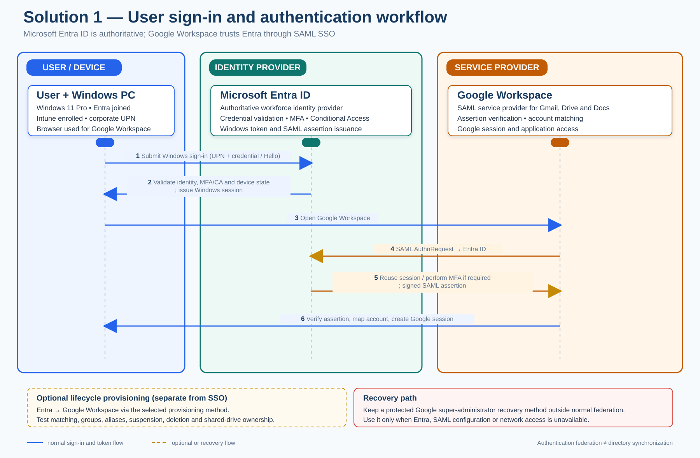

# Solution 1 — Microsoft Entra ID + Microsoft Intune

## Detailed architecture design, analysis, and comparison

**Design scope:** 6-10 Windows 11 PCs, six initial users, small-business LAN, Google Workspace-centered SaaS, Microsoft Office, and removal of the on-premises Active Directory Domain Services (AD DS) server.

**Document relationship:** This is the detailed design for Solution 1. The authoritative baseline remains [`requirements.md`](requirements.md). Remote work and user/device portability are optional capabilities; security, recovery, endpoint control, and AD dependency removal remain mandatory.

## 1. Executive decision

Microsoft Entra ID + Microsoft Intune is the strongest default architecture for this environment because the core problem is not only user authentication. It also includes Windows sign-in, endpoint configuration, patching, encryption, application deployment, local-administrator control, device inventory, and secure retirement of AD DS.

The target keeps the physical PCs and local Windows productivity model. It moves identity and endpoint control to Microsoft’s cloud control plane, keeps Google Workspace for Gmail, Drive, Docs, and collaboration, and moves basic DNS/DHCP responsibilities to the existing router or firewall. It does **not** introduce Azure virtual machines, Azure Virtual Desktop, a replacement domain controller, or a new office server.

The recommended baseline is:

- Microsoft Entra ID as the authoritative workforce identity;
- Microsoft 365 Business Premium with Teams as the baseline user subscription, including Entra ID P1-level controls and Intune Plan 1;
- Windows 11 Pro, Entra joined, Intune enrolled, encrypted, and centrally governed;
- Google Workspace retained as an optional collaboration and mail platform; its license fee is excluded from the baseline cost;
- Entra SAML SSO to Google Workspace, with automated provisioning only if tested and required;
- Google Drive/shared drives for approved business data, with independent backup;
- the office router/firewall providing DHCP and DNS forwarding after AD DS retirement;
- optional remote work or secondary-device portability enabled only through a separate decision.

Entra ID is not hosted AD DS. It does not provide traditional domain controllers, Group Policy, LDAP, Kerberos, or NTLM in the same way as AD DS. Every remaining dependency on those protocols must be removed, replaced, or explicitly retained before the domain controller is decommissioned.

## 2. Architecture diagram

The diagram shows the normal control and data paths in blue. The orange dashed path is optional mobility and is not required for acceptance of the baseline design.

## 3. Design principles

### 3.1 Small-business proportionality

The architecture must remain supportable for 6–10 users without a full-time specialist. It should use standard managed services, a small number of policy objects, exception-based monitoring, and documented repeatable procedures.

### 3.2 Local productivity remains the default

The PCs remain normal Windows endpoints. Users can run approved Office applications, Chrome, Google Drive for desktop, communication software, and local peripheral workflows. A cloud identity control plane does not require every application to be converted into a browser application.

### 3.3 Cloud control without cloud desktop infrastructure

Entra ID and Intune provide identity and endpoint control. They do not require Azure compute, Azure Files, a virtual network, or AVD session hosts. This materially reduces cost, failure modes, and operational workload.

### 3.4 One authoritative identity lifecycle

Entra ID should own the workforce user lifecycle for this option. Google Workspace remains a business SaaS platform and can trust Entra through SAML. If automated provisioning is enabled, it must be tested against existing Google accounts, primary email addresses, aliases, groups, shared-drive ownership, and offboarding behavior.

### 3.5 Recovery is mandatory; mobility is optional

The business must be able to replace a failed PC, recover data, restore administrative control, and transfer support responsibility. Employees do not need to be permitted to work remotely or use secondary devices unless the business separately approves that capability.

### 3.6 Five-pillar validation using the Azure Well-Architected lens

The Azure Well-Architected Framework is used here as a technology-neutral quality lens. Solution 1 does not deploy Azure compute; the same five concerns still apply to Entra ID, Intune, Google Workspace, SaaS dependencies, and local Windows endpoints.

| Pillar | Assessment | Controls and evidence required before approval |
|---|---|---|
| Reliability | Partial; recovery is defined, but service-path continuity must be evidenced | Set the approved RTO/RPO and an outage matrix for Entra, Google federation, Internet, router/firewall, and individual PCs. Test cached sign-in for previously signed-in users, the direct Google recovery/federation-rollback path, router configuration restore, and replacement-PC recovery. Do not claim full high availability without approved redundant connectivity or equipment. |
| Security | Strong baseline; operational response must be demonstrated | Keep MFA/Conditional Access, separate admin identities, two emergency accounts, BitLocker escrow, Defender/AV, Windows LAPS, standard-user controls, and no Internet-exposed administration. Add evidence for incident triage, lost-device response, token/session revocation, and periodic Entra/Intune/security-log review. |
| Cost Optimization | Partially explicit | Maintain the licensing, backup, and Azure subscription cost model, an approved monthly ceiling, monthly license/utilization review, and removal of unused or duplicate services. Price optional mobility/BYOD and any Azure resource consumption separately. |
| Operational Excellence | Strong process foundation; ownership and service-health handling must be explicit | Name a primary and backup operator, retain Pilot/Standard/Exception change records, and maintain runbooks for enrollment, policy rollback, incident escalation, offboarding, restore, and device replacement. Review Microsoft, Google, endpoint, backup, and firewall service health and alerts on the agreed schedule. |
| Performance Efficiency | Missing an explicit measurement baseline | Measure Windows sign-in, Intune enrollment and policy/application deployment, update completion, Google Workspace/Drive/Office responsiveness, endpoint CPU/memory/disk, and office bandwidth/latency. Review trends for the six-to-ten-PC population and add capacity or simplify policies only when measurements show a need. |

## 4. Logical architecture

### 4.1 Identity and access layer

**Microsoft Entra ID** is the authoritative identity service.

Recommended objects and controls:

- one verified corporate domain;
- one named account per employee;
- separate administrator accounts for administrative work;
- at least two emergency administrator accounts protected independently;
- security groups for pilot, standard devices, exceptions, administrators, and application assignments;
- MFA for all users and administrators;
- Conditional Access policies appropriate to the selected license level;
- self-service password reset where recovery controls are acceptable;
- least-privilege Entra roles and Intune roles;
- sign-in and audit-log retention for the approved period;
- documented joiner, mover, leaver, and emergency-access procedures.

Avoid making a personal account, a single employee, or a single unmanaged recovery method the owner of the tenant, domain, billing relationship, or emergency access.

### 4.2 Windows endpoint layer

Each retained PC becomes:

- Windows 11 Pro on supported hardware;
- Microsoft Entra joined, not hybrid joined;
- enrolled in Intune;
- assigned to a device group and compliance policy;
- encrypted with BitLocker, with recovery keys escrowed in an approved administrative system;
- protected by Microsoft Defender or an approved endpoint-security product;
- configured with host firewall, screen lock, update rings, browser security, and standard-user controls;
- administered through controlled elevation rather than permanent local-administrator rights;
- assigned a managed local administrator account with Windows LAPS or an equivalent password-rotation control;
- inventoried with owner, serial number, operating-system version, compliance state, and last-contact information.

### 4.3 Intune management layer

#### Purpose and problems solved

Microsoft Intune is the cloud endpoint-management service for the Windows PCs. It is the device-control plane in this architecture: it enrolls, configures, secures, updates, inventories, and retires endpoints and applications. Intune also reports device compliance to Microsoft Entra ID so that access policies can use the device's security state. See Microsoft's [Intune overview](https://learn.microsoft.com/en-us/intune/fundamentals/what-is-intune) and [core concepts](https://learn.microsoft.com/en-us/intune/fundamentals/core-concepts).

The boundary between the two services is deliberate:

| Service | Question it answers | Responsibilities |
|---|---|---|
| **Microsoft Entra ID** | Who is the user, and may they authenticate? | Users, groups, MFA, Conditional Access, SSO, roles, sign-in logs, and lifecycle status |
| **Microsoft Intune** | How must the Windows PC be configured, protected, and maintained? | Enrollment, configuration, applications, updates, security posture, compliance, inventory, and remote device actions |

Intune resolves the main operational gaps created by removing the domain controller:

- **GPO loss:** applies required Windows configuration and security outcomes as cloud policies;
- **manual PC setup:** standardizes enrollment, configuration, applications, and replacement-device provisioning;
- **patch and security drift:** uses update rings, security baselines, and compliance policies;
- **uncontrolled software and administration:** deploys approved applications and enforces standard-user and least-privilege controls; and
- **limited visibility and recovery:** provides inventory, compliance status, alerts, remote actions, and a repeatable rebuild process.

For this option, Intune is not a hosted replacement for AD DS. It does not provide DNS, DHCP, LDAP, Kerberos, file shares, print services, certificates, VPN/RADIUS, or application-specific service accounts. Those dependencies still require separate remediation before AD DS decommissioning.

Intune is effectively mandatory for the full **Entra ID + Intune** target. Entra-only device join would provide cloud identity, but it would not satisfy the architecture's requirements for centralized Windows configuration, patching, compliance, application deployment, inventory, endpoint recovery, and low-effort remote administration. The six-to-ten-PC deployment should use a deliberately small policy model rather than enterprise-scale policy sprawl.

Keep the policy model deliberately small:

| Policy area | Baseline design |
|---|---|
| Enrollment | Automatic enrollment for corporate devices; Autopilot for new or reset devices where practical; provisioning package or documented manual enrollment for existing devices if a wipe is deferred |
| Device groups | `Pilot`, `Standard`, and `Exception`; avoid per-user/per-PC policy sprawl |
| Configuration | Security baseline, screen lock, firewall, browser, Defender/AV, Windows Update, local-admin restrictions, and approved personalization settings |
| Compliance | Windows version, encryption, secure boot/TPM where applicable, antivirus health, firewall, and recent check-in |
| Applications | Required browsers, Office, Google Drive for desktop, communications tools, support agent, and approved line-of-business applications |
| Updates | Pilot ring followed by standard ring; quality and security updates deployed within the documented deadline |
| Recovery | BitLocker recovery keys, device retire/wipe actions, rebuild documentation, and sample restore testing |
| Monitoring | Actionable alerts for noncompliance, failed enrollment, threats, update failures, and device inactivity |

Do not recreate every historical GPO automatically. Classify each setting as required, useful, obsolete, or unsafe; implement only the required outcome in Intune.

### 4.4 Google Workspace integration

Google Workspace remains the platform for:

- Gmail;
- Google Drive and shared drives;
- Google Docs and other Workspace applications;
- Google-based collaboration and communication where used.

For the Entra-authoritative model:

1. Verify the corporate domain in both tenants.
2. Configure the Microsoft Entra Google Workspace SAML application.
3. Test one non-production or pilot group.
4. Confirm the exact Google sign-in URL, domain routing, mobile/browser behavior, recovery flow, and break-glass procedure.
5. Add automated provisioning only after confirming attribute mappings, account matching, group behavior, suspension, deletion, and shared-drive ownership.
6. Keep at least one documented administrative recovery path that does not depend on a failed federation configuration.

SAML SSO does not automatically synchronize every user, group, license, or file permission. Those behaviors must be tested and documented.

#### User sign-in and authentication workflow

The workflow has two related but distinct authentication paths:

1. The user signs in to the Entra-joined Windows PC with the corporate Entra account. Entra ID validates the identity and applies the configured MFA plus Conditional Access and device-state requirements where the selected license supports them. After successful authentication, Windows creates the user session; previously signed-in users may have limited cached sign-in continuity during a short connectivity outage.
2. Intune supplies the device-management and compliance state used by the endpoint and, where configured, by Conditional Access. Intune does not authenticate the Google Workspace user or replace Entra ID as the identity provider.
3. When the user opens Google Workspace, Google acts as the SAML service provider. If there is no valid Google session, Google redirects the browser to Entra ID with a SAML authentication request.
4. Entra reuses the valid Entra session or performs the required authentication and MFA checks, then returns a signed SAML assertion to Google Workspace through the browser.
5. Google verifies the assertion, matches the stable identifier/primary email to the existing Workspace account, creates a Google session, and grants access to Gmail, Drive, Docs, and other approved Workspace services.

SAML SSO is authentication federation, not directory synchronization. Optional provisioning is a separate Entra-to-Google lifecycle workflow and must be tested for account matching, group behavior, suspension, deletion, aliases, and shared-drive ownership. At least one protected Google super-administrator recovery path must remain usable if Entra federation is unavailable.

### 4.5 Office and other SaaS

Microsoft Office licensing must be treated separately from identity design. The business may use existing Office licenses, a Microsoft 365 bundle, or another valid license model. Do not purchase Exchange, OneDrive, SharePoint, or Copilot merely because Intune or Entra is selected unless those services have a confirmed business purpose.

Every additional SaaS application must be inventoried for:

- authentication method;
- SAML/OIDC support;
- user-provisioning and offboarding behavior;
- local-data location;
- licensing owner;
- backup and retention capability;
- dependence on AD groups, LDAP, Kerberos, NTLM, mapped drives, or service accounts.

### 4.6 Office network layer after AD DS retirement

The permanent office network should use the existing business-grade router/firewall for:

- DHCP scopes and reservations;
- DNS forwarding and local name-resolution rules;
- guest Wi-Fi isolation;
- outbound Internet filtering as appropriate;
- VPN or secure remote-support capability if separately approved;
- administrative access control and firmware updates.

The design must not expose RDP, SMB, LDAP, or administrative services directly to the Internet. If an application still requires domain DNS, DHCP, file shares, certificates, or authentication from the old server, AD DS retirement is blocked until that dependency is resolved.

### 4.7 Data and backup layer

Google Drive synchronization is not a complete backup. The design requires:

- clear ownership of shared drives and business data;
- no business-critical data stored only on one PC;
- independent backup for Google Workspace data and any required local endpoint data;
- defined retention, RPO, RTO, and deletion behavior;
- at least one sample restore before cutover and periodic restore testing afterward;
- documented export and vendor-exit procedures;
- protected administrative credentials, recovery keys, and configuration documentation.

### 4.8 Azure subscription and governance layer

The approved Solution 1 baseline includes one company-owned Azure subscription associated with the Microsoft Entra tenant. The subscription is a required Azure-side ownership, billing, and governance boundary for the project; it is not a replacement for Entra ID or Intune.

Required Azure subscription work:

- create or select the subscription under the company billing account and associate it with the production Entra tenant;
- assign separate billing, subscription-owner, contributor, and read-only support roles;
- enable subscription activity logging, budget thresholds, cost alerts, tags, support contacts, and policy controls;
- restrict resource deployment to approved administrators and approved regions;
- document the subscription ID, tenant relationship, billing owner, break-glass procedure, and transfer process; and
- keep Azure compute, Azure Files, AVD, VNets, and other resource consumption out of the baseline unless separately approved and priced.

The approved baseline user subscription is Microsoft 365 Business Premium with Teams, which includes Entra ID P1-level controls and Intune Plan 1. Standalone Intune Plan 1 with Entra ID Free remains an optional reduced-control profile. The Azure subscription provides the Azure management and billing boundary. Keep the subscriptions associated with the same company-owned Entra tenant and do not create duplicate tenants for the same workforce.

### 4.9 Optional Azure VM jumpbox and Azure Arc add-ons

These services are optional add-ons and are not required for the Solution 1 baseline. Each requires a separate purpose, owner, security review, budget, implementation scope, and removal or review date.

#### Optional Azure VM jumpbox or temporary remote server

Use a small hardened Azure VM only when a temporary migration server, administrative jumpbox, or controlled remote administration path provides a clear benefit. It is not a general employee remote-work desktop, replacement domain controller, or permanent file server.

- place the VM in a dedicated resource group and private subnet with tags, RBAC, budgets, alerts, patching, backup, and an automatic shutdown schedule;
- provide administration through Azure Bastion or an approved point-to-site VPN with Entra authentication and MFA; when the VM must reach on-premises systems, use an approved site-to-site VPN or other private connection; do not assign a public IP or expose Internet RDP/SSH;
- restrict network egress and administrative roles to the approved migration/support purpose; and
- define an expiry date, remove temporary data, and deallocate or delete the VM and supporting resources when the work is complete.

#### Optional Azure Arc-enabled on-premises hosts

Use Azure Arc-enabled servers only when an on-premises host must remain during transition or under an approved exception. Install the Azure Connected Machine agent on each target Windows or Linux server, permit the required outbound connectivity, and manage the resulting Azure resource with separate RBAC, tags, policies, and extension allowlists. Azure Arc does not replace AD DS or make a retired server a cloud service.

Arc can provide a unified inventory and Azure management view. Azure Monitor, Update Manager, Defender for Cloud, Sentinel, guest configuration, log ingestion, and other management or security services are separate add-ons and may create per-server or consumption charges. Use extra care before connecting Tier 0 hosts such as a domain controller or certificate authority.

### 4.10 Optional business value-adds

The following capabilities can improve productivity or reduce support effort, but they are not required to meet the Solution 1 baseline. For a six-user business, select only the capabilities with an identified owner, measurable outcome, approved data boundary, and acceptable recurring cost.

#### Recommended low-cost value-adds

| Capability | Small-business value | Planning treatment |
|---|---|---|
| Windows Autopilot and a standard replacement process | Reduces hands-on effort when a PC is replaced and provides a repeatable user setup | Uses the existing Intune/Business Premium platform; allow approximately **4–8 hours** for profile, application, testing, and replacement-runbook work. Autopilot is for organization-owned devices. |
| SharePoint/Teams operating hub | Provides one small, searchable location for policies, procedures, templates, onboarding material, forms, and approved shared documents | Usually uses services already included in Business Premium; allow **6–12 hours** for information architecture, permissions, versioning, and adoption. Do not create a second authoritative file store without deciding how it relates to Google Drive. |
| Power Automate standard workflows | Automates joiner/leaver checklists, approvals, reminders, backup exceptions, and simple service requests | Use standard Microsoft 365 connectors first; allow **2–4 hours per lightweight workflow**. Premium/custom connectors, on-premises gateways, RPA, and AI Builder require separate licensing or review. |
| Mobile application management (MAM) | Allows controlled access to approved Microsoft applications from a phone or BYOD device without fully managing the personal device | Optional remote-work capability using Intune; allow **4–8 hours** for app-protection, Conditional Access, testing, and user guidance. |

Microsoft documents describe Autopilot as a cloud-based device-lifecycle service, provide limited Power Automate rights with Microsoft 365 licenses, and identify Business Premium as an eligible license for Intune enrollment scenarios. See the references in section 15.

#### AI, Copilot, and chatbot options

| Option | Appropriate use | Boundary and cost treatment |
|---|---|---|
| Microsoft 365 Copilot Chat | Web research, drafting, summarization, and everyday employee assistance | Eligible Business Premium users can use the web-based Copilot Chat experience without an additional Copilot license. It should not be presented as a full work-grounded assistant for Google Workspace data. Allow **2–4 hours** for enablement, safe-use guidance, and a short pilot. |
| Microsoft 365 Copilot pilot | Meeting, email, document, and Microsoft 365 work-data assistance for one or two high-value users | Requires a separate per-user Copilot add-on. Review Microsoft 365 permissions and oversharing before enabling work-grounded access; allow **4–8 hours** for the pilot, training, and outcome review. Do not license all six users until measurable value is demonstrated. |
| Copilot Studio internal FAQ agent | Answers recurring IT, HR, operating-procedure, or customer-service questions in Teams or an approved website | Requires separate agent licensing, Copilot Credits, or usage-based billing depending on the design. Use a curated knowledge source, named content owner, human escalation path, logging, and an accuracy review; allow **8–16 hours** for a small internal agent. |
| Custom Azure AI/Azure OpenAI chatbot | Bespoke customer-facing or line-of-business automation that cannot be handled by Microsoft 365 or Copilot Studio | Treat as a separate application project with model, hosting, data, security, monitoring, and consumption costs. It is not recommended for the current baseline without a defined revenue or service-desk use case. |

The current architecture remains Google Workspace-centered. Microsoft 365 Copilot work grounding is therefore most valuable only after the business decides which Microsoft 365 content is authoritative. Do not pay for both Microsoft Copilot and another AI service without a specific workflow, data source, owner, and success measure.

#### Targeted security and Azure enhancements

- **Azure Arc plus Update Manager:** worthwhile when an on-premises server remains during transition and the business wants a central patch-compliance view. This extends the existing Arc add-on and can create per-server charges for Arc-connected machines.
- **Azure Monitor and Log Analytics:** useful for the optional jumpbox or Arc-connected hosts when actionable health, update, or security alerts are required. Keep collection limited to the required signals because ingestion and retention can create consumption charges.
- **Azure Backup:** appropriate for an approved Azure VM or critical retained server; it does not replace the independent Google Workspace and endpoint backup requirement.
- **Microsoft Defender Suite for Business Premium:** consider only for an elevated threat, compliance, or incident-response requirement. The baseline already includes Defender for Business, so this is a security step-up rather than a default purchase.

#### Capabilities to defer unless a business case exists

Defer Microsoft Sentinel, Azure Firewall, Azure SQL, Azure Functions/App Service, a custom Azure AI application, Entra ID P2/governance features, and Azure Virtual Desktop. These services can be valuable for a larger or regulated environment, but they add cost and operational complexity without a current Solution 1 requirement.

## 5. User and administrator flows

### 5.1 Normal user sign-in

See the detailed [user sign-in and authentication workflow](#user-sign-in-and-authentication-workflow) in section 4.4. The operational sequence is:

1. User signs in to the Entra-joined Windows 11 PC with the corporate Entra account.
2. Entra ID applies the required authentication and MFA, plus Conditional Access and device-state checks where licensed; Intune manages the endpoint and reports compliance.
3. User opens Google Workspace. Google redirects to Entra when a Google session is not already present.
4. Entra returns a signed SAML assertion, and Google Workspace validates it before creating the Google session.
5. User accesses Google Drive, Docs, Office, and approved SaaS according to the assigned groups, licenses, and policies.

### 5.2 New or rebuilt device

1. Confirm the hardware is supported for Windows 11 Pro.
2. Register it for Autopilot when appropriate, or use the approved existing-device enrollment method.
3. Join the device to Entra ID and enroll it in Intune.
4. Apply the pilot or standard device profile.
5. Install required applications.
6. Verify BitLocker, recovery-key escrow, endpoint protection, local-admin controls, update status, printers, scanners, and Google Drive behavior.
7. Sign in as the user and validate application and data access.

For existing domain PCs, a clean rebuild is often more reliable than trying to convert every old profile in place. If a wipe is not acceptable, a tested profile/data migration method is required; an Entra join does not automatically convert an AD domain profile into an Entra profile.

### 5.3 Administrator flow

1. Administrator uses a separate admin account with MFA.
2. Administrative work is performed through Entra, Intune, Google Admin, backup, firewall, and approved support portals.
3. Azure subscription administration uses separate subscription RBAC and billing roles; no production Azure resource is deployed without an approved design and cost review.
4. Local elevation uses the managed local administrator process, not shared permanent credentials.
5. Changes are made first to the pilot group, then to the standard group.
6. Sign-in, audit, device, threat, compliance, backup, Azure budget, and subscription alerts are reviewed on the agreed schedule.

### 5.4 Optional remote-work flow

This flow is not required for the baseline architecture. If enabled, the user connects from an approved managed device or controlled BYOD path using the same corporate identity, MFA, access policy, logging, and offboarding controls. Direct inbound access to the office LAN is prohibited. Remote performance and lost-device/token-revocation scenarios must be tested before approval.

## 6. Security baseline

| Control | Required baseline | Notes |
|---|---|---|
| Identity | Individual accounts, MFA, least privilege, separate admin identities | Do not use shared interactive accounts |
| Emergency access | Two separately protected emergency accounts | Test without weakening monitoring |
| Conditional Access | Require MFA and block risky/unapproved access where licensed and appropriate | Avoid policies that lock out both emergency accounts |
| Device join | Entra join; no hybrid dependency after AD retirement | Hybrid join is not a substitute for dependency discovery |
| Encryption | BitLocker with escrowed recovery keys | Verify recovery before production rollout |
| Endpoint security | Defender/AV, host firewall, browser controls, update enforcement | Use one primary endpoint-security control plane where feasible |
| Privilege | Standard user; controlled elevation; Windows LAPS/equivalent | No permanent local admin by default |
| Updates | Pilot and standard rings with deadlines and exception reporting | Do not leave Windows 10 unsupported without an approved temporary plan |
| Data | Shared-drive ownership, independent backup, restore testing | Synchronization alone is not backup |
| Network | Firewall, guest isolation, outbound-only cloud access, no Internet RDP | Local peripherals remain a discovery and pilot item |
| Logging | Entra, Intune, endpoint-security, backup, and firewall logs | Use exception-based review appropriate to the business size |
| Azure subscription | Company-owned subscription, subscription-level RBAC, budget alerts, policy, and activity logging | No unapproved Azure resource deployment or personal-account ownership |

## 7. AD DS dependency-removal gate

The domain controller must not be demoted until the following are evidenced:

- no required application uses LDAP, Kerberos, NTLM, domain service accounts, or AD security groups;
- DNS is served or forwarded by the router/firewall or another approved design;
- DHCP has been moved and reservations tested;
- file shares and mapped drives have been migrated or formally retired;
- printers and scanners work without domain-dependent queues or credentials;
- certificate services and auto-enrollment dependencies are removed or replaced;
- VPN, RADIUS/NPS, scripts, scheduled tasks, Windows services, backup agents, and management tools no longer depend on AD DS;
- all users can sign in to Entra-joined PCs;
- Google Workspace, Office, communications, peripherals, and critical SaaS pass acceptance testing;
- backup and sample restore have passed;
- rollback and stabilization windows are documented and have not expired with critical defects;
- the former server is backed up and the approved retention period is defined.

## 8. Migration implementation plan

### Time estimate

The following is a planning estimate for six initial users and up to 10 Windows PCs. **Effort** is hands-on implementation labor; **elapsed time** includes user acceptance, vendor/licensing decisions, migration batches, change windows, and the stabilization observation period. The clean-environment total is **36–54 hours** after adding the baseline Microsoft 365 Business Premium with Teams subscription and Azure subscription foundation. Profile migration, legacy applications, complex GPO translation, or unresolved AD-hosted services can increase the effort to approximately **52–72 hours**.

| Phase | Effort | Indicative elapsed time |
|---|---:|---:|
| Phase 0 — Discovery and design confirmation | 5–7 hours | 2–5 business days |
| Phase 1 — Tenant and Azure subscription foundation | 5–7 hours | 3–7 business days |
| Phase 2 — Intune baseline | 9–12 hours | 1–2 weeks |
| Phase 3 — Google Workspace integration | 4–6 hours | 3–7 business days |
| Phase 4 — Pilot migration | 5–7 hours | 3–5 business days |
| Phase 5 — Production migration | 4–6 hours | 1–2 weeks |
| Phase 6 — Network and service migration | 3–5 hours | 3–5 business days |
| Phase 7 — Stabilization and AD DS decommissioning | 1–4 hours | 1–2 weeks |
| **Total implementation effort** | **36–54 hours** | **Approximately 6–10 weeks** |

The elapsed range assumes one implementation owner working part time and does not include hardware procurement, licensing-approval delays, major application redevelopment, or ongoing managed support. Tenant creation, Business Premium licensing, Azure subscription provisioning, and billing verification are included in Phases 0–1; Microsoft or reseller approval delays remain calendar dependencies.

### Phase 0 — Discovery and design confirmation

**Activities**

- inventory AD users, groups, computers, GPOs, DNS, DHCP, file, print, certificate, VPN, RADIUS, scripts, scheduled tasks, and service accounts;
- inventory every PC, Windows edition/build, TPM/Secure Boot state, disk space, local data, applications, and peripherals;
- inventory Google Workspace, Office, endpoint-security, backup, and Internet entitlements;
- classify each GPO and application dependency;
- confirm the number of users/devices, data ownership, RPO/RTO, licensing ceiling, and optional mobility decision;
- confirm the Microsoft 365 Business Premium with Teams baseline, or document the optional Entra ID Free + standalone Intune Plan 1 reduced-control profile, together with the Azure subscription owner, billing account, subscription purpose, and monthly Azure consumption ceiling.

**Exit criteria:** no unknown AD-hosted service or business-critical application dependency remains in the discovery register.

### Phase 1 — Tenant and Azure subscription foundation

- create or reuse the single Microsoft Entra workforce tenant through the approved Microsoft cloud subscription;
- purchase and assign six Microsoft 365 Business Premium with Teams licenses as the baseline; do not add standalone Intune Plan 1 or Entra ID P1 licenses;
- create or associate one company-owned Azure subscription with the Entra tenant;
- assign separate subscription owner, billing, contributor, and read-only support roles; do not use a personal account;
- configure Azure subscription budgets, cost alerts, tags, policy, support contacts, and a rule preventing unapproved resource deployment;
- verify the corporate domain in Entra ID and Google Workspace;
- establish named administrative and emergency accounts;
- implement and test the approved Conditional Access policies; if the reduced-control Entra ID Free alternative is approved, use security defaults and record the missing Conditional Access/device-compliance gates;
- configure Entra groups, roles, audit settings, and recovery methods;
- confirm license assignment and avoid purchasing duplicate standalone Entra ID P1 or Intune Plan 1 licenses when Business Premium already includes them;
- document tenant ownership, Azure subscription ownership, billing ownership, and support contacts.

### Phase 2 — Intune baseline

- configure MDM authority and enrollment restrictions;
- create Pilot, Standard, and Exception groups;
- configure security, compliance, update, encryption, local-admin, browser, and application policies;
- configure BitLocker recovery-key escrow and Windows LAPS/equivalent;
- package or document the required applications;
- configure alerts and device inventory;
- test a clean Windows 11 device before touching production PCs.

### Phase 3 — Google Workspace integration

- configure and test Entra SAML SSO;
- verify user matching and Google account ownership;
- test Drive, Docs, shared drives, Gmail, browser sessions, and recovery;
- enable automated provisioning only if the selected Google edition and mappings support the required lifecycle;
- document the federation failure and emergency recovery procedures.

### Phase 4 — Pilot migration

- select one user and one non-critical PC;
- back up the PC and verify the restore path;
- migrate or rebuild the Windows profile using the approved method;
- Entra join and Intune-enroll the PC;
- validate sign-in, MFA, applications, Drive, Office, printing, scanning, communications, BitLocker, LAPS, updates, and support;
- keep the domain controller available for rollback.

### Phase 5 — Production migration

- migrate one or two PCs per batch;
- use the pilot results to correct policies and application packaging;
- confirm each device is compliant and recoverable before moving to the next batch;
- maintain a migration ledger with user, device, date, profile/data method, application status, and acceptance result.

### Phase 6 — Network and service migration

- move DHCP and DNS responsibilities to the router/firewall or approved managed service;
- migrate or retire file shares, print queues, certificates, VPN/RADIUS, scripts, scheduled tasks, and service accounts;
- test name resolution, printers, scanners, and business applications from every production PC;
- retain the domain controller until the dependency-removal gate is complete.

### Phase 7 — Stabilization and AD DS decommissioning

- observe the environment for the approved stabilization period;
- review sign-in, endpoint, backup, application, and network alerts;
- execute a controlled domain-controller shutdown test;
- if no critical dependency appears, demote and remove AD DS;
- retain the approved backup and update the final operating documentation.

### Optional add-on work packages

The following work is excluded from the **36–54 hour** baseline implementation estimate and is performed only after separate approval:

- **Azure VM jumpbox/temporary remote server:** define the use and expiry date, create the private network placement, configure Bastion or point-to-site VPN, apply Entra/MFA/RBAC/hardening/logging/budget controls, validate the migration or administration workflow, and deallocate or delete the resources at closure; plan approximately **6–12 additional hours**.
- **Azure Arc-enabled on-premises hosts:** inventory target hosts, verify support and outbound connectivity, install and register the Connected Machine agent, apply resource organization/RBAC/policy controls, enable only approved management extensions, test monitoring/update/support actions, and document offboarding; plan approximately **4–8 additional hours** for one to three simple hosts.
- **Windows Autopilot and device-replacement process:** register organization-owned devices, create the deployment profile, validate applications and policies, test replacement, and document the user and administrator runbooks; plan approximately **4–8 additional hours**.
- **SharePoint/Teams operating hub:** design the site, document libraries, permissions, versioning, navigation, forms, and owner handover; plan approximately **6–12 additional hours**.
- **Power Automate standard workflow:** design, build, secure, test, and document one lightweight workflow using standard connectors; plan approximately **2–4 additional hours per workflow**.
- **Copilot Chat enablement:** configure access, review Microsoft 365 sharing and privacy settings, publish safe-use guidance, and run a short pilot; plan approximately **2–4 additional hours**.
- **Microsoft 365 Copilot pilot:** assign the separate add-on to one or two users, validate data permissions, provide training, and measure outcomes; plan approximately **4–8 additional hours**, excluding license fees.
- **Copilot Studio internal FAQ agent:** curate source material, build the agent, configure authentication and escalation, test answers, and document ownership; plan approximately **8–16 additional hours**, excluding agent usage or license fees.
- **Mobile application management:** configure app-protection and access policies, test approved devices, and document privacy and wipe behavior; plan approximately **4–8 additional hours**.

Complex firewall/proxy rules, multiple hosts, Tier 0 servers, private connectivity, Defender/Sentinel integration, or incident remediation can increase these ranges.

### Implementation deliverables and completed end state

After the migration plan and stabilization period are complete, the project will deliver the following:

| Deliverable | Completed outcome |
|---|---|
| Microsoft cloud foundation | One company-owned Microsoft Entra tenant, verified corporate domain, Azure subscription association, documented ownership, billing, RBAC, budgets, alerts, policies, and recovery contacts |
| Licensed user platform | Six Microsoft 365 Business Premium with Teams licenses assigned as the baseline, including Entra ID P1-level controls, Intune Plan 1, Office, Defender, Purview, Exchange, OneDrive, SharePoint, and Teams |
| Identity and access | Entra user/group lifecycle, administrator and emergency accounts, MFA, Conditional Access, Google SAML SSO, and tested offboarding/recovery procedures |
| Managed Windows estate | Up to 10 supported Windows 11 Pro PCs Entra joined, Intune enrolled, encrypted with BitLocker, protected, patched, inventoried, configured as standard-user devices, and governed by approved policies |
| Applications and peripherals | Approved Office, Google Workspace, browser, communication, printing, scanning, and other business workflows tested and documented |
| Data protection | Google Workspace and required endpoint data independently backed up, with retention, RPO/RTO, restore evidence, and vendor-exit procedures documented |
| AD DS retirement | DHCP/DNS and other required services transferred or replaced; file, print, certificate, VPN/RADIUS, script, scheduled-task, and service-account dependencies remediated or formally waived; domain controller demoted and retired |
| Optional Azure add-ons, if approved | Hardened private jumpbox/temporary VM and/or Arc-enabled on-premises host inventory with documented purpose, owner, expiry, RBAC, budget, monitoring, and removal evidence |
| Optional business value-adds, if approved | Autopilot replacement profile and runbook, SharePoint/Teams operating hub, approved workflow register, Copilot/AI usage guidance or pilot evidence, FAQ-agent ownership, and/or MAM profile with acceptance evidence |
| Handover package | Final architecture diagram, configuration and policy register, device/user migration ledger, dependency-removal evidence, operating runbooks, support contacts, cost/license register, rollback record, and business acceptance sign-off |

The resulting operating model is local Windows productivity with centralized cloud identity and endpoint control. Users can sign in to managed PCs with Entra ID, access Google Workspace through the approved federation, and receive replacement-device and recovery support without depending on the retired domain controller. Remote work remains disabled unless separately approved and tested.

## 9. Operating model

### Routine operations

- review actionable identity, device, security, and backup alerts;
- approve or remediate noncompliant devices;
- review update failures and stale check-ins;
- process joiners, movers, and leavers through documented checklists;
- review license assignments and recurring costs monthly;
- review Azure subscription ownership, RBAC, budgets, alerts, activity logs, and any resource consumption monthly;
- test a restore periodically;
- review emergency-account access and recovery information.

### Change management

- pilot all policy and application changes;
- use a small number of standard groups;
- record the change, owner, rollback action, and expected user impact;
- avoid unsupported preview features as production dependencies;
- remove obsolete policies and licenses rather than allowing configuration drift.

### Support model

The target should be supportable by a qualified external administrator or internal part-time owner. Remote administration is required for operational efficiency, but employee remote work remains optional. Direct exposure of administrative services to the Internet is prohibited.

## 10. Licensing and cost model

Solution 1 uses Microsoft 365 Business Premium with Teams as the baseline user subscription, together with one company-owned Azure subscription associated with the Microsoft Entra tenant. Business Premium includes Entra ID P1-level controls, Intune Plan 1, Office, and Defender for Business. Standalone Entra ID Free + Intune Plan 1 remains an optional reduced-control profile.

### Baseline and optional subscription profile

Prices below are Canadian list-price planning assumptions checked on **2026-09-04**, before applicable tax. Confirm the final quote, currency, billing term, and existing entitlements before purchase.

The cost table uses Microsoft 365 Business Premium with Teams as the baseline. Google Workspace is optional and its license fee is excluded as **CAD 0 incremental cost**; only the independent backup allowance is included.

| Baseline or optional item | Current planning price | Six-user planning cost | Scope and notes |
|---|---:|---:|---|
| Microsoft 365 Business Premium with Teams *(baseline)* | **CAD 29.80/user/month**, annual commitment | **CAD 178.80/month** or **CAD 2,145.60/year** | Baseline bundle; includes Entra ID P1-level controls, Intune Plan 1, Office, and Defender for Business. Copilot is excluded. |
| Microsoft 365 Business Premium without Teams *(optional)* | **CAD 25.50/user/month**, annual commitment | **CAD 153.00/month** or **CAD 1,836.00/year** | Optional lower-cost bundle when Teams is not required. |
| Microsoft Entra ID Free *(optional alternative)* | **CAD 0/user/month** | **CAD 0/month** | Reduced-control directory profile; security defaults MFA and basic identity only. |
| Microsoft Intune Plan 1 *(optional alternative)* | **CAD 10.90/user/month**, annual commitment | **CAD 65.40/month** or **CAD 784.80/year** | Used with Entra ID Free when Business Premium is not selected; do not add it to Business Premium. |
| Optional Google Workspace Business Plus | **Optional; price excluded** | **CAD 0 included cost** | Available for Gmail, Drive, Docs, shared drives, and collaboration; Google Workspace licensing is not included in this estimate. |
| Azure subscription | **No fixed subscription fee in this baseline; pay-as-you-go for Azure resources** | **CAD 0 fixed** | Required company-owned Azure management/billing boundary. Azure compute, storage, networking, monitoring, and other consumption are excluded until separately approved. |
| Independent SaaS/endpoint backup | **CAD 50–100/month planning allowance** | **CAD 50–100/month** | Separate backup service; the optional Google Workspace license is excluded. Synchronization is not backup. |

### Microsoft 365 Business Premium included services

In addition to Entra ID P1-level controls and Intune Plan 1, the baseline Microsoft 365 Business Premium with Teams license includes:

| Area | Included services and value |
|---|---|
| Office productivity | Desktop, web, and mobile Word, Excel, PowerPoint, Outlook, and OneNote |
| Business email | Exchange Online email and calendar with custom-domain support |
| Collaboration | Microsoft Teams chat, calling, meetings, collaboration, and webinars; SharePoint team sites and coauthoring |
| Cloud storage | 1 TB OneDrive storage per user |
| Endpoint security | Microsoft Defender for Business for malware, ransomware, and device protection |
| Email security | Microsoft Defender for Office 365 Plan 1 for phishing and collaboration threats |
| Data protection | Microsoft Purview Information Protection and applicable data-loss-prevention capabilities |
| Additional applications | Loop, Clipchamp, Bookings, Planner, Forms, Lists, To Do, and related Microsoft 365 services |
| Windows | Windows 11 Pro upgrade rights, subject to qualifying-device requirements |

Copilot, Teams Phone/PSTN calling, Entra ID P2 features, Intune Plan 2/Suite, Azure resource consumption, Google Workspace, and independent backup are not included in this baseline license price.

### Licensing model notes

- **Entra ID Free:** remains an optional reduced-control profile. It provides the basic directory, security-defaults MFA, static groups, and basic device identity, but lacks custom Conditional Access and device-compliance gates, some automatic Intune-enrollment paths, cloud self-service password reset/writeback, dynamic groups, and advanced risk/governance controls.
- **Intune Plan 1:** is included in the baseline through Business Premium. If Business Premium is not selected, standalone Intune Plan 1 costs **CAD 10.90/user/month** with annual billing. Plan 2 (**CAD 5.40/user/month**) and Intune Suite (**CAD 13.60/user/month**) are optional add-ons and are not included in the baseline estimate.
- **Business Premium:** is the baseline bundle, not an additive charge to standalone Intune Plan 1 or Entra ID P1. It includes the Office, endpoint-security, email, storage, and collaboration services required by the baseline.

If full Conditional Access is required without Business Premium, add standalone Microsoft Entra ID P1 (**CAD 9.50/user/month**) to Intune Plan 1 (**CAD 10.90/user/month**), approximately **CAD 20.40/user/month** before separately licensed Office, endpoint security, and other services. This is an exception profile, not the baseline.

### Recurring license and platform estimate

The six-user monthly baseline estimate breaks down as follows. The Azure subscription has no fixed license fee and no Azure resource consumption is included in this baseline.

| Component | Baseline: Business Premium with Teams | Optional Business Premium without Teams | Reduced-control alternative: Entra Free + Intune Plan 1 |
|---|---:|---:|---:|
| Microsoft 365 Business Premium, 6 users | **CAD 178.80/month** | **CAD 153.00/month** | Not selected |
| Microsoft Entra ID | Included | Included | **CAD 0/month** |
| Microsoft Intune Plan 1, 6 users | Included | Included | **CAD 65.40/month** |
| Optional Google Workspace license | **CAD 0 included cost** | **CAD 0 included cost** | Optional service; license fee excluded from the baseline calculation. |
| Independent SaaS/endpoint backup | **CAD 50–100/month** | **CAD 50–100/month** | **CAD 50–100/month** |
| Azure subscription fixed fee | **CAD 0/month** | **CAD 0/month** | **CAD 0/month** |
| **Total** | **CAD 228.80–278.80/month** | **CAD 203.00–253.00/month** | **CAD 115.40–165.40/month** |

Therefore, the baseline license/platform cost is **CAD 228.80–278.80/month** (**CAD 2,745.60–3,345.60/year**), consisting of Business Premium with Teams plus backup. Google Workspace is optional and excluded from the calculation. The no-Teams alternative is **CAD 203.00–253.00/month**; the Entra Free + Intune Plan 1 alternative is **CAD 115.40–165.40/month**, before separately licensed Office and endpoint security.

The Azure subscription itself is not a monthly license line, but any deployed Azure resource creates consumption charges. If Azure Monitor, Log Analytics, Key Vault, Automation, storage, networking, or another Azure service is added, establish a separate resource-level estimate using the Azure Pricing Calculator and the subscription budget before deployment.

### Optional Azure add-on cost treatment

| Optional add-on | Cost treatment and planning rule |
|---|---|
| Azure VM jumpbox or temporary remote server | No fixed license line. Add VM compute, OS/data disks, network, Bastion or VPN, backup, monitoring, and log-ingestion consumption. Use an automatic shutdown schedule and remove the resources when the approved temporary purpose ends. |
| Azure Arc-enabled on-premises hosts | Basic Arc server connection and Azure resource organization are generally offered at no additional charge; Update Manager, guest configuration, Monitor, Defender for Cloud, Sentinel, Windows Server pay-as-you-go, log ingestion, storage, and other services can add per-server or consumption charges. Price only the approved services. |

These add-ons are excluded from the baseline **CAD 228.80–278.80/month** license/platform estimate and from the baseline implementation effort. If either is approved, add its resource/service estimate, security controls, owner, support procedure, and exit criteria before deployment.

### Optional business value-add cost treatment

| Optional capability | Cost treatment and planning rule |
|---|---|
| Windows Autopilot and replacement process | No separate Autopilot license is added to this estimate; include implementation labor and any OEM/reseller service. |
| SharePoint/Teams operating hub | Uses the baseline Microsoft 365 services where the selected design and storage remain within the subscription entitlement; include migration, information architecture, backup, and support labor separately. |
| Power Automate standard workflows | Limited standard-connector rights may be available through Microsoft 365. Premium/custom connectors, on-premises gateways, RPA, AI Builder, and higher-volume scenarios require separate licensing or consumption review. |
| Mobile application management | Treat as an Intune configuration add-on when supported by the selected apps and devices; include policy, testing, privacy, and support labor. |
| Microsoft 365 Copilot Chat | Web-based Copilot Chat is available without an additional Copilot license for eligible Business Premium users; include enablement and training labor. |
| Microsoft 365 Copilot pilot | Add a separate per-user Copilot license only for approved pilot users; exclude its price from the baseline until the tenant region, term, and reseller price are confirmed. |
| Copilot Studio internal FAQ agent | Add the applicable Copilot Studio license, Copilot Credits, or usage-based consumption, plus agent maintenance and content-owner time. |
| Custom Azure AI/Azure OpenAI chatbot | Separate application estimate for model usage, hosting, data, security, monitoring, and ongoing support; excluded from Solution 1. |
| Azure Monitor/Log Analytics | Add workspace, ingestion, retention, alerting, and any connected-resource charges only for approved VMs or Arc hosts. |
| Microsoft Defender Suite for Business Premium | Optional security add-on; do not add it to the baseline because Business Premium already includes Defender for Business. |

All optional value-adds are excluded from the baseline **CAD 228.80–278.80/month** license/platform estimate. Approve each with an owner, target outcome, implementation estimate, recurring-cost ceiling, data boundary, and rollback or retirement criterion.

### Build and implementation cost

For the baseline tenant, Microsoft 365 Business Premium with Teams, Azure subscription, endpoint, Google federation, migration, testing, and documentation work:

- **36–54 hours** for a clean six-user/up-to-10-PC implementation at **CAD 125–150/hour**: **CAD 4,500–8,100**;
- **52–72 hours** when profile migration, legacy applications, complex GPO translation, Google account matching, Azure governance exceptions, or AD-hosted services require remediation: **CAD 6,500–10,800**.

These ranges exclude hardware procurement, major application redevelopment, formal compliance work, incident response, and ongoing managed support.

### Maintenance cost

Budget **3–5 hours/month** at **CAD 125–150/hour**, or approximately **CAD 375–750/month** (**CAD 4,500–9,000/year**). This includes Entra and Intune policy review, Azure subscription/RBAC/budget review, license and cost review, device compliance and update exceptions, joiner/mover/leaver administration, backup checks, restore testing, alert review, and recovery documentation. If Azure resources are deployed or the environment requires frequent application packaging and incident support, budget **5–8 hours/month** or **CAD 625–1,200/month** instead.

Optional value-adds are excluded from these maintenance ranges. For one to three lightweight capabilities such as a SharePoint hub, standard workflows, MAM, or a Copilot pilot, allow approximately **1–3 additional hours/month** for ownership, content, exception, and usage review. Copilot Studio agents, extensive automation, or Azure telemetry may require a separate support allowance.

### Main cost drivers

- Microsoft 365 Business Premium with Teams as the baseline user subscription;
- optional Google Workspace administration and any provisioning/management upgrade; its license fee is excluded;
- independent SaaS and endpoint backup;
- Azure resource consumption if the required subscription is used for services beyond governance and billing;
- support and administration;
- Windows 11 hardware replacement where current PCs fail eligibility; and
- optional mobility or BYOD controls;
- optional workflow automation, Copilot/agent usage, and Azure monitoring or management services.

## 11. Comparison with the other proposed solutions

The comparison is against the updated requirements, where remote work and user/device portability are optional.

| Criterion | Entra ID + Intune | Google Workspace + GCPW | Azure Virtual Desktop |
|---|---|---|---|
| Windows endpoint management | Strongest native fit | Conditional; exact controls must be tested | Strong for hosted sessions, but still requires terminal management |
| Google Workspace alignment | Good with SAML/provisioning integration | Best native alignment | Indirect and more complex |
| Local Windows productivity | Preserved | Preserved | Not the primary operating model |
| AD retirement | Valid after dependency removal | Valid after dependency removal | Valid, but legacy apps may require additional services |
| Simplicity | Moderate and controllable | Lowest if requirements are basic | Lowest; many additional components |
| Recurring cost | Moderate | Potentially lowest | Highest and consumption-sensitive |
| Administration | Intune/Entra policy administration | Google plus possible supplemental tooling | Images, hosts, profiles, scaling, monitoring, and session support |
| Office Internet outage behavior | Some local productivity can continue | Some local productivity can continue | Users may lose access to hosted desktops |
| Optional remote work | Supported if enabled | Supported if enabled and controlled | Strong capability, but not required by baseline |
| Replacement-device recovery | Strong with Intune and documented rebuild | Conditional | Strong for hosted profile, but infrastructure-dependent |
| Suitability for this baseline | **Preferred** | **Conditional alternative** | **Exception only** |

### Why Solution 1 remains preferred

The requirements make centrally managed Windows security, encryption, patching, inventory, application deployment, and local-admin control mandatory. Intune maps most directly to those requirements without introducing a new desktop-hosting platform.

### When Solution 2 may be selected

Select Google Workspace + GCPW only if discovery proves that:

- all required Windows controls are available in the current or approved Google edition;
- no application requires AD DS, LDAP, Kerberos, NTLM, or domain membership;
- supplemental endpoint-security, patching, privilege, or RMM tools are not needed or are affordable;
- the business accepts a workgroup-style Windows operating model;
- the lower cost and simpler Google-centered administration outweigh Intune’s stronger Windows controls.

### When Solution 3 may be selected

Select AVD only if a documented requirement justifies it, such as:

- a legacy application that is difficult or unsafe to deploy locally;
- the same centrally managed desktop is required from multiple approved locations;
- local data must be minimized;
- physical PCs are intentionally reduced to access terminals;
- contractors or temporary users need controlled hosted desktops;
- centralized application/version control provides measurable value.

Without one of those conditions, AVD adds cost and operational dependencies without satisfying a mandatory requirement.

## 12. Risks and mitigations

| Risk | Impact | Mitigation |
|---|---|---|
| AD dependency discovered late | AD cannot be retired on schedule | Complete dependency inventory before pilot and maintain a decommissioning gate |
| Old Windows 10 hardware cannot run supported Windows 11 | Security and support failure | Test hardware now; replace, repurpose, or use only an approved temporary ESU plan |
| Entra and Google accounts do not match | Duplicate accounts or wrong file ownership | Pilot SAML/provisioning with immutable matching and ownership checks |
| Domain profile data is lost or duplicated | User disruption or data loss | Back up first; use a tested profile migration or clean rebuild method |
| Intune policies are too complex | High support workload and user complaints | Use Pilot/Standard/Exception groups and a small policy baseline |
| Duplicate Microsoft and Google licensing | Unnecessary recurring cost | Inventory entitlements; purchase only required services |
| Google Drive is treated as backup | Inability to recover deleted or corrupted data | Use independent SaaS backup and perform restore tests |
| Emergency accounts are unavailable | Administrative lockout | Secure two separate emergency accounts and test recovery |
| Cloud identity or Internet outage | Authentication or SaaS interruption | Define outage behavior, retain local productivity where possible, and document support escalation |
| Azure subscription is misconfigured or accumulates unapproved resource charges | Unexpected cost or loss of administrative control | Use company-owned billing, separate RBAC, budgets, alerts, policy controls, and monthly resource review |
| Optional Azure VM becomes permanent or Internet-exposed | Security exposure, unplanned cost, or scope expansion | Use a private VM with Bastion/VPN, Entra/MFA/RBAC, budgets, shutdown automation, an expiry date, and a deletion checklist |
| Azure Arc agent or extensions expand privilege or cost unexpectedly | On-premises management or financial exposure | Use host allowlists, least-privilege RBAC, extension policies, outbound-only connectivity, budgets, service-level approval, and agent offboarding |
| Optional mobility expands scope silently | Cost and security exposure | Separate approval, cost line, owner, and acceptance test for mobility/BYOD |
| Copilot or chatbot exposes overshared or inaccurate information | Confidentiality risk, incorrect decisions, or loss of user trust | Review Microsoft 365/SharePoint permissions, use curated sources, restrict publishing, label AI output as requiring human review, and define an owner and escalation path |
| Power Automate workflow becomes business-critical without support ownership | Silent process failure or duplicated actions | Use standard connectors first, document triggers/owners/failure alerts, test idempotency, and review premium or gateway dependencies before production use |
| Optional services create platform duplication | Higher cost and fragmented support | Choose a system of record, limit pilots to measurable use cases, and review licenses, Azure consumption, and usage monthly |

## 13. Acceptance criteria

The design is accepted only when:

- all production users can sign in to Entra-joined Windows 11 PCs with MFA;
- Microsoft 365 Business Premium with Teams is active and assigned to the approved users, providing the baseline Entra, Intune, Office, and endpoint-security capabilities;
- the approved Conditional Access policies are tested; any separately approved Entra ID Free + Intune Plan 1 alternative documents its reduced-control exceptions;
- the company-owned Azure subscription is associated with the production Entra tenant, has separate billing and RBAC ownership, and has budget, alert, policy, and activity-log controls tested;
- all retained PCs are inventoried, encrypted, patched, protected, and centrally managed;
- required Office, Google Workspace, communication, printing, scanning, and peripheral workflows pass user acceptance;
- BitLocker recovery keys are escrowed and the local-admin recovery process works;
- onboarding, offboarding, device replacement, emergency access, and support procedures are documented and tested;
- user and shared data are owned correctly, independently backed up, and sample-restored;
- all DNS, DHCP, file, print, certificate, VPN, RADIUS, LDAP, Kerberos, NTLM, script, scheduled-task, and service-account dependencies have documented replacements or are proven unused;
- the router/firewall provides the approved post-AD DNS/DHCP functions;
- no Internet-exposed RDP, SMB, LDAP, or administrative service is required;
- rollback and stabilization criteria are satisfied;
- the domain controller is demoted cleanly and the approved backup is retained;
- the recurring cost is within the approved budget and no unapproved duplicate platform remains;
- remote work or user/device portability is tested only if separately enabled; it is not a baseline acceptance condition.

## 14. Decisions required before implementation

- Confirm Entra ID as the authoritative workforce identity for Solution 1.
- Create or reuse the company-owned Microsoft Entra tenant through the approved Microsoft cloud subscription; do not create a duplicate workforce tenant.
- Approve six Microsoft 365 Business Premium with Teams user licenses as the Solution 1 baseline; do not add standalone Intune Plan 1 or Entra ID P1 licenses.
- If the Entra ID Free + standalone Intune Plan 1 profile is considered, approve it as a reduced-control exception and document the missing Conditional Access/device-compliance gates.
- Create or associate one company-owned Azure subscription with the Entra tenant and approve its billing owner, RBAC model, resource scope, budget ceiling, and cost-alert thresholds.
- Decide whether the optional Azure VM jumpbox or temporary remote server is needed; approve its purpose, private access path, owner, expiry date, budget, and removal criteria.
- Decide which retained on-premises hosts, if any, may be Azure Arc-enabled; approve agent connectivity, allowed extensions, management/security services, owner, budget, and offboarding criteria.
- Decide whether Google Workspace or Microsoft 365 will be authoritative for each category of business content before enabling work-grounded Copilot or building a knowledge agent.
- Prioritize any optional value-adds: Autopilot, SharePoint/Teams hub, standard workflows, MAM, Copilot Chat, paid Copilot pilot, Copilot Studio agent, or Azure monitoring.
- Approve the users, data sources, human-review rules, and success measures for any Copilot or chatbot pilot; do not treat AI output as an autonomous business decision.
- Confirm whether any workflow needs premium connectors, an on-premises gateway, RPA, AI Builder, or high-volume execution before relying on Microsoft 365 Power Automate rights.
- Confirm the existing Google Workspace edition and whether SAML/provisioning features are available.
- Confirm the exact Office licensing model; do not add Copilot or other unused services.
- Confirm whether Defender for Business or another endpoint-security product is required.
- Confirm the independent Google Workspace backup product and retention.
- Confirm Windows 11 compatibility for every PC and the replacement schedule for failed devices.
- Confirm which router/firewall will provide DHCP and DNS forwarding.
- Confirm every file, print, certificate, VPN, RADIUS, script, scheduled-task, and service-account dependency.
- Decide whether remote work is deferred, desired, or enabled for a defined group.
- Decide whether BYOD and secondary-device portability are deferred, controlled, or prohibited.
- Approve the monthly operating-cost ceiling and implementation effort range.
- Approve RTO, RPO, maintenance window, rollback window, and stabilization period.

## 15. References

- [Microsoft Entra joined devices](https://learn.microsoft.com/en-us/entra/identity/devices/concept-directory-join)
- [Microsoft Intune Windows enrollment guide](https://learn.microsoft.com/en-us/intune/device-enrollment/windows/guide)
- [Windows Autopilot registration overview](https://learn.microsoft.com/en-us/autopilot/registration-overview)
- [Windows Autopilot for existing devices](https://learn.microsoft.com/en-us/autopilot/existing-devices)
- [Microsoft 365 Copilot Chat requirements](https://learn.microsoft.com/en-us/microsoft-365/copilot/microsoft-365-copilot-chat-requirements)
- [Microsoft Copilot licensing options](https://learn.microsoft.com/en-us/microsoft-365/copilot/microsoft-365-copilot-licensing)
- [Power Automate licensing](https://learn.microsoft.com/en-us/power-platform/admin/power-automate-licensing/types)
- [Copilot Studio billing and consumption](https://learn.microsoft.com/en-us/microsoft-copilot-studio/requirements-messages-management)
- [Microsoft Defender for Business overview](https://learn.microsoft.com/en-us/defender-business/mdb-overview)
- [SharePoint and OneDrive version history](https://learn.microsoft.com/en-us/sharepoint/document-library-version-history-limits)
- [Microsoft Entra SSO for Google Workspace](https://learn.microsoft.com/en-us/entra/identity/saas-apps/google-apps-tutorial)
- [Microsoft Entra provisioning for Google Workspace](https://learn.microsoft.com/en-us/entra/identity/saas-apps/g-suite-provisioning-tutorial)
- [Microsoft 365 Business Premium pricing in Canada](https://www.microsoft.com/en-ca/microsoft-365/business/microsoft-365-business-premium)
- [Microsoft Intune plans and pricing in Canada](https://www.microsoft.com/en-ca/security/business/microsoft-intune-pricing)
- [Microsoft Intune licensing](https://learn.microsoft.com/en-us/intune/fundamentals/licensing)
- [Microsoft Entra plans and pricing in Canada](https://www.microsoft.com/en-ca/security/business/microsoft-entra-pricing)
- [Microsoft Entra licensing](https://learn.microsoft.com/en-us/entra/fundamentals/licensing)
- [Google Workspace pricing in Canada](https://workspace.google.com/intl/en_ca/business/)
- [Azure subscription and Microsoft Entra tenant relationship](https://learn.microsoft.com/en-us/entra/fundamentals/how-subscriptions-associated-directory)
- [Azure Pricing Calculator](https://azure.microsoft.com/en-ca/pricing/calculator/)
- [Azure Virtual Machines pricing](https://azure.microsoft.com/en-ca/pricing/details/virtual-machines/)
- [Azure Bastion documentation](https://learn.microsoft.com/en-us/azure/bastion/)
- [Azure Arc-enabled servers overview](https://learn.microsoft.com/en-us/azure/azure-arc/servers/overview)
- [Azure Arc Connected Machine agent overview](https://learn.microsoft.com/en-us/azure/azure-arc/servers/agent-overview)
- [Azure Update Manager overview](https://learn.microsoft.com/en-us/azure/update-manager/overview)
- [Azure Arc pricing](https://azure.microsoft.com/en-us/pricing/details/azure-arc/core-control-plane/)
- [Azure Well-Architected Framework pillars](https://learn.microsoft.com/en-us/azure/well-architected/pillars)
- [Windows 10 support lifecycle](https://support.microsoft.com/en-us/windows/deployment/updates-lifecycle/windows-10-support-has-ended-on-october-14-2025)
