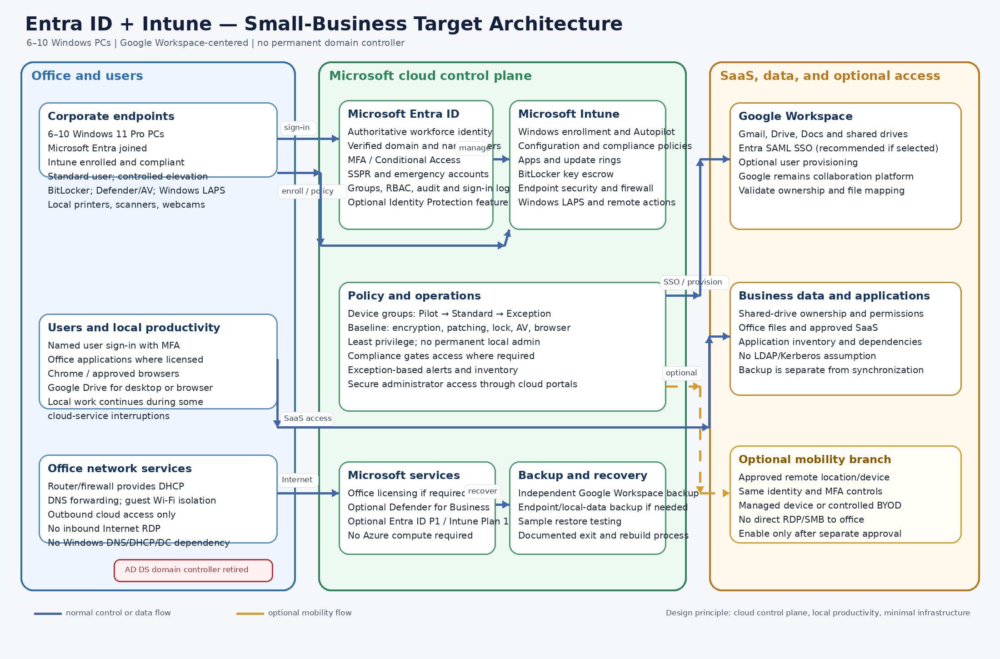

# Option 1 — Microsoft Entra ID + Microsoft Intune

## Detailed architecture design, analysis, and comparison

**Design scope:** 6-10 Windows 11 PCs, six initial users, small-business LAN, Google Workspace-centered SaaS, Microsoft Office, and removal of the on-premises Active Directory Domain Services (AD DS) server.

**Document relationship:** This is the detailed design for Option 1. The authoritative baseline remains [`requirements.md`](requirements.md). Remote work and user/device portability are optional capabilities; security, recovery, endpoint control, and AD dependency removal remain mandatory.

## 1. Executive decision

Microsoft Entra ID + Microsoft Intune is the strongest default architecture for this environment because the core problem is not only user authentication. It also includes Windows sign-in, endpoint configuration, patching, encryption, application deployment, local-administrator control, device inventory, and secure retirement of AD DS.

The target keeps the physical PCs and local Windows productivity model. It moves identity and endpoint control to Microsoft’s cloud control plane, keeps Google Workspace for Gmail, Drive, Docs, and collaboration, and moves basic DNS/DHCP responsibilities to the existing router or firewall. It does **not** introduce Azure virtual machines, Azure Virtual Desktop, a replacement domain controller, or a new office server.

The recommended baseline is:

- Microsoft Entra ID as the authoritative workforce identity;
- Microsoft Intune as the Windows endpoint-management plane;
- Windows 11 Pro, Entra joined, Intune enrolled, encrypted, and centrally governed;
- Google Workspace retained as the collaboration and mail platform;
- Entra SAML SSO to Google Workspace, with automated provisioning only if tested and required;
- Google Drive/shared drives for approved business data, with independent backup;
- the office router/firewall providing DHCP and DNS forwarding after AD DS retirement;
- optional remote work or secondary-device portability enabled only through a separate decision.

Entra ID is not hosted AD DS. It does not provide traditional domain controllers, Group Policy, LDAP, Kerberos, or NTLM in the same way as AD DS. Every remaining dependency on those protocols must be removed, replaced, or explicitly retained before the domain controller is decommissioned.

## 2. Architecture diagram

The diagram shows the normal control and data paths in blue. The orange dashed path is optional mobility and is not required for acceptance of the baseline design.

## 3. Design principles

### 3.1 Small-business proportionality

The architecture must remain supportable for 6–10 users without a full-time specialist. It should use standard managed services, a small number of policy objects, exception-based monitoring, and documented repeatable procedures.

### 3.2 Local productivity remains the default

The PCs remain normal Windows endpoints. Users can run approved Office applications, Chrome, Google Drive for desktop, communication software, and local peripheral workflows. A cloud identity control plane does not require every application to be converted into a browser application.

### 3.3 Cloud control without cloud desktop infrastructure

Entra ID and Intune provide identity and endpoint control. They do not require Azure compute, Azure Files, a virtual network, or AVD session hosts. This materially reduces cost, failure modes, and operational workload.

### 3.4 One authoritative identity lifecycle

Entra ID should own the workforce user lifecycle for this option. Google Workspace remains a business SaaS platform and can trust Entra through SAML. If automated provisioning is enabled, it must be tested against existing Google accounts, primary email addresses, aliases, groups, shared-drive ownership, and offboarding behavior.

### 3.5 Recovery is mandatory; mobility is optional

The business must be able to replace a failed PC, recover data, restore administrative control, and transfer support responsibility. Employees do not need to be permitted to work remotely or use secondary devices unless the business separately approves that capability.

## 4. Logical architecture

### 4.1 Identity and access layer

**Microsoft Entra ID** is the authoritative identity service.

Recommended objects and controls:

- one verified corporate domain;
- one named account per employee;
- separate administrator accounts for administrative work;
- at least two emergency administrator accounts protected independently;
- security groups for pilot, standard devices, exceptions, administrators, and application assignments;
- MFA for all users and administrators;
- Conditional Access policies appropriate to the selected license level;
- self-service password reset where recovery controls are acceptable;
- least-privilege Entra roles and Intune roles;
- sign-in and audit-log retention for the approved period;
- documented joiner, mover, leaver, and emergency-access procedures.

Avoid making a personal account, a single employee, or a single unmanaged recovery method the owner of the tenant, domain, billing relationship, or emergency access.

### 4.2 Windows endpoint layer

Each retained PC becomes:

- Windows 11 Pro on supported hardware;
- Microsoft Entra joined, not hybrid joined;
- enrolled in Intune;
- assigned to a device group and compliance policy;
- encrypted with BitLocker, with recovery keys escrowed in an approved administrative system;
- protected by Microsoft Defender or an approved endpoint-security product;
- configured with host firewall, screen lock, update rings, browser security, and standard-user controls;
- administered through controlled elevation rather than permanent local-administrator rights;
- assigned a managed local administrator account with Windows LAPS or an equivalent password-rotation control;
- inventoried with owner, serial number, operating-system version, compliance state, and last-contact information.

### 4.3 Intune management layer

#### Purpose and problems solved

Microsoft Intune is the cloud endpoint-management service for the Windows PCs. It is the device-control plane in this architecture: it enrolls, configures, secures, updates, inventories, and retires endpoints and applications. Intune also reports device compliance to Microsoft Entra ID so that access policies can use the device's security state. See Microsoft's [Intune overview](https://learn.microsoft.com/en-us/intune/fundamentals/what-is-intune) and [core concepts](https://learn.microsoft.com/en-us/intune/fundamentals/core-concepts).

The boundary between the two services is deliberate:

| Service | Question it answers | Responsibilities |
|---|---|---|
| **Microsoft Entra ID** | Who is the user, and may they authenticate? | Users, groups, MFA, Conditional Access, SSO, roles, sign-in logs, and lifecycle status |
| **Microsoft Intune** | How must the Windows PC be configured, protected, and maintained? | Enrollment, configuration, applications, updates, security posture, compliance, inventory, and remote device actions |

Intune resolves the main operational gaps created by removing the domain controller:

- **GPO loss:** applies required Windows configuration and security outcomes as cloud policies;
- **manual PC setup:** standardizes enrollment, configuration, applications, and replacement-device provisioning;
- **patch and security drift:** uses update rings, security baselines, and compliance policies;
- **uncontrolled software and administration:** deploys approved applications and enforces standard-user and least-privilege controls; and
- **limited visibility and recovery:** provides inventory, compliance status, alerts, remote actions, and a repeatable rebuild process.

For this option, Intune is not a hosted replacement for AD DS. It does not provide DNS, DHCP, LDAP, Kerberos, file shares, print services, certificates, VPN/RADIUS, or application-specific service accounts. Those dependencies still require separate remediation before AD DS decommissioning.

Intune is effectively mandatory for the full **Entra ID + Intune** target. Entra-only device join would provide cloud identity, but it would not satisfy the architecture's requirements for centralized Windows configuration, patching, compliance, application deployment, inventory, endpoint recovery, and low-effort remote administration. The six-to-ten-PC deployment should use a deliberately small policy model rather than enterprise-scale policy sprawl.

Keep the policy model deliberately small:

| Policy area | Baseline design |
|---|---|
| Enrollment | Automatic enrollment for corporate devices; Autopilot for new or reset devices where practical; provisioning package or documented manual enrollment for existing devices if a wipe is deferred |
| Device groups | `Pilot`, `Standard`, and `Exception`; avoid per-user/per-PC policy sprawl |
| Configuration | Security baseline, screen lock, firewall, browser, Defender/AV, Windows Update, local-admin restrictions, and approved personalization settings |
| Compliance | Windows version, encryption, secure boot/TPM where applicable, antivirus health, firewall, and recent check-in |
| Applications | Required browsers, Office, Google Drive for desktop, communications tools, support agent, and approved line-of-business applications |
| Updates | Pilot ring followed by standard ring; quality and security updates deployed within the documented deadline |
| Recovery | BitLocker recovery keys, device retire/wipe actions, rebuild documentation, and sample restore testing |
| Monitoring | Actionable alerts for noncompliance, failed enrollment, threats, update failures, and device inactivity |

Do not recreate every historical GPO automatically. Classify each setting as required, useful, obsolete, or unsafe; implement only the required outcome in Intune.

### 4.4 Google Workspace integration

Google Workspace remains the platform for:

- Gmail;
- Google Drive and shared drives;
- Google Docs and other Workspace applications;
- Google-based collaboration and communication where used.

For the Entra-authoritative model:

1. Verify the corporate domain in both tenants.
2. Configure the Microsoft Entra Google Workspace SAML application.
3. Test one non-production or pilot group.
4. Confirm the exact Google sign-in URL, domain routing, mobile/browser behavior, recovery flow, and break-glass procedure.
5. Add automated provisioning only after confirming attribute mappings, account matching, group behavior, suspension, deletion, and shared-drive ownership.
6. Keep at least one documented administrative recovery path that does not depend on a failed federation configuration.

SAML SSO does not automatically synchronize every user, group, license, or file permission. Those behaviors must be tested and documented.

### 4.5 Office and other SaaS

Microsoft Office licensing must be treated separately from identity design. The business may use existing Office licenses, a Microsoft 365 bundle, or another valid license model. Do not purchase Exchange, OneDrive, SharePoint, or Copilot merely because Intune or Entra is selected unless those services have a confirmed business purpose.

Every additional SaaS application must be inventoried for:

- authentication method;
- SAML/OIDC support;
- user-provisioning and offboarding behavior;
- local-data location;
- licensing owner;
- backup and retention capability;
- dependence on AD groups, LDAP, Kerberos, NTLM, mapped drives, or service accounts.

### 4.6 Office network layer after AD DS retirement

The permanent office network should use the existing business-grade router/firewall for:

- DHCP scopes and reservations;
- DNS forwarding and local name-resolution rules;
- guest Wi-Fi isolation;
- outbound Internet filtering as appropriate;
- VPN or secure remote-support capability if separately approved;
- administrative access control and firmware updates.

The design must not expose RDP, SMB, LDAP, or administrative services directly to the Internet. If an application still requires domain DNS, DHCP, file shares, certificates, or authentication from the old server, AD DS retirement is blocked until that dependency is resolved.

### 4.7 Data and backup layer

Google Drive synchronization is not a complete backup. The design requires:

- clear ownership of shared drives and business data;
- no business-critical data stored only on one PC;
- independent backup for Google Workspace data and any required local endpoint data;
- defined retention, RPO, RTO, and deletion behavior;
- at least one sample restore before cutover and periodic restore testing afterward;
- documented export and vendor-exit procedures;
- protected administrative credentials, recovery keys, and configuration documentation.

## 5. User and administrator flows

### 5.1 Normal user sign-in

1. User starts an Entra-joined Windows 11 PC.
2. User signs in with the corporate Entra account.
3. MFA or other Conditional Access requirements are applied according to policy.
4. Windows receives Intune configuration and compliance state.
5. User opens Google Workspace; Entra SAML SSO is used if configured.
6. User accesses Google Drive, Docs, Office, and approved SaaS according to the assigned groups and policies.

### 5.2 New or rebuilt device

1. Confirm the hardware is supported for Windows 11 Pro.
2. Register it for Autopilot when appropriate, or use the approved existing-device enrollment method.
3. Join the device to Entra ID and enroll it in Intune.
4. Apply the pilot or standard device profile.
5. Install required applications.
6. Verify BitLocker, recovery-key escrow, endpoint protection, local-admin controls, update status, printers, scanners, and Google Drive behavior.
7. Sign in as the user and validate application and data access.

For existing domain PCs, a clean rebuild is often more reliable than trying to convert every old profile in place. If a wipe is not acceptable, a tested profile/data migration method is required; an Entra join does not automatically convert an AD domain profile into an Entra profile.

### 5.3 Administrator flow

1. Administrator uses a separate admin account with MFA.
2. Administrative work is performed through Entra, Intune, Google Admin, backup, firewall, and approved support portals.
3. Local elevation uses the managed local administrator process, not shared permanent credentials.
4. Changes are made first to the pilot group, then to the standard group.
5. Sign-in, audit, device, threat, compliance, and backup alerts are reviewed on the agreed schedule.

### 5.4 Optional remote-work flow

This flow is not required for the baseline architecture. If enabled, the user connects from an approved managed device or controlled BYOD path using the same corporate identity, MFA, access policy, logging, and offboarding controls. Direct inbound access to the office LAN is prohibited. Remote performance and lost-device/token-revocation scenarios must be tested before approval.

## 6. Security baseline

| Control | Required baseline | Notes |
|---|---|---|
| Identity | Individual accounts, MFA, least privilege, separate admin identities | Do not use shared interactive accounts |
| Emergency access | Two separately protected emergency accounts | Test without weakening monitoring |
| Conditional Access | Require MFA and block risky/unapproved access where licensed and appropriate | Avoid policies that lock out both emergency accounts |
| Device join | Entra join; no hybrid dependency after AD retirement | Hybrid join is not a substitute for dependency discovery |
| Encryption | BitLocker with escrowed recovery keys | Verify recovery before production rollout |
| Endpoint security | Defender/AV, host firewall, browser controls, update enforcement | Use one primary endpoint-security control plane where feasible |
| Privilege | Standard user; controlled elevation; Windows LAPS/equivalent | No permanent local admin by default |
| Updates | Pilot and standard rings with deadlines and exception reporting | Do not leave Windows 10 unsupported without an approved temporary plan |
| Data | Shared-drive ownership, independent backup, restore testing | Synchronization alone is not backup |
| Network | Firewall, guest isolation, outbound-only cloud access, no Internet RDP | Local peripherals remain a discovery and pilot item |
| Logging | Entra, Intune, endpoint-security, backup, and firewall logs | Use exception-based review appropriate to the business size |

## 7. AD DS dependency-removal gate

The domain controller must not be demoted until the following are evidenced:

- no required application uses LDAP, Kerberos, NTLM, domain service accounts, or AD security groups;
- DNS is served or forwarded by the router/firewall or another approved design;
- DHCP has been moved and reservations tested;
- file shares and mapped drives have been migrated or formally retired;
- printers and scanners work without domain-dependent queues or credentials;
- certificate services and auto-enrollment dependencies are removed or replaced;
- VPN, RADIUS/NPS, scripts, scheduled tasks, Windows services, backup agents, and management tools no longer depend on AD DS;
- all users can sign in to Entra-joined PCs;
- Google Workspace, Office, communications, peripherals, and critical SaaS pass acceptance testing;
- backup and sample restore have passed;
- rollback and stabilization windows are documented and have not expired with critical defects;
- the former server is backed up and the approved retention period is defined.

## 8. Migration implementation plan

### Phase 0 — Discovery and design confirmation

**Activities**

- inventory AD users, groups, computers, GPOs, DNS, DHCP, file, print, certificate, VPN, RADIUS, scripts, scheduled tasks, and service accounts;
- inventory every PC, Windows edition/build, TPM/Secure Boot state, disk space, local data, applications, and peripherals;
- inventory Google Workspace, Office, endpoint-security, backup, and Internet entitlements;
- classify each GPO and application dependency;
- confirm the number of users/devices, data ownership, RPO/RTO, licensing ceiling, and optional mobility decision.

**Exit criteria:** no unknown AD-hosted service or business-critical application dependency remains in the discovery register.

### Phase 1 — Tenant foundation

- verify the corporate domain;
- establish named administrative and emergency accounts;
- enable MFA and implement tested Conditional Access policies;
- configure Entra groups, roles, audit settings, and recovery methods;
- confirm licensing and avoid purchasing duplicate Google/Microsoft services;
- document tenant ownership, billing ownership, and support contacts.

### Phase 2 — Intune baseline

- configure MDM authority and enrollment restrictions;
- create Pilot, Standard, and Exception groups;
- configure security, compliance, update, encryption, local-admin, browser, and application policies;
- configure BitLocker recovery-key escrow and Windows LAPS/equivalent;
- package or document the required applications;
- configure alerts and device inventory;
- test a clean Windows 11 device before touching production PCs.

### Phase 3 — Google Workspace integration

- configure and test Entra SAML SSO;
- verify user matching and Google account ownership;
- test Drive, Docs, shared drives, Gmail, browser sessions, and recovery;
- enable automated provisioning only if the selected Google edition and mappings support the required lifecycle;
- document the federation failure and emergency recovery procedures.

### Phase 4 — Pilot migration

- select one user and one non-critical PC;
- back up the PC and verify the restore path;
- migrate or rebuild the Windows profile using the approved method;
- Entra join and Intune-enroll the PC;
- validate sign-in, MFA, applications, Drive, Office, printing, scanning, communications, BitLocker, LAPS, updates, and support;
- keep the domain controller available for rollback.

### Phase 5 — Production migration

- migrate one or two PCs per batch;
- use the pilot results to correct policies and application packaging;
- confirm each device is compliant and recoverable before moving to the next batch;
- maintain a migration ledger with user, device, date, profile/data method, application status, and acceptance result.

### Phase 6 — Network and service migration

- move DHCP and DNS responsibilities to the router/firewall or approved managed service;
- migrate or retire file shares, print queues, certificates, VPN/RADIUS, scripts, scheduled tasks, and service accounts;
- test name resolution, printers, scanners, and business applications from every production PC;
- retain the domain controller until the dependency-removal gate is complete.

### Phase 7 — Stabilization and AD DS decommissioning

- observe the environment for the approved stabilization period;
- review sign-in, endpoint, backup, application, and network alerts;
- execute a controlled domain-controller shutdown test;
- if no critical dependency appears, demote and remove AD DS;
- retain the approved backup and update the final operating documentation.

## 9. Operating model

### Routine operations

- review actionable identity, device, security, and backup alerts;
- approve or remediate noncompliant devices;
- review update failures and stale check-ins;
- process joiners, movers, and leavers through documented checklists;
- review license assignments and recurring costs monthly;
- test a restore periodically;
- review emergency-account access and recovery information.

### Change management

- pilot all policy and application changes;
- use a small number of standard groups;
- record the change, owner, rollback action, and expected user impact;
- avoid unsupported preview features as production dependencies;
- remove obsolete policies and licenses rather than allowing configuration drift.

### Support model

The target should be supportable by a qualified external administrator or internal part-time owner. Remote administration is required for operational efficiency, but employee remote work remains optional. Direct exposure of administrative services to the Internet is prohibited.

## 10. Licensing and cost model

The exact subscription choice must be based on existing entitlements and a current reseller quote. The architecture should compare two licensing profiles:

### Lean profile

- existing Google Workspace retained;
- Entra ID P1 and Intune Plan 1, if required for the selected controls;
- existing or separately licensed Microsoft Office;
- one endpoint-security product;
- independent Google Workspace backup;
- no Azure compute or AVD infrastructure.

### Consolidated Microsoft profile

- Microsoft 365 Business Premium if the combined value of Entra ID P1, Intune, Office, Defender for Business, and related controls justifies the cost;
- Google Workspace still retained for Gmail, Drive, and Docs;
- no Copilot or unused Microsoft collaboration services unless separately approved;
- independent backup remains required.

The proposal must not assume that a Microsoft 365 bundle is automatically cheaper. Compare the incremental cost against current Office, Google, endpoint-security, and backup licenses. Optional remote work, BYOD, or portability must have its own incremental-cost line.

### Budgetary effort

For a clean six-device environment, a realistic implementation range is approximately **32–48 hours**. Allow approximately **48–64 hours** when profile migration, legacy applications, complex GPO translation, Google account matching, or AD-hosted services require remediation. This excludes major hardware replacement, complex application redevelopment, formal compliance work, and ongoing managed support.

### Main cost drivers

- Entra and Intune licensing;
- Office and endpoint-security licensing;
- Google Workspace edition and any provisioning/management upgrade;
- independent SaaS backup;
- support and administration;
- Windows 11 hardware replacement where current PCs fail eligibility;
- optional mobility or BYOD controls.

There is no recurring AVD session-host, profile-container, Azure Files, or Azure network cost in this baseline architecture.

## 11. Comparison with the other proposed solutions

The comparison is against the updated requirements, where remote work and user/device portability are optional.

| Criterion | Entra ID + Intune | Google Workspace + GCPW | Azure Virtual Desktop |
|---|---|---|---|
| Windows endpoint management | Strongest native fit | Conditional; exact controls must be tested | Strong for hosted sessions, but still requires terminal management |
| Google Workspace alignment | Good with SAML/provisioning integration | Best native alignment | Indirect and more complex |
| Local Windows productivity | Preserved | Preserved | Not the primary operating model |
| AD retirement | Valid after dependency removal | Valid after dependency removal | Valid, but legacy apps may require additional services |
| Simplicity | Moderate and controllable | Lowest if requirements are basic | Lowest; many additional components |
| Recurring cost | Moderate | Potentially lowest | Highest and consumption-sensitive |
| Administration | Intune/Entra policy administration | Google plus possible supplemental tooling | Images, hosts, profiles, scaling, monitoring, and session support |
| Office Internet outage behavior | Some local productivity can continue | Some local productivity can continue | Users may lose access to hosted desktops |
| Optional remote work | Supported if enabled | Supported if enabled and controlled | Strong capability, but not required by baseline |
| Replacement-device recovery | Strong with Intune and documented rebuild | Conditional | Strong for hosted profile, but infrastructure-dependent |
| Suitability for this baseline | **Preferred** | **Conditional alternative** | **Exception only** |

### Why Option 1 remains preferred

The requirements make centrally managed Windows security, encryption, patching, inventory, application deployment, and local-admin control mandatory. Intune maps most directly to those requirements without introducing a new desktop-hosting platform.

### When Option 2 may be selected

Select Google Workspace + GCPW only if discovery proves that:

- all required Windows controls are available in the current or approved Google edition;
- no application requires AD DS, LDAP, Kerberos, NTLM, or domain membership;
- supplemental endpoint-security, patching, privilege, or RMM tools are not needed or are affordable;
- the business accepts a workgroup-style Windows operating model;
- the lower cost and simpler Google-centered administration outweigh Intune’s stronger Windows controls.

### When Option 3 may be selected

Select AVD only if a documented requirement justifies it, such as:

- a legacy application that is difficult or unsafe to deploy locally;
- the same centrally managed desktop is required from multiple approved locations;
- local data must be minimized;
- physical PCs are intentionally reduced to access terminals;
- contractors or temporary users need controlled hosted desktops;
- centralized application/version control provides measurable value.

Without one of those conditions, AVD adds cost and operational dependencies without satisfying a mandatory requirement.

## 12. Risks and mitigations

| Risk | Impact | Mitigation |
|---|---|---|
| AD dependency discovered late | AD cannot be retired on schedule | Complete dependency inventory before pilot and maintain a decommissioning gate |
| Old Windows 10 hardware cannot run supported Windows 11 | Security and support failure | Test hardware now; replace, repurpose, or use only an approved temporary ESU plan |
| Entra and Google accounts do not match | Duplicate accounts or wrong file ownership | Pilot SAML/provisioning with immutable matching and ownership checks |
| Domain profile data is lost or duplicated | User disruption or data loss | Back up first; use a tested profile migration or clean rebuild method |
| Intune policies are too complex | High support workload and user complaints | Use Pilot/Standard/Exception groups and a small policy baseline |
| Duplicate Microsoft and Google licensing | Unnecessary recurring cost | Inventory entitlements; purchase only required services |
| Google Drive is treated as backup | Inability to recover deleted or corrupted data | Use independent SaaS backup and perform restore tests |
| Emergency accounts are unavailable | Administrative lockout | Secure two separate emergency accounts and test recovery |
| Cloud identity or Internet outage | Authentication or SaaS interruption | Define outage behavior, retain local productivity where possible, and document support escalation |
| Optional mobility expands scope silently | Cost and security exposure | Separate approval, cost line, owner, and acceptance test for mobility/BYOD |

## 13. Acceptance criteria

The design is accepted only when:

- all production users can sign in to Entra-joined Windows 11 PCs with MFA;
- all retained PCs are inventoried, encrypted, patched, protected, and centrally managed;
- required Office, Google Workspace, communication, printing, scanning, and peripheral workflows pass user acceptance;
- BitLocker recovery keys are escrowed and the local-admin recovery process works;
- onboarding, offboarding, device replacement, emergency access, and support procedures are documented and tested;
- user and shared data are owned correctly, independently backed up, and sample-restored;
- all DNS, DHCP, file, print, certificate, VPN, RADIUS, LDAP, Kerberos, NTLM, script, scheduled-task, and service-account dependencies have documented replacements or are proven unused;
- the router/firewall provides the approved post-AD DNS/DHCP functions;
- no Internet-exposed RDP, SMB, LDAP, or administrative service is required;
- rollback and stabilization criteria are satisfied;
- the domain controller is demoted cleanly and the approved backup is retained;
- the recurring cost is within the approved budget and no unapproved duplicate platform remains;
- remote work or user/device portability is tested only if separately enabled; it is not a baseline acceptance condition.

## 14. Decisions required before implementation

- Confirm Entra ID as the authoritative workforce identity for Option 1.
- Confirm the existing Google Workspace edition and whether SAML/provisioning features are available.
- Confirm the exact Office licensing model; do not assume Microsoft 365 Business Premium or Copilot.
- Confirm whether Defender for Business or another endpoint-security product is required.
- Confirm the independent Google Workspace backup product and retention.
- Confirm Windows 11 compatibility for every PC and the replacement schedule for failed devices.
- Confirm which router/firewall will provide DHCP and DNS forwarding.
- Confirm every file, print, certificate, VPN, RADIUS, script, scheduled-task, and service-account dependency.
- Decide whether remote work is deferred, desired, or enabled for a defined group.
- Decide whether BYOD and secondary-device portability are deferred, controlled, or prohibited.
- Approve the monthly operating-cost ceiling and implementation effort range.
- Approve RTO, RPO, maintenance window, rollback window, and stabilization period.

## 15. References

- [Microsoft Entra joined devices](https://learn.microsoft.com/en-us/entra/identity/devices/concept-directory-join)
- [Microsoft Intune Windows enrollment guide](https://learn.microsoft.com/en-us/intune/device-enrollment/windows/guide)
- [Windows Autopilot registration overview](https://learn.microsoft.com/en-us/autopilot/registration-overview)
- [Windows Autopilot for existing devices](https://learn.microsoft.com/en-us/autopilot/existing-devices)
- [Microsoft Entra SSO for Google Workspace](https://learn.microsoft.com/en-us/entra/identity/saas-apps/google-apps-tutorial)
- [Microsoft Entra provisioning for Google Workspace](https://learn.microsoft.com/en-us/entra/identity/saas-apps/g-suite-provisioning-tutorial)
- [Windows 10 support lifecycle](https://support.microsoft.com/en-us/windows/deployment/updates-lifecycle/windows-10-support-has-ended-on-october-14-2025)
