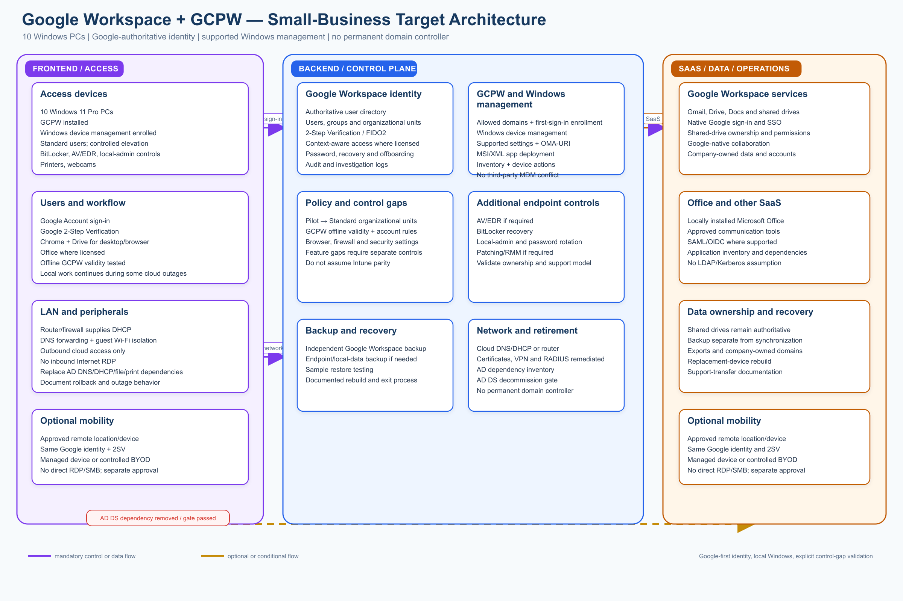

# Option 2 — Google Workspace + GCPW + Windows Device Management

## Detailed architecture design, analysis, and comparison

**Design scope:** 6–10 Windows PCs, six initial users, small-business LAN, Google Workspace-centered SaaS, Microsoft Office, and removal of the on-premises Active Directory Domain Services (AD DS) server.

**Document relationship:** This is the detailed design for Option 2. The authoritative baseline remains [`requirements.md`](requirements.md). Remote work and user/device portability are optional; endpoint security, recovery, data ownership, and AD dependency removal remain mandatory.

## 1. Executive decision

Google Workspace + Google Credential Provider for Windows (GCPW) + Google Windows device management is a viable lower-cost alternative when Google Workspace is already the company’s dominant platform and Windows requirements are simple.

Google Workspace becomes the authoritative workforce identity. GCPW lets users sign in to Windows with their managed Google Account. Google Admin console Windows management can apply supported settings, custom OMA-URI settings, selected MSI application deployments, device inventory, and administrative actions.

This option is not a full Active Directory or Intune replacement by default. It must pass a feature-level pilot for encryption and recovery, local-administrator control, antivirus/EDR, Windows patching, application deployment, inventory, reporting, and device retirement. If those gaps require a separate MDM/UEM, endpoint-security, patching, privilege-management, or RMM platform, the apparent simplicity and cost advantage may disappear.

The recommended target for this option is:

- Google Workspace as the authoritative identity and collaboration platform;
- GCPW installed on supported Windows 11 Pro PCs;
- Google Windows device management enabled and enrolled;
- Google Admin organizational units used for Pilot, Standard, and Exception policies;
- Chrome and Google Drive for desktop managed as core applications;
- Microsoft Office retained locally under a separately validated license;
- independent endpoint security, backup, and local-administrator controls where Google-native capabilities are insufficient;
- the router/firewall providing DHCP and DNS forwarding after AD DS retirement;
- optional remote work or secondary-device portability enabled only through a separate decision.

Google’s current documentation states that GCPW supports Windows 10/11 Pro, Pro for Workstations, Enterprise, or Education, requires Chrome 81 or later, and is not compatible with third-party mobile-device-management providers. GCPW with Windows device management is edition-dependent and must be confirmed before procurement.

## 2. Architecture diagram

Blue paths represent normal identity, management, and data flows. Orange paths represent optional or conditional controls. The “Additional controls” box is intentional: the Google-native Windows feature set must be validated rather than assumed to provide complete Intune-equivalent coverage.

## 3. Design principles

### 3.1 Google-first identity

There is one authoritative user lifecycle: Google Workspace. User creation, suspension, password recovery, 2-Step Verification, groups, organizational units, and Google SaaS access are controlled in Google Admin. Windows sign-in uses GCPW against the same managed Google identity.

### 3.2 Keep Windows local and simple

The physical PCs remain normal Windows endpoints. Users run approved Office applications, Chrome, Google Drive for desktop, communication software, and local peripheral workflows. No AVD session hosts, Azure Files profile containers, or replacement domain controller are introduced.

### 3.3 Do not overstate endpoint-management coverage

Google Windows management can apply supported settings and custom OMA-URI settings, and it can deploy MSI packages using documented XML and hash values. This does not establish parity with Intune for every Windows security, application, privilege, remediation, reporting, or recovery capability. Each mandatory requirement must be mapped to an implemented and tested control.

### 3.4 No third-party MDM conflict

GCPW is documented as incompatible with third-party mobile-device-management providers. Do not layer another MDM/UEM over GCPW without explicit vendor validation. Endpoint security, backup, and remote-support products must be evaluated separately and must not take ownership of incompatible management functions.

### 3.5 Recovery is mandatory; mobility is optional

The business must recover data, administrative access, and a failed PC. Employees do not need to work remotely or use secondary devices unless the business separately approves that capability.

## 4. Logical architecture

### 4.1 Google Workspace identity and administration

Google Workspace is the authoritative directory for this option.

Recommended controls:

- one verified corporate domain;
- one named account per employee;
- separate super-administrator accounts for administrative work;
- at least two separately protected emergency administrator accounts;
- organizational units for Pilot, Standard, and Exception device/user policies;
- groups for applications, shared drives, administrators, and exceptions;
- mandatory 2-Step Verification for users and administrators;
- FIDO2/security-key or passkey enforcement where supported and practical;
- context-aware or access policies where included in the selected edition;
- password, recovery, suspension, and offboarding procedures;
- audit and investigation-log retention for the approved period.

Google account ownership must be company-controlled. Do not use personal Gmail accounts for company data, billing, tenant ownership, emergency recovery, or administrative access.

### 4.2 GCPW layer

GCPW is installed on each corporate Windows PC and configured in Google Admin.

Baseline GCPW settings:

- permit only the company’s approved Workspace domain(s);
- use an organization-specific enrollment token from the Admin console;
- enable automatic enrollment into Windows device management where supported;
- permit only one managed Google user per assigned PC unless a shared-device use case is explicitly approved;
- define an online sign-in validity period rather than allowing indefinite offline access;
- enable automatic GCPW updates after pilot validation;
- document the first-sign-in process and the behavior after a Google password change or security event;
- associate an existing Windows profile only through a tested procedure;
- avoid unmanaged local accounts except for controlled break-glass or recovery purposes.

GCPW’s first sign-in requires Internet connectivity. Subsequent Windows sign-in can work offline, subject to the configured offline validity period and local Windows behavior. This behavior must be tested because a user may otherwise be locked out during an Internet outage or after an account-security event.

### 4.3 Google Windows device-management layer

Enable Windows device management in Google Admin and apply settings through organizational units.

Use the smallest policy set that satisfies the requirements:

| Policy area | Target design |
|---|---|
| Organizational units | `Pilot`, `Standard`, and `Exception`; avoid per-device policy sprawl |
| GCPW settings | Allowed domains, automatic enrollment, account count, offline validity, update behavior |
| Windows settings | Supported security and device settings exposed by Google; custom OMA-URI only where justified |
| Applications | Chrome, GCPW, Drive for desktop, and required MSI packages with version/hash control |
| Inventory | Device identity, last contact, installed applications, and management status |
| Actions | Device sign-out, block/retire actions, and other documented actions supported by the edition |
| Reporting | Google Admin reports plus separate endpoint-security and backup reporting |

Custom settings must be treated as controlled configuration code: record the OMA-URI, data type, value, scope, owner, test result, and rollback action. Google does not assume responsibility for arbitrary third-party settings entered as custom policies.

### 4.4 Endpoint-security and control-gap layer

The following controls must be proven in the pilot, not inferred from GCPW:

- BitLocker enablement and recovery-key escrow;
- antivirus/endpoint detection and response;
- host firewall enforcement;
- Windows quality and security update deadlines;
- standard-user enforcement and controlled elevation;
- local-administrator password rotation;
- application allow/block and removal behavior;
- remote lock, retire, or wipe behavior;
- device compliance reporting and remediation;
- support-tool security and audit logging.

If Google-native settings cannot satisfy a mandatory control, select one compatible supplemental product or formally redesign the requirement. Avoid building a patchwork of multiple overlapping endpoint platforms.

### 4.5 Google Workspace data layer

Google Workspace remains the platform for:

- Gmail;
- Google Drive and shared drives;
- Google Docs and related Workspace applications;
- Google-based collaboration and communication.

Required data controls:

- shared drives for business-owned data where appropriate;
- clear ownership and sharing boundaries;
- no business-critical data stored only on one PC;
- independent SaaS backup;
- documented retention, deletion, export, RPO, and RTO;
- periodic restore testing;
- documented provider-exit and administrative-recovery procedures.

Drive for desktop synchronization is not a backup. Offline files and local caches must be treated as endpoint data and protected accordingly.

### 4.6 Office and other SaaS

Microsoft Office is installed locally only where the business has a valid license. Google Workspace does not provide Microsoft Office licensing.

Other SaaS applications must be inventoried for:

- authentication and SSO support;
- account provisioning and suspension behavior;
- local-data location;
- licensing owner;
- backup and retention;
- dependency on AD security groups, LDAP, Kerberos, NTLM, mapped drives, or service accounts.

GCPW provides Google-account Windows sign-in and Google-service SSO. It does not automatically provide SSO to every non-Google SaaS application.

### 4.7 Office network layer after AD DS retirement

The router/firewall should provide:

- DHCP scopes and reservations;
- DNS forwarding and local name-resolution rules;
- guest Wi-Fi isolation;
- outbound access required by Google, Microsoft, endpoint-security, backup, and support services;
- VPN or secure remote-support capability only if separately approved;
- firmware, administrator, and firewall-rule management.

RDP, SMB, LDAP, and administrative services must not be exposed directly to the Internet. Any remaining requirement for domain DNS, file shares, certificates, or AD authentication blocks decommissioning until it is resolved.

### 4.8 Optional mobility branch

Remote work and secondary-device portability are not baseline requirements. If enabled, the user must use the same Google identity, 2-Step Verification, access policy, and offboarding controls. Managed corporate devices are preferred. BYOD requires explicit data-download, session, browser, and revocation controls. Direct inbound access to the office network is prohibited.

## 5. User and administrator flows

### 5.1 First GCPW sign-in and enrollment

1. Confirm the PC is supported Windows 11 Pro and has Chrome installed.
2. Install GCPW using the organization-specific package or an approved deployment method.
3. Configure the allowed Workspace domain and enrollment token.
4. User selects the GCPW work-account sign-in option.
5. User authenticates with the managed Google Account and completes 2-Step Verification.
6. GCPW creates or associates the approved Windows profile.
7. If automatic enrollment is enabled, the device enrolls into Google Windows device management.
8. Google Admin policies and applications synchronize.
9. Administrator verifies device inventory, settings, application installation, endpoint security, encryption, and recovery controls.

### 5.2 Subsequent sign-in and offline behavior

After the first successful enrollment, the user signs in to the Windows profile normally. If the device is offline, local sign-in may continue until the configured GCPW validity period expires. A Google password change, session expiry, or suspicious-activity event can require a fresh Google sign-in. These cases must be tested with the actual PC image and policies.

### 5.3 New or rebuilt device

1. Verify Windows 11 compatibility, licensing, TPM/Secure Boot state, and hardware ownership.
2. Back up and verify recovery of any local data.
3. Reset or rebuild the device when practical; this is usually cleaner than retaining unknown domain-profile state.
4. Install Chrome and GCPW with the organization token.
5. Configure the permitted domain and automatic device-management enrollment.
6. Complete the user’s Google sign-in and 2-Step Verification.
7. Apply the Pilot or Standard organizational-unit policy.
8. Deploy required applications and configure printers, scanners, webcams, Drive, and Office.
9. Verify encryption, endpoint protection, local-admin control, updates, inventory, and recovery.

If an existing profile must be retained, use a documented profile-association/data-migration method. GCPW does not automatically convert every AD domain profile into a clean Google-managed operating model.

### 5.4 Administrator flow

1. Administrator uses a separate Google super-admin or delegated admin account with 2-Step Verification.
2. Administrative work is performed through Google Admin, backup, endpoint-security, firewall, and approved support portals.
3. Local elevation uses the approved recovery or support process.
4. Policy and application changes are tested in the Pilot organizational unit.
5. Device, sign-in, application, threat, and backup status are reviewed on the agreed schedule.

### 5.5 Offboarding flow

1. Suspend the user’s Google Workspace account.
2. Revoke sessions and tokens and remove group/application access.
3. Block or retire the associated PC through the supported device-management action.
4. Preserve or transfer business data according to the documented ownership and retention process.
5. Recover company assets, local administrator information, and backup records.

### 5.6 Optional remote-work flow

This flow is used only if separately approved. The user connects from an approved managed device or controlled BYOD path, authenticates with Google and 2-Step Verification, and accesses Google Workspace and approved SaaS directly. Remote performance, browser/data controls, token revocation, and lost-device response must be tested before enablement.

## 6. Security and management baseline

| Control | Baseline requirement | Validation concern |
|---|---|---|
| Identity | Individual Google Workspace accounts; no routine shared accounts | Confirm ownership and recovery contacts |
| Authentication | 2-Step Verification for users and administrators; FIDO2/passkeys where practical | Test GCPW login and recovery behavior |
| Administration | Separate admin accounts and at least two emergency accounts | Do not make both emergency accounts dependent on one policy or device |
| GCPW domain restriction | Only approved corporate domains may sign in | A missing domain setting blocks GCPW sign-in |
| Offline access | Configure a finite online sign-in validity period | Test Internet outage and expired validity behavior |
| Account count | One managed user per assigned PC unless a shared-device exception is approved | Windows device management enrollment is limited per device |
| Windows version | Supported Windows 11 Pro or approved edition | Windows 10 requires a documented retirement or temporary ESU plan |
| Encryption | BitLocker enabled and recovery keys escrowed | Google-native key escrow must be proven or supplemented |
| Endpoint security | AV/EDR and firewall centrally enforced | Do not assume GCPW is an EDR product |
| Updates | Windows quality/security updates within the approved deadline | Confirm reporting and failed-update remediation |
| Privilege | Standard user and controlled elevation | Confirm local-admin/password-rotation capability |
| Applications | Required MSI applications use documented URL, product ID, hash, and rollback | Test non-MSI and complex application needs separately |
| Inventory | Devices and installed applications are reviewable | Confirm reporting delay and completeness |
| Backup | Independent Google Workspace and local-data backup | Synchronization is not backup |
| Network | Router/firewall DHCP/DNS, guest isolation, outbound-only cloud access | No Internet-exposed RDP/SMB/LDAP |
| Logging | Google audit/investigation logs plus endpoint, backup, and firewall logs | Define retention and review responsibility |

## 7. AD DS dependency-removal gate

The domain controller must not be demoted until evidence shows that:

- no application uses LDAP, Kerberos, NTLM, AD groups, domain service accounts, or domain membership;
- DNS has moved to the router/firewall or another approved design;
- DHCP has moved and reservations have been tested;
- file shares, mapped drives, and redirected folders have migrated or been retired;
- printers, scanners, and local peripherals work without domain-dependent credentials;
- certificate services and auto-enrollment dependencies are removed or replaced;
- VPN/RADIUS, scripts, scheduled tasks, Windows services, backup agents, and support tools no longer depend on AD DS;
- all users can sign in through GCPW and access Google Workspace, Office, communication tools, and required peripherals;
- the Google Workspace backup and a sample local-data restore have passed;
- the selected endpoint-security and privilege controls are active and reportable;
- rollback and stabilization criteria are satisfied.

## 8. Migration implementation plan

### Phase 0 — Discovery and feasibility

- inventory AD users, groups, computers, GPOs, DNS, DHCP, file, print, certificates, VPN/RADIUS, scripts, scheduled tasks, and service accounts;
- inventory each PC’s Windows edition/build, hardware, TPM/Secure Boot, applications, peripherals, local data, and current profile;
- confirm the Google Workspace edition and whether it supports GCPW with Windows device management;
- map every mandatory endpoint requirement to a Google-native control or a compatible supplemental control;
- confirm Office licensing, backup, endpoint-security, and support entitlements;
- record whether remote work and secondary-device portability are deferred or separately desired.

**Exit criteria:** no mandatory requirement remains marked “assumed,” and no incompatible third-party MDM is included.

### Phase 1 — Google Workspace foundation

- verify the company domain and tenant ownership;
- establish named users, groups, organizational units, admin roles, and emergency accounts;
- enforce 2-Step Verification and configure recovery methods;
- configure audit/investigation logging and administrator alerts;
- define shared-drive ownership and data-retention rules;
- select and configure independent Workspace backup.

### Phase 2 — GCPW and Windows-management pilot

- enable Windows device management for the Pilot organizational unit;
- configure permitted domains, enrollment token, automatic enrollment, account count, offline validity, and GCPW update behavior;
- install GCPW and Chrome on one non-critical PC;
- confirm first sign-in, subsequent sign-in, password change, offline sign-in, security-event reauthentication, device inventory, and policy synchronization;
- test one required MSI deployment and one custom setting;
- document rollback and device unenrollment behavior.

### Phase 3 — Security and control-gap validation

- verify BitLocker and recovery-key handling;
- verify AV/EDR, firewall, update enforcement, local-admin control, password rotation, and device retirement;
- add one compatible supplemental product only where a mandatory gap is proven;
- test Google Workspace backup and local endpoint backup;
- test printers, scanners, webcams, Drive for desktop, Office, and communications applications.

### Phase 4 — Profile and data migration

- back up each PC and verify the restore path;
- choose clean rebuild versus profile association based on pilot evidence;
- migrate approved local data and browser/application settings;
- validate Google Drive ownership, shared-drive access, local cache behavior, and offline files;
- document the user and device mapping.

### Phase 5 — Production rollout

- migrate one or two PCs per batch;
- assign Standard policies only after the pilot is accepted;
- maintain a migration ledger with user, PC, date, profile/data method, applications, and acceptance result;
- keep the AD server available for rollback until the stabilization period ends.

### Phase 6 — Network and service migration

- move DHCP and DNS to the router/firewall or approved managed service;
- migrate or retire file shares, print queues, certificates, VPN/RADIUS, scripts, scheduled tasks, and service accounts;
- verify normal operation from every production PC without AD connectivity.

### Phase 7 — Stabilization and AD DS decommissioning

- review Google, endpoint-security, backup, device, and network alerts;
- execute a controlled domain-controller shutdown test;
- resolve any critical dependency before demotion;
- demote and remove AD DS only after the gate passes;
- retain the approved backup and finalize operating documentation.

## 9. Operating model

### Routine operations

- review Google sign-in, audit, device, application, endpoint-security, and backup alerts;
- process joiners, movers, and leavers through documented checklists;
- review stale devices and failed policy/application sync;
- review GCPW and Chrome versions after pilot validation;
- review license assignments and backup status monthly;
- perform periodic restore tests;
- review emergency accounts and recovery contacts.

### Change management

- pilot every GCPW, Windows custom setting, MSI package, and supplemental-agent change;
- record the OMA-URI, value, scope, owner, test result, and rollback action;
- avoid policy duplication between Google and any supplemental product;
- remove obsolete settings and licenses;
- do not use unsupported custom settings as an undocumented substitute for a security product.

### Support model

The environment should be supportable by a part-time internal owner or qualified external administrator. Remote administration is required for operational efficiency; employee remote work is optional. Direct exposure of Windows administrative services to the Internet is prohibited.

## 10. Licensing and cost model

The Google Workspace edition must be confirmed before approving this option. Google’s current documentation distinguishes standalone GCPW support from GCPW combined with Windows device management. The combined feature is edition-dependent and includes Business Plus, selected Enterprise, Enterprise Essentials, and Cloud Identity Premium editions; the exact entitlement must be verified against the current tenant and quote.

### Lean Google profile

- existing or approved Google Workspace edition with GCPW and Windows device management;
- Microsoft Office licenses retained separately if required;
- one compatible endpoint-security product;
- independent Google Workspace backup;
- no Azure compute and no AVD infrastructure;
- supplemental RMM or patching only if a mandatory gap is proven.

### Cost discipline

- do not upgrade to Business Plus solely by assumption;
- do not purchase a second MDM/UEM product that conflicts with GCPW;
- do not treat Google Drive synchronization as backup;
- price endpoint security, local-admin control, patch reporting, support tooling, and backup separately;
- identify the incremental cost of optional mobility or BYOD separately.

### Budgetary effort

For a clean six-device environment with simple applications, budget approximately **28–44 implementation hours**. Allow approximately **40–60 hours** when profile migration, custom OMA-URI settings, MSI packaging, application remediation, or supplemental endpoint tooling is required. This excludes major hardware replacement, formal compliance work, complex application redevelopment, and ongoing managed support.

### Main cost drivers

- Google Workspace edition upgrade, if required;
- Microsoft Office licensing;
- endpoint-security/EDR;
- independent Google Workspace and endpoint backup;
- local-administrator/password-rotation or patching tooling;
- remote-support tooling;
- Windows 11 hardware replacement;
- optional mobility or BYOD controls.

### Standard deployment, operational, and maintenance budget

For a comparable six-user/six-device planning model, use Canadian dollars before tax and annual commitments where available. “Deployment” is one-time professional services. “Operational” is recurring licensing, cloud, endpoint-tooling, and backup cost and excludes support labor. “Maintenance” is routine administration at **CAD 125–150/hour** and excludes incidents, major projects, hardware replacement, and vendor support contracts.

| Cost category | Standard planning amount |
|---|---:|
| One-time deployment | **CAD 3,500–6,600** for 28–44 hours; profile migration, custom settings, application packaging, or supplemental tooling can increase this range. |
| Recurring operational cost | **CAD 290–540/month** gross for Google Workspace Business Plus, Microsoft Office if needed, supplemental endpoint/RMM tooling, and independent backup. The annual Google commitment uses **CAD 28.70/user/month**; flexible billing can add approximately **CAD 34/month** for 6 users. Subtract existing licenses and count only upgrade deltas. |
| Routine maintenance | **CAD 375–900/month** for approximately 3–6 hours of endpoint inventory, GCPW/device-policy review, patch and security review, onboarding/offboarding, backup checks, and recovery testing. |
| Excluded or optional items | Hardware replacement, Internet service, optional dual-WAN/5G or UPS, major application work, incident response, and vendor support contracts. |

## 11. Comparison with the other proposed solutions

The comparison uses the updated requirements, where remote work and user/device portability are optional.

| Criterion | Option 1: Entra ID + Intune | Option 2: Google + GCPW | Option 3: AVD |
|---|---|---|---|
| Authoritative identity | Entra ID | Google Workspace | Entra ID, with hosted desktops |
| Windows sign-in | Native Entra join | GCPW Google-account sign-in | Hosted-session sign-in |
| Windows endpoint depth | Strongest native Windows control | Conditional; feature coverage must be tested | Strong for session hosts, but terminals also need management |
| Google Workspace alignment | Good through SAML/provisioning | Best native alignment | Indirect and more complex |
| Local Windows productivity | Preserved | Preserved | Not the primary model |
| Application deployment | Broad Intune packaging and policy model | MSI/custom-setting model; validate non-MSI apps | Centralized image/app model |
| Privilege, EDR, recovery | More complete when licensed | May require supplemental products | Requires host, profile, and terminal controls |
| MDM compatibility | Native Microsoft stack | GCPW conflicts with third-party MDM/UEM | Separate AVD/endpoint management stack |
| Simplicity | Moderate | Lowest if requirements are basic | Lowest |
| Recurring cost | Moderate | Potentially lowest | Highest and consumption-sensitive |
| Office Internet outage | Some local productivity can continue | Some local productivity can continue after sign-in | Hosted work may be unavailable |
| Optional remote work | Supported if enabled | Supported if enabled and controlled | Strong capability but not baseline-required |
| Suitability for this baseline | **Preferred for Windows control** | **Conditional low-cost alternative** | **Exception only** |

### When Option 2 is appropriate

Select this option only if the pilot proves that:

- the existing or approved Google edition includes the required Windows-management features;
- all mandatory endpoint controls are available or covered by one compatible supplemental product;
- GCPW’s third-party-MDM incompatibility is acceptable;
- no application requires AD DS, LDAP, Kerberos, NTLM, domain membership, or mapped-drive dependencies;
- Office, Drive, printers, scanners, and communications tools work reliably;
- the organization accepts Google Admin as the primary Windows-management console;
- the lower cost and Google alignment justify the weaker Windows-management depth relative to Intune.

### Why Option 1 remains stronger for risk reduction

The mandatory baseline requires centrally enforced encryption, security, updates, privilege control, application repeatability, inventory, device actions, and reporting. Intune is designed around those Windows controls. Option 2 may satisfy them, but the organization must prove more through testing and may need additional products.

### When AVD should be selected instead

AVD should be considered only when a legacy application, centralized desktop requirement, terminal-only PC model, minimized local data, or approved mobility requirement justifies its additional infrastructure and administration.

## 12. Risks and mitigations

| Risk | Impact | Mitigation |
|---|---|---|
| GCPW is mistaken for a complete AD/GPO replacement | Missing Windows controls or hidden dependencies | Map every mandatory requirement to a tested control |
| Required Windows-management feature is not included in the current edition | Rework or unexpected licensing cost | Confirm edition entitlement before pilot |
| Third-party MDM is introduced alongside GCPW | Enrollment or policy conflict | Do not deploy another MDM/UEM without explicit compatibility evidence |
| GCPW first sign-in requires Internet | New or rebuilt users cannot sign in during an outage | Keep a controlled recovery process and test offline behavior |
| Offline validity is indefinite or too short | Security exposure or user lockout | Configure and test a finite validity period |
| Local-admin, BitLocker, EDR, or patch controls are incomplete | Endpoint compromise or recovery failure | Add one compatible supplemental control or reject the option |
| MSI/custom-setting deployment is insufficient | Applications cannot be installed or updated consistently | Inventory app types and pilot packaging before selection |
| Existing AD profile is retained incorrectly | Data loss, duplicate profile, or permissions problems | Prefer clean rebuild or use a tested profile-association process |
| Google password reset behavior is misunderstood | Windows sign-in or user recovery failure | Document and test reset, security-event, and emergency flows |
| Google Drive is treated as backup | Data cannot be restored after deletion or corruption | Use independent backup and sample restores |
| Optional mobility expands scope | More cost and security exposure | Separate approval, budget, owner, and acceptance test |

## 13. Acceptance criteria

The design is accepted only when:

- all production users can sign in to supported Windows 11 PCs through GCPW;
- 2-Step Verification and emergency-account recovery have been tested;
- all retained PCs are inventoried and show the expected management state;
- encryption, endpoint security, firewall, updates, local-admin controls, and recovery keys are active and reportable;
- required Google Workspace, Office, communication, printing, scanning, and peripheral workflows pass user acceptance;
- required applications are repeatably installed and updated, or a documented compatible supplemental tool is approved;
- user and shared data ownership is correct, independent backup is active, and sample restoration passes;
- onboarding, offboarding, device replacement, and support procedures are documented and tested;
- DNS, DHCP, file, print, certificate, VPN, RADIUS, LDAP, Kerberos, NTLM, script, scheduled-task, and service-account dependencies are replaced or proven unused;
- no Internet-exposed RDP, SMB, LDAP, or administrative service is required;
- rollback and stabilization criteria are satisfied;
- the domain controller is demoted cleanly and retained backups meet the approved policy;
- recurring cost and supplemental-tool count remain within the approved limits;
- remote work and user/device portability are tested only if separately enabled; they are not baseline acceptance conditions.

## 14. Decisions required before implementation

- Confirm Google Workspace as the authoritative workforce identity.
- Confirm the current Google Workspace edition and GCPW-with-Windows-management entitlement.
- Decide whether Windows device management will be enabled for all devices or only selected organizational units.
- Confirm the GCPW domain restriction, offline validity period, automatic enrollment, and one-user-per-PC policy.
- Confirm the exact controls available for BitLocker, AV/EDR, firewall, updates, local-admin rotation, device actions, inventory, and application deployment.
- Decide whether one compatible supplemental endpoint-security or RMM product is required.
- Confirm Microsoft Office licensing and deployment method.
- Confirm independent Google Workspace and endpoint backup.
- Confirm Windows 11 compatibility and replacement schedule for every PC.
- Confirm router/firewall ownership of DHCP and DNS after AD DS retirement.
- Confirm every file, print, certificate, VPN/RADIUS, script, scheduled-task, and service-account dependency.
- Decide whether remote work, BYOD, or secondary-device portability is deferred or separately enabled.
- Approve the monthly operating-cost ceiling, implementation effort range, RTO, RPO, rollback window, and stabilization period.

## 15. References

- [Install Google Credential Provider for Windows](https://knowledge.workspace.google.com/admin/devices/install-google-credential-provider-for-windows)
- [Google Workspace pricing in Canada](https://workspace.google.com/intl/en_ca/business/)
- [Sign in to Windows after GCPW installation](https://support.google.com/a/users/answer/9250915?hl=en)
- [Enable Windows device management](https://knowledge.workspace.google.com/admin/devices/enable-windows-device-management)
- [Device requirements for Google endpoint management](https://knowledge.workspace.google.com/admin/devices/device-requirements-for-google-endpoint-management)
- [Custom settings for Windows 10 or 11 devices](https://knowledge.workspace.google.com/admin/devices/add-edit-or-delete-custom-settings-for-windows-10-or-11-devices)
- [Install apps on Windows devices with custom settings](https://knowledge.workspace.google.com/admin/devices/install-apps-on-windows-10-or-11-devices-with-custom-settings)
- [GCPW FIDO2 security-key support](https://workspaceupdates.googleblog.com/2026/07/google-credential-provider-for-windows-now-supports-FIDO2-compliant-physical-security-keys-as-a-second-factor-for-authentication.html)
- [Windows 10 support lifecycle](https://support.microsoft.com/en-us/windows/deployment/updates-lifecycle/windows-10-support-has-ended-on-october-14-2025)
