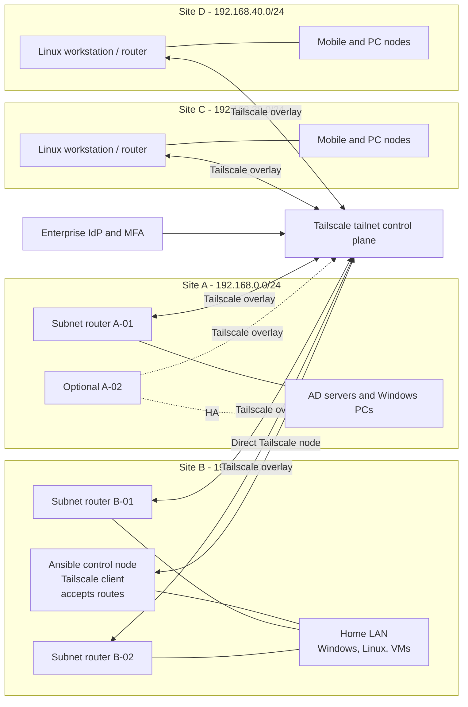

# Enterprise Tailscale + Ansible Multi-Site Management Solution

## Detailed architecture design, operations, and reliability analysis

**Document status:** Architecture baseline for design review  
**Document relationship:** Extends [`requirements.md`](requirements.md) with the Tailscale + Ansible multi-site design  
**Scope:** Four Internet-distributed sites, subnet routing, cross-site SSH and service access, and centralized Ansible management  
**Primary control site:** Site B / home site  
**Addressing:** The four RFC1918 IPv4 ranges supplied for this design  
**Date:** 2026-09-01  

## 1. Executive decision

Use a single organization-owned Tailscale tailnet as the encrypted connectivity and identity layer, with Linux subnet routers at Sites A–D and a directly enrolled Ansible control node at Site B.

The recommended production pattern is:

- Site A: two Linux subnet routers where possible; the available Linux VM is the minimum viable router and is an explicit single point of failure until a second router is added.
- Site B: two dedicated Linux subnet routers plus a separate Ansible control node. Do not make the Ansible controller the only routing gateway.
- Sites C and D: the Linux workstation can be the lab router and managed endpoint; production should add a small second Linux appliance or VM if the office requires router failover.
- Tailscale advertises only the four site LAN prefixes; no default route or Internet exit-node behavior is part of this design.
- The Ansible controller connects directly to Tailscale and accepts the four subnet routes. It uses SSH for Linux and WinRM/PSRP for Windows.
- Site-to-site traffic uses least-privilege Tailscale Grants, route approval, local host firewalls, and site-gateway routing where source preservation is required.

Tailscale subnet routing is an overlay route-advertisement model, not a replacement for LAN firewall policy or host authorization. A route must be advertised and approved, and an access policy must also permit the traffic. The route and the policy are separate controls.

## 2. Requirements and assumptions

### 2.1 Supplied site model

| Site | Role | LAN subnet | Supplied systems | Minimum routing role |
|---|---|---|---|---|
| Site A | Enterprise site | `192.168.0.0/24` | 10 Windows PCs, 2 AD servers, possible 1 Linux VM | Linux VM as subnet router; add a second Linux router for production HA |
| Site B | Home / management site | `192.168.10.0/24` | 5 Windows servers, 5 workstations, 5 Linux servers, 10 VMs | Two Linux subnet routers and one separate Ansible control node |
| Site C | Remote office | `192.168.30.0/24` | 1 Linux workstation and up to 10 mobile nodes/PCs/laptops/tablets | Linux workstation as lab router; add a second router for production HA |
| Site D | Remote office | `192.168.40.0/24` | 1 Linux workstation and up to 10 mobile nodes/PCs/laptops/tablets | Linux workstation as lab router; add a second router for production HA |

The address ranges are non-overlapping, which is required for straightforward site-to-site subnet routing. If a real site has a duplicate or overlapping range, renumbering, NAT, or a different segmentation design is required before connecting the sites.

### 2.2 Management requirements

- The Site B Ansible controller must reach all four site networks.
- SSH is mandatory for Linux systems and any Windows system intentionally configured for OpenSSH.
- Windows management must also be supported through WinRM HTTPS or PSRP over WinRM, normally TCP `5986`.
- Common additional services must be explicitly approved rather than opened broadly:
  - HTTPS `443` for administration and APIs;
  - RDP `3389` for restricted operator access, if required;
  - SMB `445` only for defined file-management or backup workflows;
  - DNS `53` only when a management workflow needs it;
  - application-specific ports only for named systems and owners.
- Mobile nodes and tablets can use Tailscale to reach approved site services, but Ansible can manage them only if they expose a supported SSH, WinRM/PSRP, or application API interface.

## 3. Target logical architecture



The control plane distributes node identity, route advertisements, and policy. Data traffic normally flows directly between Tailscale nodes where possible; traffic to a non-Tailscale LAN host is forwarded by that site's subnet router.

## 4. Address and naming plan

The following addresses are examples for a lab or design workbook. Reserve them in the real DHCP/IPAM system before use.

| Site | Function | Example name | Example LAN address |
|---|---|---|---:|
| A | Primary subnet router | `tsr-a-01` | `192.168.0.2` |
| A | Secondary subnet router | `tsr-a-02` | `192.168.0.3` |
| A | AD server 1 | `a-ad-01` | `192.168.0.10` |
| A | AD server 2 | `a-ad-02` | `192.168.0.11` |
| A | Windows PCs | `a-pc-01` to `a-pc-10` | `192.168.0.101` to `192.168.0.110` |
| B | Primary subnet router | `tsr-b-01` | `192.168.10.2` |
| B | Secondary subnet router | `tsr-b-02` | `192.168.10.3` |
| B | Ansible control node | `ansible-b-01` | `192.168.10.20` |
| B | Windows servers | `b-win-srv-01` to `b-win-srv-05` | `192.168.10.21` to `192.168.10.25` |
| B | Workstations | `b-pc-01` to `b-pc-05` | `192.168.10.101` to `192.168.10.105` |
| B | Linux servers | `b-linux-01` to `b-linux-05` | `192.168.10.41` to `192.168.10.45` |
| B | VMs | `b-vm-01` to `b-vm-10` | `192.168.10.61` to `192.168.10.70` |
| C | Linux workstation / router | `tsr-c-01` | `192.168.30.2` |
| C | Mobile and PC reservation | `c-node-01` to `c-node-10` | `192.168.30.101` to `192.168.30.110` |
| D | Linux workstation / router | `tsr-d-01` | `192.168.40.2` |
| D | Mobile and PC reservation | `d-node-01` to `d-node-10` | `192.168.40.101` to `192.168.40.110` |

Use stable hostnames in Ansible inventory and set `ansible_host` to the LAN address when managing a host behind a subnet router. Use Tailscale MagicDNS names for directly enrolled nodes such as `ansible-b-01` and the subnet routers themselves.

## 5. Routing model

### 5.1 Advertised routes

| Router tag | Advertised route | Site |
|---|---|---|
| `tag:subnet-router-a` | `192.168.0.0/24` | A |
| `tag:subnet-router-b` | `192.168.10.0/24` | B |
| `tag:subnet-router-c` | `192.168.30.0/24` | C |
| `tag:subnet-router-d` | `192.168.40.0/24` | D |

For HA, the two routers at one site must advertise the exact same prefix. Tailscale failover does not promote a broader prefix when a more-specific route fails, and there is no administrator-selected preferred router in the standard failover model. The route must be approved either manually in the admin console or through an `autoApprovers` policy.

Do not advertise `0.0.0.0/0` for this use case. An exit node is a different function from a site subnet router and would create a much larger security and troubleshooting scope.

### 5.2 SNAT choices

| Mode | Advantages | Trade-off | Use |
|---|---|---|---|
| Default subnet-route SNAT | Requires fewer changes to existing LAN gateways; good for the first lab | Remote hosts see the local subnet router as the source; site-to-site return-path and audit detail are less explicit | Lab fast path and environments where gateways cannot add static routes |
| No SNAT with static routes | Preserves the originating Tailscale/LAN source address and supports clearer site-to-site routing and logging | Requires static routes on site gateways and carefully designed firewall rules | Enterprise baseline when gateway control is available |

The no-SNAT design requires every participating LAN gateway to know how to return traffic to the relevant remote prefixes through its local subnet router. If that cannot be implemented safely, retain SNAT and limit access to directly enrolled Tailscale clients or to explicitly routed management sources.

### 5.3 Site B access

The preferred path is to install Tailscale directly on the home PC and the Ansible controller, then enable route acceptance on the Linux controller. This avoids making every home device depend on a single LAN gateway for remote access.

If the entire Site B LAN must access Sites A, C, and D, add routes on the Site B gateway pointing the remote prefixes to the Site B subnet router. For a no-SNAT design, add corresponding return routes on Sites A, C, and D. Validate whether the gateway supports redundant next hops before claiming router HA for non-Tailscale LAN clients.

## 6. Tailscale control-plane design

### 6.1 Identity and device enrollment

- Use the enterprise identity provider with MFA for human tailnet access.
- Use role-based groups such as `group:netops` and `group:ansible-operators`.
- Use tags for non-human devices; tag ownership must be limited to the network/security administration group.
- Use pre-approved, tagged auth keys for servers when device approval is enabled. Keep keys in a secret manager or CI secret store and never commit them.
- Use separate auth keys per site and purpose so a compromised enrollment secret has a bounded scope.
- Review node-key expiry, auth-key expiry, reauthentication, and offboarding procedures. Tagged devices have different key-expiry behavior, so document the selected policy rather than relying on defaults.
- Consider Tailnet Lock, posture checks, and policy-as-code review when the tailnet and operating model support them.

### 6.2 Illustrative Grants policy

The following is a starting example, not a drop-in production policy. Replace the example identity, validate the current Grants syntax in the Tailscale policy editor, and test from both a permitted and denied source.

```json
{
  "groups": {
    "group:netops": ["netops@example.com"],
    "group:ansible-operators": ["automation@example.com"]
  },
  "tagOwners": {
    "tag:subnet-router-a": ["group:netops"],
    "tag:subnet-router-b": ["group:netops"],
    "tag:subnet-router-c": ["group:netops"],
    "tag:subnet-router-d": ["group:netops"],
    "tag:ansible-control": ["group:netops"],
    "tag:linux-managed": ["group:netops"]
  },
  "autoApprovers": {
    "routes": {
      "192.168.0.0/24": ["tag:subnet-router-a"],
      "192.168.10.0/24": ["tag:subnet-router-b"],
      "192.168.30.0/24": ["tag:subnet-router-c"],
      "192.168.40.0/24": ["tag:subnet-router-d"]
    }
  },
  "grants": [
    {
      "src": ["tag:ansible-control", "192.168.10.0/24"],
      "dst": ["192.168.0.0/24"],
      "ip": ["icmp:*", "tcp:22", "tcp:443", "tcp:5986"],
      "via": ["tag:subnet-router-a"]
    },
    {
      "src": ["tag:ansible-control", "192.168.10.0/24"],
      "dst": ["192.168.30.0/24"],
      "ip": ["icmp:*", "tcp:22", "tcp:443", "tcp:5986"],
      "via": ["tag:subnet-router-c"]
    },
    {
      "src": ["tag:ansible-control", "192.168.10.0/24"],
      "dst": ["192.168.40.0/24"],
      "ip": ["icmp:*", "tcp:22", "tcp:443", "tcp:5986"],
      "via": ["tag:subnet-router-d"]
    },
    {
      "src": ["group:ansible-operators"],
      "dst": ["tag:subnet-router-a", "tag:subnet-router-b", "tag:subnet-router-c", "tag:subnet-router-d"],
      "ip": ["tcp:22", "tcp:443"]
    }
  ],
  "ssh": [
    {
      "action": "check",
      "src": ["group:ansible-operators"],
      "dst": ["tag:linux-managed"],
      "users": ["autogroup:nonroot"],
      "checkPeriod": "12h"
    }
  ]
}
```

The network Grants allow routed IP access; they do not configure an operating-system SSH daemon or create Windows accounts. The `ssh` policy applies only to Tailscale SSH on directly enrolled Linux/macOS devices. It does not provide SSH to a host that is merely behind a subnet router.

### 6.3 Tailscale SSH versus standard SSH

Use standard SSH over the Tailscale network for Ansible Linux management by default. This keeps the inventory and key-management model familiar and works for Linux hosts reached through a subnet route. Tailscale SSH is a useful operator access option for Linux nodes that run Tailscale directly, but it is not a replacement for standard SSH on every routed host.

Tailscale SSH is not the Windows management protocol and cannot reach devices behind a subnet router unless the destination itself runs Tailscale SSH. Windows systems should use WinRM/PSRP or Windows OpenSSH according to the approved host standard.

## 7. Ansible management architecture

### 7.1 Control node

`ansible-b-01` is a Linux control node on Site B with:

- a direct Tailscale client and `--accept-routes` enabled;
- an SSH key held by `ssh-agent` or a protected key store;
- Ansible Vault for passwords, WinRM certificates, API tokens, and other secrets;
- a Git repository containing inventory, group variables, roles, playbooks, tests, and change history;
- local logs and a backup of the configuration repository;
- a documented recovery procedure or a secondary control node.

Do not place the only Ansible controller and the only Site B subnet router on the same VM for production. A failure of that VM would remove both automation and routed access.

### 7.2 Ansible connection standards

| Target | Recommended connection | Typical port | Credential/control |
|---|---|---:|---|
| Linux servers, Linux VMs, and Linux subnet routers | OpenSSH | 22 | Per-purpose `ansible` account, SSH key, least-privilege `sudo` |
| Windows servers, AD servers, and Windows PCs | WinRM HTTPS or PSRP over WinRM | 5986 | Domain/Kerberos where appropriate, or local account/certificate over trusted HTTPS |
| Windows lab-only rapid path | WinRM with NTLM and message encryption over Tailscale | 5985 | Lab credential in Vault; never expose the listener to the public Internet |
| Directly enrolled Linux operator nodes | Standard SSH or Tailscale SSH | 22 | Standard SSH keys or tailnet identity policy |
| Mobile/tablet clients | Not an Ansible target by default | Varies | Tailscale access only unless a supported management API exists |

Ansible inventory should use group variables for connection behavior and host variables for the routed LAN address. Use FQCNs such as `ansible.builtin.ssh`, `ansible.builtin.winrm`, `ansible.windows.win_ping`, and `ansible.builtin.ping` in playbooks and documentation.

### 7.3 Service access policy

| Service | Source | Destination | Decision |
|---|---|---|---|
| SSH TCP 22 | Ansible control, approved netops devices | Linux targets and subnet routers | Required |
| WinRM HTTPS TCP 5986 | Ansible control | Windows targets | Required for Windows automation |
| WinRM HTTP TCP 5985 | Lab control only | Lab Windows targets | Temporary lab exception only; use message encryption and remove after the lab |
| HTTPS TCP 443 | Ansible control and approved operators | Admin portals/APIs | Required only for named services |
| RDP TCP 3389 | Approved operator group | Named Windows targets | Optional, restricted, audited |
| SMB TCP 445 | Approved backup/file-management job | Named file servers | Optional, never broad tailnet access |
| DNS TCP/UDP 53 | Approved DNS clients | Approved DNS servers | Optional; prefer known DNS resolvers and IP inventory where practical |

Do not grant `*:*` from the Ansible controller to all four LANs as the production default. Add an application-specific rule with an owner, purpose, expiration/review date, and validation test.

## 8. High availability and single-point-of-failure review

| Component | Failure impact | Enterprise treatment |
|---|---|---|
| Tailscale control plane | New policy, route distribution, or new-node enrollment may be affected; established paths have different continuity characteristics | Protect the tailnet administrator accounts, recovery methods, policy backups, and vendor escalation path |
| Site A Linux VM router | Site A is unreachable through the overlay | Add `tsr-a-02` on a separate host, power path, and preferably separate virtualization or hardware boundary |
| Site B router pair | Site B LAN routing can fail or become asymmetric | Use two routers with the same route; keep Ansible control separate; test router failure and return paths |
| Site B Ansible controller | Automation stops, but Tailscale routes can remain available | Maintain a backed-up repository and a secondary controller or rebuild procedure |
| Site C/D Linux workstation router | Each small office becomes unreachable through the overlay | Add a second always-on Linux router/appliance if RTO requires it; do not claim HA with one workstation |
| Site ISP or power | Local users may lose cloud access and the subnet router may disappear | UPS, configuration backups, spare equipment, and optional secondary WAN/5G based on approved RTO |
| Host firewall or gateway routes | Services may be unreachable despite a healthy Tailscale route | Manage local firewall and static-route configuration as code where possible |

When overlapping subnet routers advertise the exact same prefix, Tailscale can fail over between them. The documented failover behavior can take approximately 15 seconds, and broader or differently sized prefixes are not equivalent failover candidates. If a site has only one Linux router, record that as an accepted SPOF until the second router is installed and tested.

For HA routers advertising the same local prefix, avoid enabling route acceptance on the standby unless the design specifically needs that behavior; otherwise the standby can route traffic for its own directly connected LAN through the other router. Test `--accept-routes` behavior deliberately rather than copying the setting to every router.

## 9. Security and operations

### 9.1 Secrets and privileged access

- Store Tailscale auth keys, SSH private keys, WinRM passwords, certificates, and API credentials outside Git.
- Use short-lived or scoped enrollment keys where the device lifecycle permits it.
- Use unique local automation accounts per operating-system class and site, or centrally governed identities where available.
- Use `sudo` rules that permit only the required Ansible roles; do not make every playbook an unrestricted root workflow.
- Use Windows local/domain accounts with only the permissions required by the playbook. Protect WinRM listener certificates and CA trust chains.
- Require MFA and periodic reauthentication for human operator access; do not use a shared Tailscale user.

### 9.2 Monitoring and evidence

Monitor and retain:

- subnet-router health, route advertisements, route approval, and route changes;
- Tailscale node authorization, tag changes, key events, and policy changes;
- Ansible job identity, inventory revision, playbook revision, result, and failure reason;
- SSH, WinRM, RDP, SMB, and application firewall events on managed hosts;
- connectivity latency and packet loss from Site B to each site;
- backup and restore tests for the Ansible repository, policy export, router configuration, and critical service data.

### 9.3 Change control

Route advertisements, Grants, subnet-router firewall rules, static gateway routes, WinRM listeners, and Ansible privileged tasks are production changes. Every change should record the request, owner, affected sites, exact prefixes/ports, rollback action, validation result, and next review date.

## 10. Enterprise rollout sequence

1. Confirm IPAM, gateway ownership, non-overlap, DNS behavior, and the real inventory at Sites A–D.
2. Create the tailnet, identity integration, MFA, administrator groups, device-approval model, tag ownership, and recovery procedures.
3. Build one isolated lab route per site and validate the policy with both allowed and denied tests.
4. Deploy the Site B Ansible controller and bootstrap Linux SSH and Windows WinRM/PSRP credentials using Vault.
5. Enroll Site A, then Site C and D, then the remaining Site B nodes. Start with one representative Linux and Windows host per site.
6. Approve only the exact four site prefixes and validate route acceptance on the controller and home PC.
7. Add service-specific Grants and host-firewall rules; do not broaden access because a single test failed.
8. Add the second subnet router at each site where the availability target requires it, then test exact-prefix failover.
9. Automate configuration drift checks, patching, inventory collection, backup verification, and recovery testing.
10. Sign off the acceptance matrix before treating the design as production-ready.

## 11. Acceptance test matrix

| Test | Expected result |
|---|---|
| Ansible controller sees all four advertised routes | `ip route` or equivalent shows the four approved prefixes |
| Controller reaches each subnet router | Tailscale IP and LAN IP tests succeed |
| Controller reaches Linux targets | SSH succeeds on TCP 22 using the approved key and account |
| Controller reaches Windows targets | WinRM/PSRP succeeds on TCP 5986 with certificate validation and Vault credentials |
| Home PC reaches Site A/C/D approved services | Only explicitly permitted ports succeed |
| Unauthorized tailnet user or tag reaches a protected service | Connection is denied by Tailscale policy or the host firewall |
| Site gateway return path | No-SNAT traffic returns through the correct local subnet router |
| Subnet-router failure | Exact-prefix route fails over to the second router where HA is deployed |
| New-device recovery | A rebuilt router or controller can be enrolled without a shared permanent secret |
| Ansible idempotency | The same playbook run produces no unexpected changes on the second run |
| Audit and rollback | Policy, route, firewall, and playbook changes have evidence and a tested rollback |

## 12. Design boundaries

- Tailscale does not remove the need for local Windows firewalls, Linux firewalls, gateway ACLs, operating-system accounts, or application authorization.
- Subnet routing does not make a mobile phone or tablet an Ansible-managed node.
- Tailscale SSH is not a universal SSH gateway for hosts behind subnet routers.
- Ansible is agentless; it still requires a supported connection protocol and sufficient host permissions.
- AD servers can be managed through WinRM/PSRP, but normal AD DS protocols and DNS dependencies remain application concerns and should not be exposed broadly through the tailnet.
- A single Linux workstation acting as both user endpoint and subnet router is suitable for a lab, not a high-availability production office.

## 13. References

- [Tailscale site-to-site networking](https://tailscale.com/docs/features/site-to-site)
- [Tailscale subnet routers](https://tailscale.com/docs/features/subnet-routers)
- [Tailscale route injection](https://tailscale.com/docs/reference/route-injection)
- [Tailscale subnet-router high availability](https://tailscale.com/docs/how-to/set-up-high-availability)
- [Tailscale Grants syntax](https://tailscale.com/docs/reference/syntax/grants)
- [Tailscale policy-file syntax](https://tailscale.com/docs/reference/syntax/policy-file)
- [Tailscale auth keys](https://tailscale.com/docs/features/access-control/auth-keys)
- [Tailscale SSH](https://tailscale.com/docs/features/tailscale-ssh)
- [Ansible inventory guide](https://docs.ansible.com/projects/ansible/latest/inventory_guide/intro_inventory.html)
- [Ansible Windows management guide](https://docs.ansible.com/projects/ansible/latest/os_guide/intro_windows.html)
- [Ansible Windows Remote Management guide](https://docs.ansible.com/projects/ansible-core/devel/os_guide/windows_winrm.html)
- [Ansible WinRM connection plugin](https://docs.ansible.com/projects/ansible/latest/collections/ansible/builtin/winrm_connection.html)
